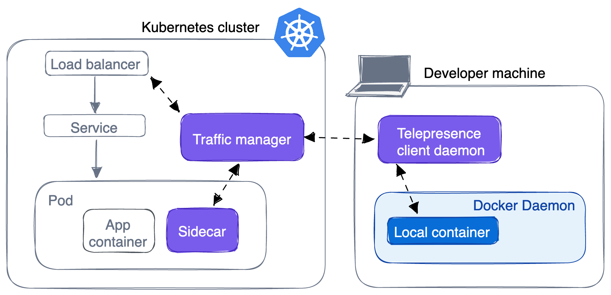

Teams developing large, cloud-native applications might find themselves in a
situation where it's not possible to run the entire application locally on a
development machine. There are several reasons why running an application
locally is sometimes not feasible:

- It requires more resources than your local machine can provide
- There are dependencies to cloud services, APIs, or networking configurations
  that can't be emulated
- Testing and validating requires large amounts of data or network traffic

Often, this means you need to rely on continuous integration pipelines or
staging environments to verify code changes. This introduces a time-consuming
and cumbersome workflow where you must commit, push, build, test, and deploy
your code in order to see them running.

## Combining local and remote

One solution to this problem is to integrate local services with a remote
development cluster. In practice, this means starting a service on your
development machine using `docker run`, and allowing that local service to
communicate with the development cluster over the network. The remote
development cluster hosts workloads that represent the production environment.

A development environment that lets you combine containers running locally with
remote resources helps simplify and speed up the inner loop. There are several
tools available, commercial and open-source, that you can use to enable a hybrid
local-and-remote development environment. For example:

- [Telepresence](https://app.getambassador.io/auth/realms/production/protocol/openid-connect/auth?client_id=docker-docs&response_type=code&redirect_uri=https%3A%2F%2Fapp.getambassador.io&utm_source=docker-docs&utm_medium=dockerwebsite&utm_campaign=Docker%26TP){: target="_blank" rel="noopener" class="_" }
- [CodeZero](https://www.codezero.io/){: target="_blank" rel="noopener" class="_" }
- [Gefyra](https://gefyra.dev/){: target="_blank" rel="noopener" class="_" }
- [kubefwd](https://kubefwd.com/){: target="_blank" rel="noopener" class="_" }
- [ktunnel](https://github.com/omrikiei/ktunnel){: target="_blank" rel="noopener" class="_" }
- [mirrord](https://mirrord.dev){: target="_blank" rel="noopener" class="_" }

## Telepresence

Telepresence is an open-source CNCF project that helps you integrate local
services with a remote Kubernetes cluster. Telepresence works by running a
traffic manager pod in Kubernetes, and Telepresence client daemons on developer
workstations. The traffic manager acts as a two-way network proxy that can
intercept connections and route traffic between the cluster and containers
running on developer machines.

You have a few options for how the local containers can integrate with the cluster:

- No intercepts

  The most basic integration involves no intercepts at all. Simply establishing
  a connection between the container and the cluster. This enables the container
  to access cluster resources, such as APIs and databases.

- Global intercepts

  You can set up global intercepts for a service. This means all traffic
  for a service will be re-routed from Kubernetes to your local container.

- Personal intercepts

  The more advanced alternative to global intercepts is personal intercepts.
  Personal intercepts let you define conditions for when a request should be
  routed to your local container. The conditions could be anything from only
  routing requests that include a specific HTTP header, to requests targeting a
  specific route of an API.

Telepresence is free and open-source, and you can try it out by heading to
the
[Telepresence quickstart guide](https://www.telepresence.io/docs/latest/quick-start/?utm_source=docker-docs&utm_medium=dockerwebsite&utm_campaign=Docker-TP){: target="_blank" rel="noopener" class="_" }.
There’s also a
[Telepresence extension for Docker Desktop](https://www.getambassador.io/docs/telepresence/latest/docker/extension?utm_source=docker-docs&utm_medium=dockerwebsite&utm_campaign=Docker-TP){: target="_blank" rel="noopener" class="_" },
which helps you manage intercepts for your containers.

### Docker × Ambassador

Sharing a development cluster with a large team can be both a blessing and a
curse. Because your teammates are connected to the cluster, you’re able to see
what they’re working on. But they can also accidentally step on your intercepts
of shared services. Ambassador Labs, creators of Telepresence, run a
subscription platform that helps teams share the cluster. You can identify all
the intercepts you have running on a service. Each developer can generate an
authenticated preview URL to share during code review.

Docker and Ambassador Labs are working together to make running a hybrid
local-remote development environment easy and seamless. You can now connect your
Docker ID to Ambassador Cloud to sign in and use Telepresence. To get started:

1. Go to the
   [Docker × Ambassador](https://app.getambassador.io/auth/realms/production/protocol/openid-connect/auth?client_id=docker-docs&response_type=code&redirect_uri=https%3A%2F%2Fapp.getambassador.io&utm_source=docker-docs&utm_medium=dockerwebsite&utm_campaign=Docker%26TP)
   page.
2. Sign in using your Docker ID.
3. Authorize the Ambassador Cloud app.

This takes you to a step-by-step guide on setting up Telepresence,
connecting to a development cluster, and creating intercepts.

## mirrord

mirrord is an open-source tool that lets developers run local processes in the context of their cloud environment. When you use mirrord, it injects itself into your local process, and starts a temporary pod in your Kubernetes cluster called the mirrord Agent. It then overrides low-level functions in your local process, and relays them to a pod in your Kubernetes cluster through the mirrord Agent. mirrord does this for incoming and outgoing traffic, file access, and environment variables. So your process "thinks" it's running in the pod you selected, even though it's actually running locally.

You can configure mirrord's different features (e.g. file access, outgoing traffic) to run either locally or remotely and suit any type of use case. Incoming traffic supports the following modes:
- Mirroring: mirrord duplicates incoming traffic to the remote pod and sends a copy to your local process. The request is handled by the remote pod.
- Stealing: mirrord intercepts the incoming traffic to the remote pod and sends it to your local process. The request is handled by the local process.
- Stealing with a filter: mirrord only steals incoming traffic that matches a filter you specified, on either an HTTP header or a path. Requests matching the filter are handled by the local process, and all other traffic is handled by the remote pod.  

mirrord comes as either a CLI tool or an IDE extension for either VS Code or IntelliJ IDEs. You can try it out [here](https://mirrord.dev/docs/overview/quick-start/).
