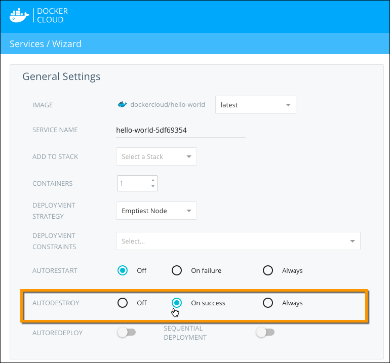

When enabled on a service, **Autodestroy** automatically terminates containers
when they stop. **This destroys all data in the container on stop.** This is
useful for one-time actions that store their results in an external system.

The following Autodestroy options are available:

- `OFF`: the container remains in the **Stopped** state regardless of exit code, and is not destroyed.
- `ON_SUCCESS`: if the container stops with an exit code of 0 (normal shutdown), Docker Cloud automatically destroys it. If it stops with any other exit code, Docker Cloud leaves it in the **Stopped** state.
- `ALWAYS`: if the container stops, Docker Cloud automatically terminates it regardless of the exit code.

If **Autorestart** is activated, Docker Cloud evaluates whether to try restarting the container or not before evaluating **Autodestroy**.

## Launch a service with Autodestroy

You can enable **Autodestroy** on the **Service configuration** step of the **Launch new service** wizard.



Autodestroy is set to `OFF` (deactivated) by default.

### Use the API or CLI

You can enable autodestroy when launching a service through the API or CLI.

If not provided, it has a default value of `OFF`. Check our [API documentation](/apidocs/docker-cloud.md) for more information.

#### Launch with autodestroy using the API
```
POST /api/app/v1/service/ HTTP/1.1
{
	 "autodestroy": "ALWAYS",
	 [...]
}
```

#### Launch with autodestroy using the CLI
```
$ docker-cloud service run --autodestroy ALWAYS [...]
```

## Enable autodestroy on an already deployed service

You can also activate or deactivate the **Autodestroy** setting on a service
after it has been deployed, by editing the service.

1. Go to the service detail page.
2. Click **Edit**.
3. Select the new autodestroy setting.
4. Click **Save**.

### Use the API or CLI

You can set the **Autodestroy** option after the service has been
deployed, using the API or CLI.

Check our [API documentation](/apidocs/docker-cloud.md) for more information.

#### Enable autodestroy using the API
```
PATCH /api/app/v1/service/(uuid)/ HTTP/1.1
{
	"autodestroy": "ALWAYS"
}
```

#### Enable autodestroy using the CLI
```
$ docker-cloud service set --autodestroy ALWAYS (name or uuid)
```
