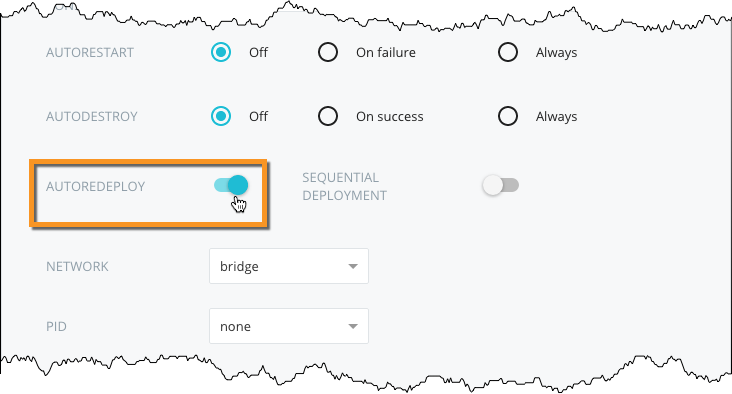

Docker Cloud's **Autoredeploy** feature allows a service that uses an image
stored in Docker Hub to automatically redeploy whenever a new image is pushed or
built.

> **Note:** To enable autoredeploy on an image stored in a third party registry,
> you will need to use [redeploy triggers](triggers.md) instead.


## Launching a new service with autoredeploy

You can launch a service with **autoredeploy** enabled by enabling it from the **general settings** section of the **Launch new service** wizard.



By default, autoredeploy is *deactivated*.

### Using the CLI or API

You can enable **autoredeploy** when launching a service using the CLI or API.

By default, autoredeploy is set to `false`. See the [API documentation](/apidocs/docker-cloud.md) for more information.

#### Enable autoredeploy using the CLI

```
$ docker-cloud service run --autoredeploy [...]
```

#### Enable autoredeploy using the API

```
POST /api/app/v1/service/ HTTP/1.1
{
	 "autoredeploy": true,
	 [...]
}
```

## Enabling autoredeploy to an already deployed service

You can activate or deactivate **autoredeploy** on a service after it has been deployed.

1. Click into the service detail page.
2. Click **Edit**.
3. Change the **autoredeploy** setting on the form to `true`
4. Click **Save changes**.


### Using the CLI or API

You can set the **autoredeploy** option after the service has been deployed,
using the CLI or API.

Check our [API documentation](/apidocs/docker-cloud.md) for more information.


#### Enabling autoredeploy using the CLI

```bash
$ docker-cloud service set --autoredeploy (name or uuid)
```

### Enabling autoredeploy using the API

```
PATCH /api/app/v1/service/(uuid)/ HTTP/1.1
{
	"autoredeploy": true
}
```