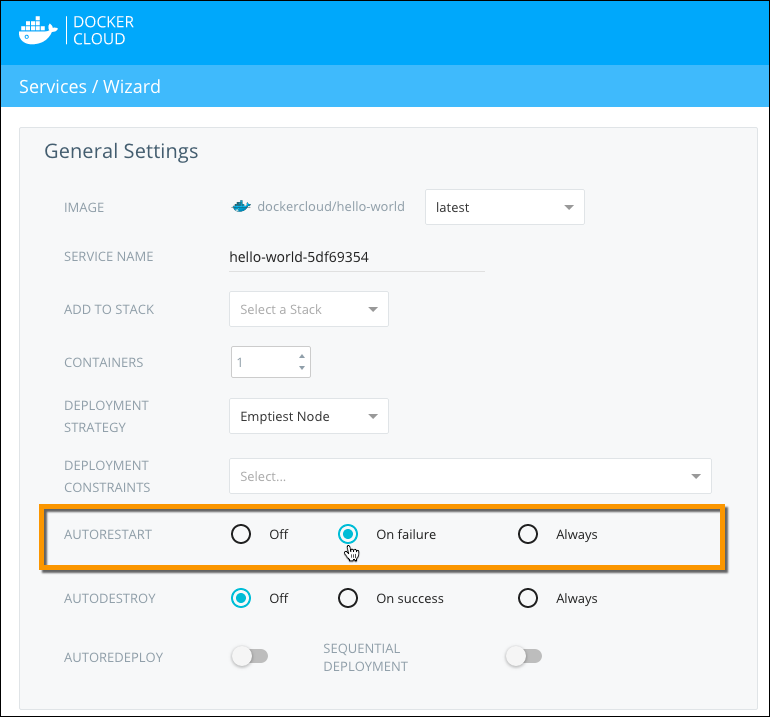

**Autorestart** is a service-level setting that can automatically start your
containers if they stop or crash. You can use this setting as an automatic crash
recovery mechanism.

Autorestart uses Docker's `--autorestart` flag. When called, the Docker daemon
attempts to restart the container until it succeeds. If the first restart
attempts fail, the daemon continues to attempt a restart, but uses an
incremental back-off algorithm.

The following Autorestart options are available:

- `OFF`: the container does not restart, regardless of the exit code.
- `ON_FAILURE`: the container restarts *only* if it stops with an exit code other than 0. (0 is for normal shutdown.)
- `ALWAYS`: the container restarts automatically, regardless of the exit code.

> **Note**: If you are using **Autorestart** set to `ALWAYS`, **Autodestroy** must be set to `OFF`.

If the Docker daemon in a node restarts (because it was upgraded, or because the
underlying node was restarted), the daemon only restarts containers that
have **Autorestart** set to `ALWAYS`.

## Launching a Service with Autorestart

You can enable **Autorestart** on the **Service configuration** step of the **Launch new service wizard**.



Autorestart is set to `OFF` by default, which means that autorestart is *deactivated*.

### Using the API and CLI

You can set the **Autorestart** option when launching a service through the
API and through the CLI. Autorestart is set to `OFF` by default. 

#### Set autorestart using the API

```
POST /api/app/v1/service/ HTTP/1.1
{
	"autorestart": "ON_FAILURE",
	[...]
}
```

#### Set autorestart using the CLI

```
$ docker-cloud service run --autorestart ON_FAILURE [...]
```

See our [API documentation](/apidocs/docker-cloud.md) for more information.

## Enabling autorestart on an already deployed service

You can activate or deactivate **Autorestart** on a service after it has been deployed by editing the service.

1. Go to the service detail page.
2. Click **Edit**.
3. Choose the autorestart option to apply.
4. Click **Save**.

### Using the API and CLI

You can change the **Autorestart** setting after the service has been deployed using the API or CLI.

#### Enable autorestart using the API
```
PATCH /api/app/v1/service/(uuid)/ HTTP/1.1
{
	"autorestart": "ALWAYS",
}
```

#### Enable autorestart using the CLI

```
$ docker-cloud service set --autorestart ALWAYS (name or uuid)
```

See the [API documentation](/apidocs/docker-cloud.md) for more information.
