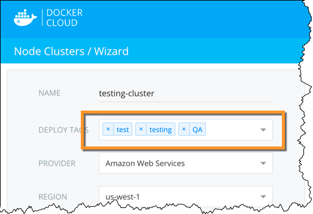
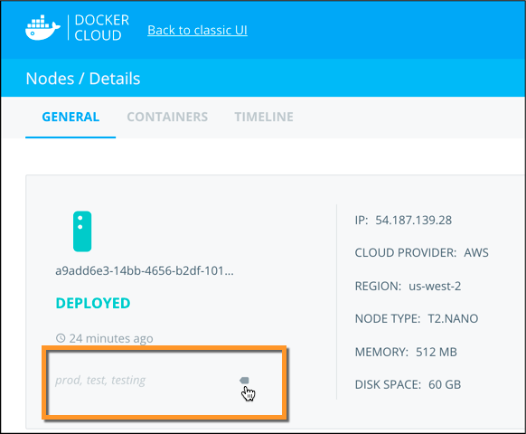
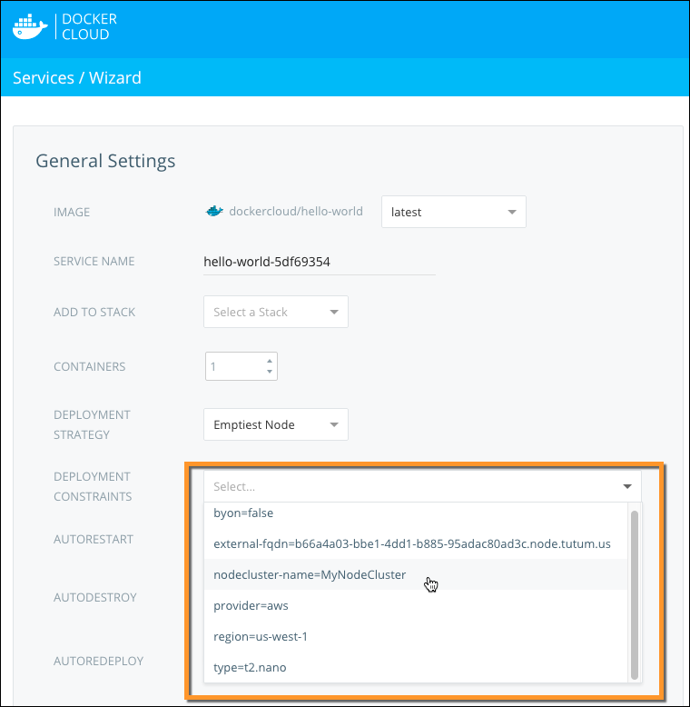

You can use **Deployment tags** to make sure certain services are deployed only
to specific nodes. Tagged services only deploy to nodes that match **all** of
the tags on that service. Docker Cloud shows an error if no nodes match all of
the service's deployment tags. A node might have extra tags that are not
specified on the service, but these do not prevent the service from deploying.

You can specify multiple tags on services, on individual nodes, and on node clusters. All nodes that are members of a node cluster inherit the tags specified on the cluster. See [Automatic deployment tags](deploy-tags.md#automatic-deployment-tags) to learn more.

#### Deployment tags example

In this example, we have five nodes. One is used for development and testing, and four are used for production. The production nodes are distributed between frontend and backend. The table below summarizes their names and tags:

| Node name | Tags |
| --------- | ---- |
| my-node-dev | `aws` `us-east-1` `development` `test` `frontend` `backend`|
| my-node-prod-1 | `aws` `us-east-1` `production` `frontend` |
| my-node-prod-2 | `aws` `us-east-2` `production` `frontend` |
| my-node-prod-3 | `aws` `us-east-1` `production` `backend` |
| my-node-prod-4 | `aws` `us-east-2` `production` `backend` |

Imagine that you deploy a service called **my-webapp-dev** with two tags:
`development` and `frontend`. All containers for the service would be deployed
to the node labeled **my-node-dev**, because the node is tagged with both
`development` *and* `frontend`.

Similarly, if you deploy a production service called **my-webapp-prod** with the
two tags `production` and `frontend`, all containers for that service
would be deployed to the two nodes **my-node-prod-1** and **my-node-prod-2**
because those two nodes are tagged with both `production` *and* `frontend`.

> **Tip**: Containers are distributed between the two nodes based on the
[deployment strategy](../infrastructure/deployment-strategies.md) selected.

## Automatic deployment tags

When you launch a node cluster, four tags are automatically assigned to the
node cluster and all nodes in that cluster:

* Provider name (for example `digitalocean`, `aws`)
* "[Bring your own node](../infrastructure/byoh.md)" (BYON) status (for example `byon=false` or `byon=true`)
* Region name (for example `us-east-1`, `lon1`)
* Node cluster name (for example `my-node-cluster-dev-1`)

## Add tags to a node or node cluster at launch

A single node is considered a node cluster with a size of 1. Because of this, you create a node cluster even if you are only launching a single node.

1. Click **Node clusters** in the left navigation menu.
2. Click **Create**.
3. In the **Deploy tags** field, enter the tags to assign to the cluster and all
of its member nodes.

    

    When the node cluster scales up, new nodes automatically inherit the
    node cluster's tags, including the [Automatic deployment tags](deploy-tags.md#automatic-deployment-tags) described above.

    You can see a node cluster's tags on the left side of the cluster's detail page.

4. Click **Launch node cluster**.

### Update or add tags on a node or node cluster

To change the tags on an existing node or node cluster:

1. Go to the node or node cluster's detail page.
2. Click the tags below the node or node cluster status line to edit them.

    

    If there are no tags assigned to the cluster, move your cursor under the deployment status line and click the tag icon that appears.

3. In the dialog that appears, add or remove tags.

    The individual nodes in a cluster inherit all tags from the cluster, including automatic tags. Each individual node can have extra tags in addition to the tags it inherits as a member of a node cluster.

4. Click **Save** to save your tag changes to the nodes.

## Add tags to a service at launch

To deploy a service to a specific node using tags, you must first specify one or more tags on the service. If you don't add any tags to a service, the service is deployed to all available nodes.

1. Use the **Create new service** wizard to start a new service.

    

2. Select tags from the **deployment constraints** list to add to this service. Only tags that already exist on your nodes appear in the list.

    Tags in a service define which nodes are used on deployment: only nodes that match *all* tags specified in the service are used for deployment.

### Update or add tags to a service

You can add or remove tags on a running service from the service's detail view.

1. From the service detail view, click **Edit**.
2. Select tags from the **deployment constraints** list to add to this service. Only tags that already exist on your nodes appear in the list.

    

3. Click **Save Changes**.

**If you update the tags on a service, you must redeploy the service for them to take effect.** To do this you can terminate all containers and relaunch them, or you can scale
your service down to zero nodes and then scale it back up. New containers are
deployed to the nodes that match the new tags.

## Using deployment tags in the API and CLI

See the [tags API and CLI documentation](/apidocs/docker-cloud.md#tags) for more information on how to use tags with our API and CLI.
