When you deploy a web service to multiple containers, you might want to load
balance between the containers using a proxy or load balancer.

In this tutorial, you use the **dockercloud/hello-world** image as a sample
web service and **dockercloud/haproxy** to load balance traffic to the service.
If you follow this tutorial exactly, your traffic is distributed evenly
between eight containers in a node cluster containing four nodes.

## Create a Node Cluster

First, deploy a node cluster of four nodes.

1. If you have not linked to a host or cloud services provider, do that now.

    You can find instructions on how to link to your own hosts, or to different providers [here](../infrastructure/index.md).

2. Click **Node Clusters** in the left-hand navigation menu.

3. Click **Create**.

4. Enter a name for the node cluster, select the **Provider**, **Region**, and **Type/Size**.

5. Add a **deployment tag** of `web`. (This is used to make sure the right services are deployed to the correct nodes.)

5. Drag or increment the **Number of nodes** slider to **4**.

    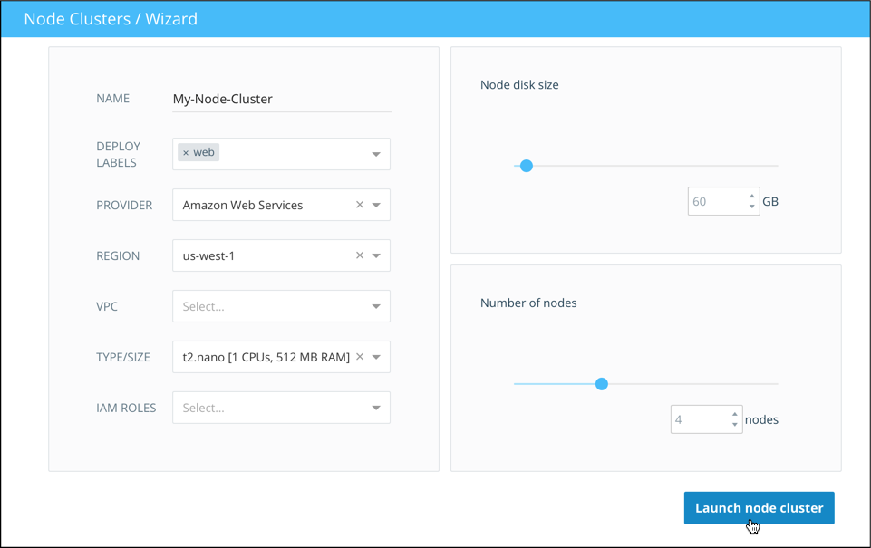

4. Click **Launch node cluster**.

    This might take up to 10 minutes while the nodes are provisioned. This a great time to grab a cup of coffee.

Once the node cluster is deployed and all four nodes are running, we're
ready to continue and launch our web service.

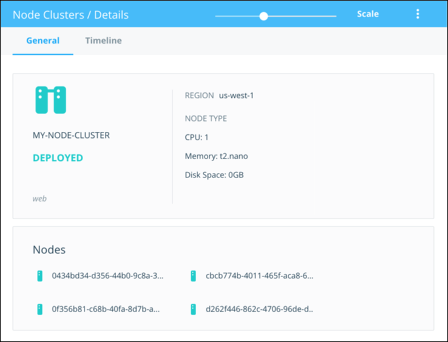

## Launch the web service

1. Click **Services** in the left hand menu, and click **Create**.

3. Click the **rocket icon** at the top of page, and select the **dockercloud/hello-world** image.

    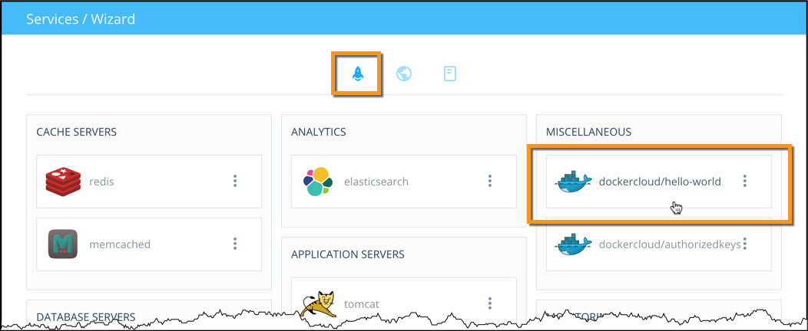

4. On the **Service configuration** screen, configure the service using these values:

    * **image**: Set the tag to `latest` so you get the most recent build of the image.
    * **service name**: `web`. This is what we call the service internally.
    * **number of containers**: 8
    * **deployment strategy**: `high availability`. Deploy evenly to all nodes.
    * **deployment constraints**: `web`. Deploy only to nodes with this tag.

    > **Note**: For this tutorial, make sure you change the *deployment strategy* to **High Availability**, and add the *tag* **web** to ensure this service is deployed to the right nodes.

    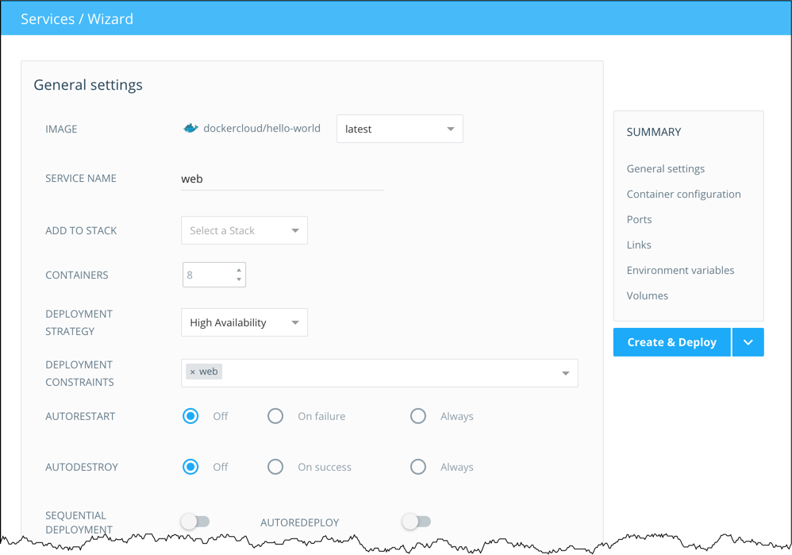

5. Last, scroll down to the **Ports** section and make sure the **published** box is checked next to port 80.

    We're going to access these containers from the public internet, and
    publishing the port makes them available externally. Make sure you leave the
    `node port` field unset so that it stays dynamic.

6. Click **Create and deploy**.

    Docker Cloud switches to the **Service detail** view after you create the
    service.

7. Scroll up to the **Containers** section to see the containers as they deploy.

    The icons for each container change color to indicate what phase of deployment they're in. Once all containers are green (successfully started), continue to the next step.

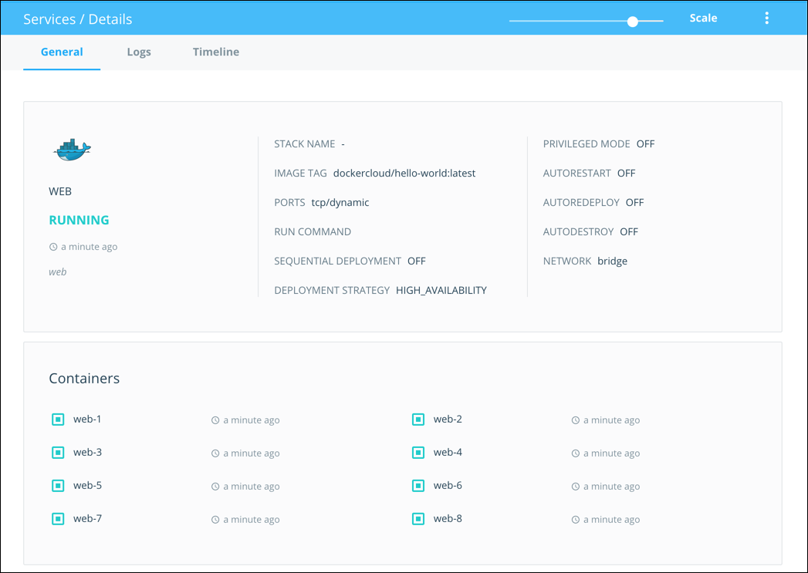

## Test the web service

1.  Once your containers are all green (running), scroll down to the
    **Endpoints** section.

    A list shows all the endpoints available for this service on the public internet.

    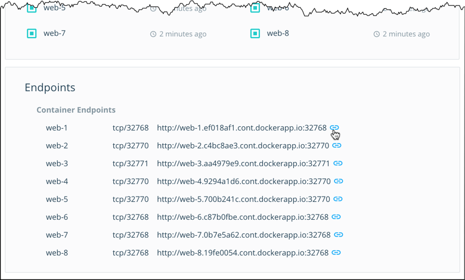

2.  Click an endpoint URL (it should look something like
    `http://web-1.username.cont.dockerapp.io:49154`) to open a new tab in your
    browser and view the **dockercloud/hello-world** web page. Note the hostname
    for the page that loads.

    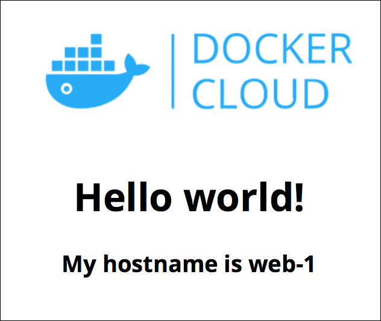

3.  Click other endpoints and check the hostnames. You see different hostnames
    which match the container name (web-2, web-3, and so on).

## Launch the load balancer

We verified that the web service is working, so now we can set up the load balancer.

1. Click **Services** in the left navigation bar, and click **Create** again.

    This time we launch a load balancer that listens on port 80 and balances the traffic across the 8 containers that are running the `web` service. 

3. Click the **rocket icon** if necessary and find the **Proxies** section.

4. Click the **dockercloud/haproxy** image.

5. On the next screen, set the **service name** to `lb`.

    Leave the tag, deployment strategy, and number of containers at their default values.

    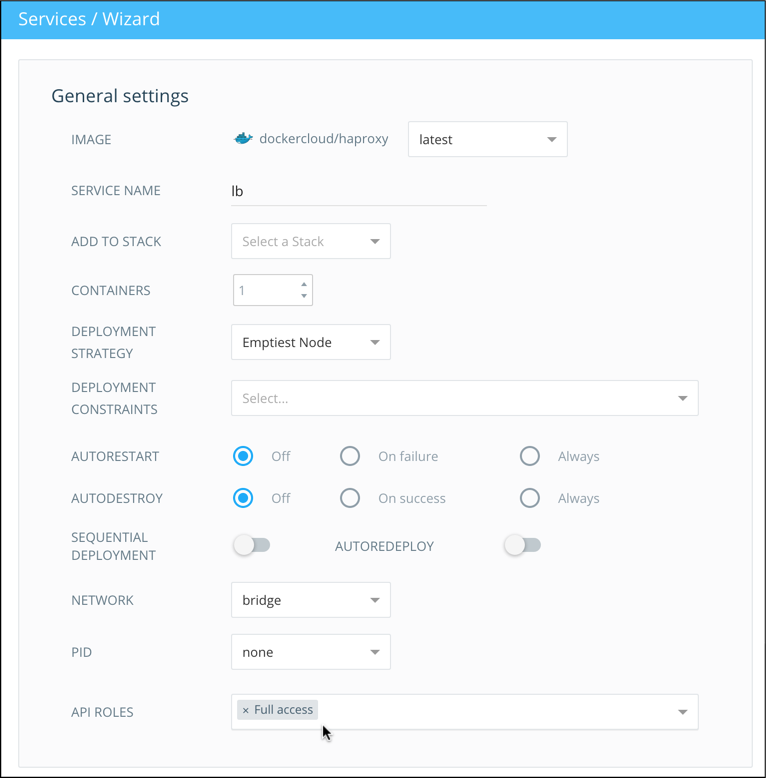

6. Locate the **API Roles** field at end of the **General settings** section.

7. Set the **API Role** to `Full access`.

    When you assign the service an API role, it passes a `DOCKERCLOUD_AUTH`
    environment variable to the service's containers, which allows them to query
    Docker Cloud's API on your behalf. You can [read more about API Roles here](../apps/api-roles.md).

    The **dockercloud/haproxy** image uses the API to check how many containers
    are in the `web` service we launched earlier. **HAproxy** then uses this
    information to update its configuration dynamically as the web service
    scales. 

8. Next, scroll down to the **Ports** section.

9. Click the **Published** checkbox next to the container port 80.

10. Click the word *dynamic* next to port 80, and enter 80 to set the published
port to also use port 80. 

    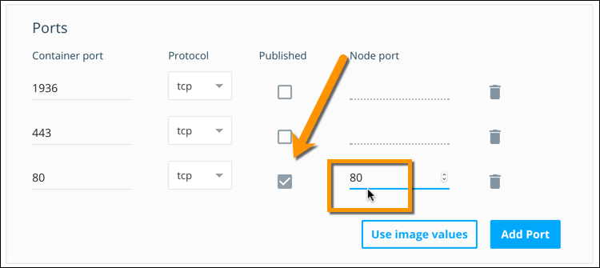

11. Scroll down to the **Links** section.

12. Select `web` from the drop down list, and click the blue **plus sign** to
add the link.

    This links the load balancing service `lb` with the web service `web`. The
    link appears in the table in the Links section.

    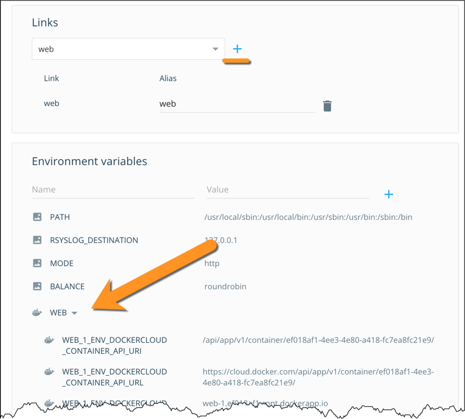

    A new set of `WEB` environment variables appears in the service we're about
    to launch. You can read more about
    service link environment variables [here](../apps/service-links.md).

13. Click **Create and deploy** and confirm that the service launches.

## Test the load-balanced web service

1.  On the load balancer service detail page, scroll down to the **endpoints**
    section.

    Unlike on the web service, this time the HTTP URL for the load balancer is
    mapped to port 80. 

    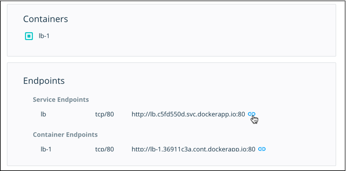

2.  Click the endpoint URL to open it in a new tab.

    The same hello-world webpage you saw earlier is shown. Make note of the
    hostname.

3.  Refresh the web page.

    With each refresh, the hostname changes as the requests are load-balanced to
    different containers. 

    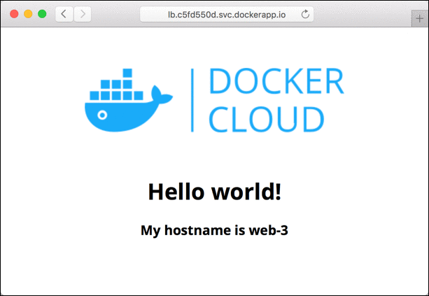

    Each container in the web service has a different hostname, which
    appears in the webpage as `container_name-#`. When you refresh the
    page, the load balancer routes the request to a new host and the displayed hostname changes.

    > **Tip**: If you don't see the hostname change, clear your browser's cache
    or load the page from a different web browser. 

Congratulations! You just deployed a load balanced web service using Docker
Cloud!

## Further reading: load balancing the load balancer

What if you had so many `web` containers that you needed more than one `lb`
container?

Docker Cloud automatically assigns a DNS endpoint to all services. This endpoint
routes to all of the containers of that service. You can use the DNS endpoint to
load balance your load balancer. To learn more, read up on [service
links](service-links.md).
