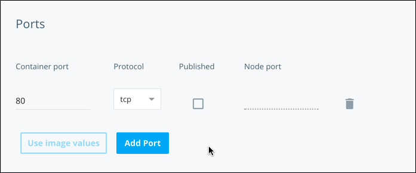
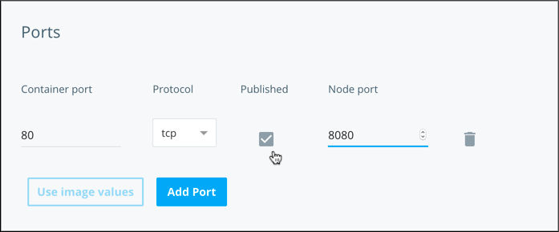
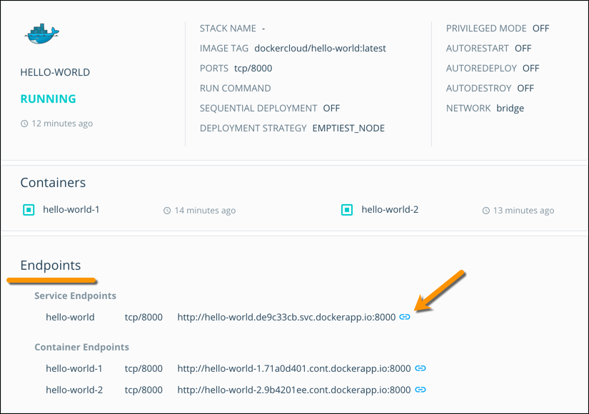

In Docker Cloud you can **publish** or **expose** ports in services and
containers, just like you can in Docker Engine (as documented
[here](/engine/reference/run.md#expose-incoming-ports)).

* **Exposed ports** are ports that a container or service is using either to
provide a service, or listen on. By default, exposed ports in Docker Cloud are
only privately accessible. This means only other services that are linked to
the service which is exposing the ports can communicate over the
exposed port.

    *Exposed ports* cannot be accessed publicly over the internet.

* **Published ports** are exposed ports that are accessible publicly over the internet. Published ports are published to the public-facing network interface in which the container is running on the node (host).

    *Published ports* **can** be accessed publicly over the internet.

## Launch a Service with an exposed port

If the image that you are using for your service already exposes any ports, these appear in Docker Cloud in the **Launch new service** wizard.

1. From the **Launch new service** wizard, select the image to use.
2. Scroll down to the **Ports** section.

    

The image in this example screenshot *exposes* port 80. Remember, this means
that the port is only accessible to other services that link this service. It
is not accessible publicly over the internet.

You can expose more ports from this screen by clicking **Add Port**.

### Using the API/CLI

See the API and CLI documentation [here](/apidocs/docker-cloud.md#service) for
information on how to launch a service with an exposed port.

## Launch a Service with a published port

If the image that you are using for your service already exposes any ports,
these appear in Docker Cloud in the **Launch new service** wizard. You can
choose to publish and map them from the wizard.

1. From the **Launch new service** wizard, select the image to use.
2. Scroll down to the **Ports** section.
    This section displays any ports configured in the image.
4. Click the **Published** checkbox.
5. Optionally, choose which port on the node where you want to make the exposed port available.

    By default, Docker Cloud assigns a published port dynamically. You can also
    choose a specific port. For example, you might choose to take a port that is
    exposed internally on port 80, and publish it externally on port 8080.
    

To access the published port over the internet, connect to the port you
specified in the "Node port" section. If you used the default **dynamic**
option, find the published port on the service detail page.

### Using the API/CLI

See the API and CLI documentation [here](/apidocs/docker-cloud.md#service) on
how to launch a service with a published port.

## Check which ports a service has published

The **Endpoints** section in the Service view lists the published ports for a service. Ports that are exposed internally are not listed in this section but can be viewed by editing the service configuration.

* The **Service endpoints** list shows the endpoints that automatically round-robin route to the containers in a service.
* The **Container endpoints** list shows the endpoints for each individual container. Click the blue "link" icon to open the endpoint URL in a new tab.

<!--  DCUI-741
Ports that are exposed internally display with a closed (locked) padlock
icon and published ports (that are exposed to the internet) show an open
(unlocked) padlock icon.

* Exposed ports are listed as **container port/protocol**
* Published ports are listed as **node port**->**container port/protocol** -->

### Using the API/CLI

See the API and CLI documentation [here](/apidocs/docker-cloud.md#service) to learn how to list a service's exposed and published ports.

## Service and container DNS endpoints

The short word before `dockerapp.io` in an endpoint URL tells you what type of endpoint it is. The three available types are:

* `node` routes to a specific node or host
* `svc` routes round-robin style to the containers of a service
* `cont` routes to a specific container within a service regardless of which host the container is deployed on

For example, you might see an endpoint such as `web.quickstart-python.0a0b0c0d.svc.dockerapp.io`. You would know that this is a `service` endpoint, for reaching the `web` service in the `quickstart-python` stack.

### Container endpoints

Each container that has one or more published ports is automatically assigned a
DNS endpoint in the format
`container-name[.stack-name].shortuuid.cont.dockerapp.io`. This DNS endpoint
(single A record) resolves to the public IP of the node where the container is
running. If the container is redeployed into another node, the DNS updates
automatically and resolves to the new node or host.

You can see a list of container endpoints on the stack, service or container
detail views, in the **Endpoints** tab.

### Service endpoints

Each service that has at least one port published with a fixed (not dynamic)
host port is assigned a DNS endpoint in the format
`service-name[.stack-name].shortuuid.svc.dockerapp.io`. This DNS endpoint
(multiple A record) resolves to the IPs of the nodes where the containers are
running, in a [round-robin
fashion](https://en.wikipedia.org/wiki/Round-robin_DNS).

You can see a list of service endpoints on the stack and service detail views, under the **Endpoints** tab.
