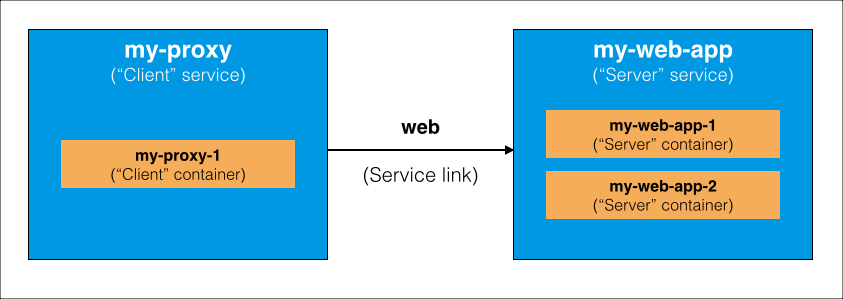

Docker Cloud creates a per-user overlay network which connects all containers
across all of the user's hosts. This network connects all of your containers on
the `10.7.0.0/16` subnet, and gives every container a local IP. This IP persists
on each container even if the container is redeployed and ends up on a different
host. Every container can reach any other container on any port within the
subnet.

Docker Cloud gives your containers two ways find other services:

* Using service and container names directly as **hostnames**

* Using **service links**, which are based on [Docker Compose links](/compose/compose-file/#links)

**Service and Container Hostnames** update automatically when a service scales
up or down or redeploys. As a user, you can configure service names, and Docker
Cloud uses these names to find the IP of the services and containers for you.
You can use hostnames in your code to provide abstraction that allows you to
easily swap service containers or components.

**Service links** create environment variables which allow containers to
communicate with each other within a stack, or with other services outside of a
stack. You can specify service links explicitly when you create a new service
or edit an existing one, or specify them in the stackfile for a service stack.

### Hostnames vs service links

When a service is scaled up, a new hostname is created and automatically
resolves to the new IP of the container, and the parent service hostname record
also updates to include the new container's IP. However, new service link
environment variables are not created, and existing ones are not removed, when a
service scales up or down.

## Using service and container names as hostnames

You can use hostnames to connect any container in your Docker Cloud account to
any other container on your account without having to create service links or
manage environment variables. This is the recommended service discovery method.

Hostnames always resolve to the correct IP for the service or container,
and update as the service scales up, scales down, or redeploys. The Docker
Cloud automatic DNS service resolves the service name to the correct IP on the
overlay network, even if the container has moved or is now on a different host.

### Discovering containers on the same service or stack

A container can always discover other containers on the same stack using just
the **container name** as hostname. This includes containers of the same
service. Similarly, a container can always discover other services on the same
stack using the **service name**.

For example, a container `webapp-1` in the service `webapp` can connect to the
container `db-1` in the service `db` by using `db-1` as the hostname. It can
also connect to a peer container, `webapp-2`, by using `webapp-2` as the
hostname.

A container `proxy-1` on the same stack could discover all `webapp` containers
by using the **service name** `webapp` as hostname. Connecting to the service
name resolves as an `A`
[round-robin](http://en.wikipedia.org/wiki/Round-robin_DNS) record, listing all
IPs of all containers on the service `webapp`.

### Discovering services or containers on another stack

To find a service or a container on another stack, append `.<stack_name>` to the
service or container name. For example, if `webapp-1` on the stack `production`
needs to access container `db-1` on the stack `common`, it could use the
hostname `db-1.common` which Docker Cloud resolves to the appropriate IP.

### Discovering services or containers not included in a stack

To find a container or service that is not included in a stack, use the service
or container name as the hostname.

If the container making the query is part of a stack, and there is a local match
on the same stack, the local match takes precedence over the service or
container that is outside the stack.

> **Tip**: To work around this, you can rename the local match so that it has a
more specific name. You might also put the external service or container in a
dedicated stack so that you can specify the stack name as part of the namespace.

## Using service links for service discovery

Docker Cloud's service linking is modeled on [Docker Compose
links](/compose/compose-file/#links) to provide a basic service discovery
functionality using directional links recorded in environment variables.

When you link a "client" service to a "server" service, Docker Cloud performs
the following actions on the "client" service:

1. Creates a group of environment variables that contain information about the exposed ports of the "server" service, including its IP address, port, and protocol.

2. Copies all of the "server" service environment variables to the "client" service with an `HOSTNAME_ENV_` prefix.

3. Adds a DNS hostname to the Docker Cloud DNS service that resolves to the "server" service IP address.

Some environment variables such as the API endpoint are updated when a service
scales up or down. Service links are only updated when a service is deployed or
redeployed, but are not updated during runtime. No new service link environment
variables are created when a service scales up or down.

>**Tip:** You can specify one of several [container distribution strategies](/docker-cloud/infrastructure/deployment-strategies.md) for
applications deployed to multiple nodes. These strategies enable automatic
deployments of containers to nodes, and sometimes auto-linking of containers.
If a service with
[EVERY_NODE](/docker-cloud/infrastructure/deployment-strategies.md#every-node)
strategy is linked to another service with EVERY_NODE strategy, containers are
linked one-to-one on each node.

### Service link example

For the explanation of service linking, consider the following application
diagram.



Imagine that you are running a web service (`my-web-app`) with 2 containers
(`my-web-app-1` and `my-web-app-2`). You want to add a proxy service
(`my-proxy`) with one container (`my-proxy-1`) to balance HTTP traffic to
each of the containers in your `my-web-app` application, with a link name of
`web`.

### Service link environment variables

Several environment variables are set on each container at startup to provide
link details to other containers. The links created are directional. These are
similar to those used by Docker Compose.

For our example app above, the following environment variables are set in the
proxy containers to provide service links. The example proxy application can use
these environment variables to configure itself on startup, and start balancing
traffic between the two containers of `my-web-app`.

| Name                    | Value                 |
|:------------------------|:----------------------|
| WEB_1_PORT              | `tcp://172.16.0.5:80` |
| WEB_1_PORT_80_TCP       | `tcp://172.16.0.5:80` |
| WEB_1_PORT_80_TCP_ADDR  | `172.16.0.5`          |
| WEB_1_PORT_80_TCP_PORT  | `80`                  |
| WEB_1_PORT_80_TCP_PROTO | `tcp`                 |
| WEB_2_PORT              | `tcp://172.16.0.6:80` |
| WEB_2_PORT_80_TCP       | `tcp://172.16.0.6:80` |
| WEB_2_PORT_80_TCP_ADDR  | `172.16.0.6`          |
| WEB_2_PORT_80_TCP_PORT  | `80`                  |
| WEB_2_PORT_80_TCP_PROTO | `tcp`                 |

To create these service links, you would specify the following in your stackfile:

```yml
my-proxy:
  links:
    - my-web-app:web
```

This example snippet creates a directional link from `my-proxy` to `my-web-app`, and calls that link `web`.

### DNS hostnames vs service links

> **Note**: Hostnames are updated during runtime if the service scales up or down. Environment variables are only set or updated at deploy or redeploy. If your services scale up or down frequently, you should use hostnames rather than service links.

In the example, the `my-proxy` containers can access the service links using following hostnames:

| Hostname | Value                     |
|:---------|:--------------------------|
| `web`    | `172.16.0.5 172.16.0.6`   |
| `web-1`  | `172.16.0.5`              |
| `web-2`  | `172.16.0.6`              |

The best way for the `my-proxy` service to connect to the `my-web-app` service
containers is using the hostnames, because they are updated during runtime if
`my-web-app` scales up or down. If `my-web-app` scales up, the new hostname
`web-3` automatically resolves to the new IP of the container, and the hostname
`web` is updated to include the new IP in its round-robin record.

However, the service link environment variables are not added or updated until
the service is redeployed. If `my-web-app` scales up, no new service link
environment variables (such as `WEB_3_PORT`, `WEB_3_PORT_80_TCP`, etc) are added
to the "client" container. This means the client does not know how to contact
the new "server" container.

### Service environment variables

Environment variables specified in the service definition are instantiated in
each individual container. This ensures that each container has a copy of the
service's defined environment variables, and also allows other connecting
containers to read them.

These environment variables are prefixed with the `HOSTNAME_ENV_` in each
container.

In our example, if we launch our `my-web-app` service with an environment
variable of `WEBROOT=/login`, the following environment variables are set and
available in the proxy containers:

| Name              | Value    |
|:------------------|:---------|
| WEB_1_ENV_WEBROOT | `/login` |
| WEB_2_ENV_WEBROOT | `/login` |

In our example, this enables the "client" service (`my-proxy-1`) to read
configuration information such as usernames and passwords, or simple
configuration, from the "server" service containers (`my-web-app-1` and
`my-web-app-2`).

#### Docker Cloud specific environment variables

In addition to the standard Docker environment variables, Docker Cloud also sets
special environment variables that enable containers to self-configure. These
environment variables are updated on redeploy.

In the example above, the following environment variables are available in the `my-proxy` containers:

| Name                           | Value                                                                                 |
|:-------------------------------|:--------------------------------------------------------------------------------------|
| WEB_DOCKERCLOUD_API_URL        | `https://cloud.docker.com/api/app/v1/service/3b5fbc69-151c-4f08-9164-a4ff988689ff/`   |
| DOCKERCLOUD_SERVICE_API_URI    | `/api/v1/service/651b58c47-479a-4108-b044-aaa274ef6455/`                              |
| DOCKERCLOUD_SERVICE_API_URL    | `https://cloud.docker.com/api/app/v1/service/651b58c47-479a-4108-b044-aaa274ef6455/`  |
| DOCKERCLOUD_CONTAINER_API_URI  | `/api/v1/container/20ae2cff-44c0-4955-8fbe-ac5841d1286f/`                             |
| DOCKERCLOUD_CONTAINER_API_URL  | `https://cloud.docker.com/api/app/v1/container/20ae2cff-44c0-4955-8fbe-ac5841d1286f/` |
| DOCKERCLOUD_NODE_API_URI       | `/api/v1/node/d804d973-c8b8-4f5b-a0a0-558151ffcf02/`                                  |
| DOCKERCLOUD_NODE_API_URL       | `https://cloud.docker.com/api/infra/v1/node/d804d973-c8b8-4f5b-a0a0-558151ffcf02/`    |
| DOCKERCLOUD_CONTAINER_FQDN     | `my-proxy-1.20ae2cff.cont.dockerapp.io`                                               |
| DOCKERCLOUD_CONTAINER_HOSTNAME | `my-proxy-1`                                                                          |
| DOCKERCLOUD_SERVICE_FQDN       | `my-proxy.651b58c47.svc.dockerapp.io`                                                 |
| DOCKERCLOUD_SERVICE_HOSTNAME   | `my-proxy`                                                                            |
| DOCKERCLOUD_NODE_FQDN          | `d804d973-c8b8-4f5b-a0a0-558151ffcf02.node.dockerapp.io`                              |
| DOCKERCLOUD_NODE_HOSTNAME      | `d804d973-c8b8-4f5b-a0a0-558151ffcf02`                                                |

Where:

* `WEB_DOCKERCLOUD_API_URL` is the Docker Cloud API resource URL of the linked service. Because this is a link, the link name is the environment variable prefix.

* `DOCKERCLOUD_SERVICE_API_URI` and `DOCKERCLOUD_SERVICE_API_URL` are the Docker Cloud API resource URI and URL of the service running in the container.

* `DOCKERCLOUD_CONTAINER_API_URI` and `DOCKERCLOUD_CONTAINER_API_URL` are the Docker Cloud API resource URI and URL of the container itself.

* `DOCKERCLOUD_NODE_API_URI` and `DOCKERCLOUD_NODE_API_URL` are the Docker Cloud API resource URI and URL of the node where the container is running.

* `DOCKERCLOUD_CONTAINER_HOSTNAME` and `DOCKERCLOUD_CONTAINER_FQDN` are the external hostname and Fully Qualified Domain Name (FQDN) of the container itself.

* `DOCKERCLOUD_SERVICE_HOSTNAME` and `DOCKERCLOUD_SERVICE_FQDN` are the external hostname and Fully Qualified Domain Name (FQDN) of the service to which the container belongs.

* `DOCKERCLOUD_NODE_HOSTNAME` and `DOCKERCLOUD_NODE_FQDN` are the external hostname and Fully Qualified Domain Name (FQDN) of the node where the container is running.

These environment variables are also copied to linked containers with the `NAME_ENV_` prefix.

If you provide API access to your service, you can use the generated token
(stored in `DOCKERCLOUD_AUTH`) to access these API URLs to gather information or
automate operations, such as scaling.
