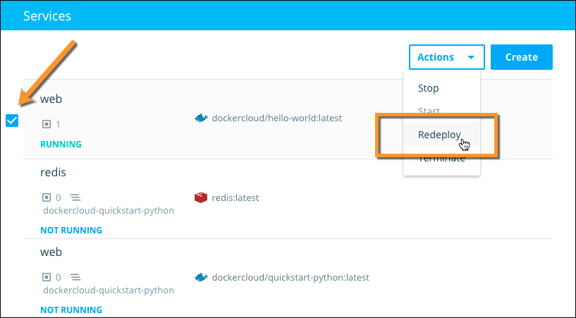

You can **redeploy** services in Docker Cloud while they are running to
regenerate a service's containers. You might do this when a new version of the
image is pushed to the registry, or to apply changes that you made to
the service's settings.

When you redeploy a service, Docker Cloud terminates the current service
containers. It then deploys new containers using the most recent service
definition, including service and deployment tags, deployment strategies, port
mappings, and so on.

> **Note**: Your containers might be redeployed to different nodes during redeployment.

#### Container hostnames

*Container* **hostnames** change on redeployment, and if your service uses
**dynamic published ports**, new ports might be used on redeployment.

Container hostnames appear in the following format:
`servicename-1.new-container-short-uuid.cont.dockerapp.io`

However, containers keep their local IPs after redeployment, even if they end up
in different nodes. This means that linked services do not need to be
redeployed. To learn more, see [Service Links](service-links.md).

#### Service hostnames

*Service* hostnames remain the same after redeployment. Service hostnames are only
available for ports that are bound to a specific port on the host. They are
_not_ available if the port is dynamically allocated.

Service hostnames appear in the following format:
`servicename.service-short-uuid.svc.dockerapp.io`

#### Redeploy with volumes

If your containers use volumes, the new containers can **reuse** the
existing volumes. If you chose to reuse the volumes, the containers redeploy to the same nodes to preserve their links to the volumes.

> **Note**: When you redeploy services with reused volumes, your redeployment can fail if the service's deployment tags no longer allow it to be deployed on the node that the volume resides on. To learn more, see [Deployment Tags](deploy-tags.md).

## Redeploy a service using the web interface

1. Click **Services** in the left menu to view a list of services.
2. Click the checkbox to the left of the service or services you want to redeploy.
2. From the **Actions** menu at the top right, choose **Redeploy**.
    
The service begins redeploying immediately.

<!-- DCUI-732, DCUI-728
3. If the container uses volumes, choose whether to reuse them.
4. Click **OK** on the confirmation dialog to start the redeployment.-->

## Redeploy a service using the API and CLI

See the Docker Cloud [API and CLI documentation](/apidocs/docker-cloud.md#redeploy-a-service) for more information
on using our API and CLI to redeploy services.

## Autoredeploy on image push to Docker Hub

If your service uses an image stored in Docker Hub or Docker Cloud, you can
enable **Autoredeploy** on the service. Autoredeploy triggers a redeployment
whenever a new image is pushed. See the [Autoredeploy documentation](auto-redeploy.md) to learn more.

## Redeploy a service using webhooks

You can also use **triggers** to redeploy a service, for example when its image
is pushed or rebuilt in a third-party registry. See the [Triggers documentation](triggers.md) to learn more.
