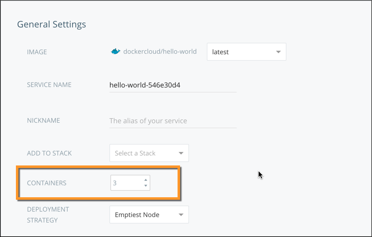
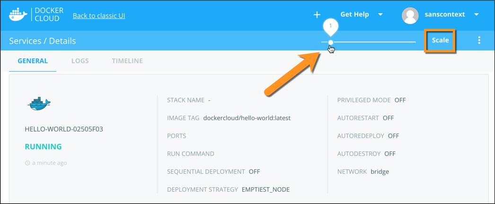
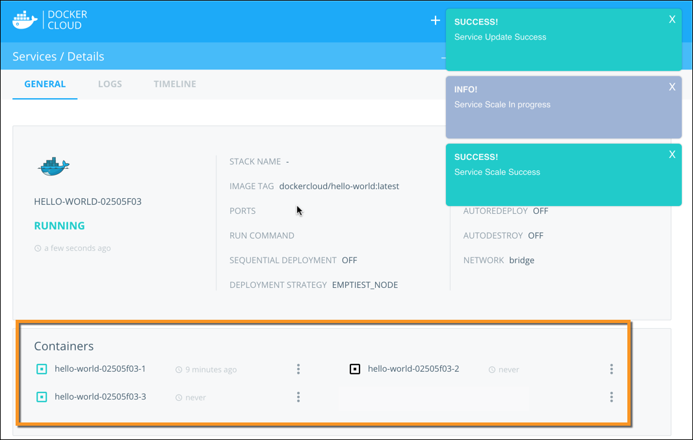
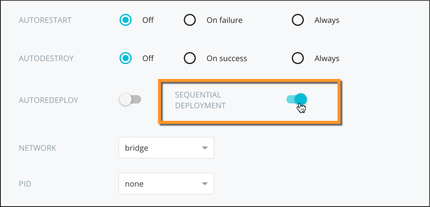

Docker Cloud makes it easy to spawn new containers of your service to handle
additional load. Two modes are available to allow you to scale services with
different configuration requirements.

## Deployment and scaling modes

Any service that handles additional load by increasing the number of containers
of the service is considered "horizontally scalable".

There are two deployment modes when scaling a service:

-   **Parallel mode** (default): all containers of a service are
    deployed at the same time without any links between them. This is
    the fastest way to deploy, and is the default.

-   **Sequential mode**: each new container is deployed in the service one at a
    time. Each container is linked to all previous containers using service
    links. This makes complex configuration possible within the containers
    startup logic. This mode is explained in detail in the following sections.

## When should I use Parallel scaling?

 When the containers in a service work independently of each other and do not
 need to coordinate between themselves, they can be scaled up in parallel mode.

Examples include:

-   Stateless web servers and proxies
-   “Worker” instances that process jobs from a queue
-   “Cron”-style instances that execute periodic tasks

The default scaling mode is parallel, so no additional configuration is
required to use this mode.

## When should I use Sequential scaling?

Some services require coordination between different containers to ensure that
the service functions correctly. Many databases, such as MySQL for example,
require that the containers know about each other at startup time so that
traffic can be routed to them appropriately. When this is the case, you should
use [sequential scaling](service-scaling.md#sequential-deployment-and-scaling).

To allow peer-aware container startup, you can enable sequential scaling mode. See [Sequential Scaling](service-scaling.md#sequential-deployment-and-scaling) for more information.

## Set the initial number of containers

When you configure a service in Docker Cloud, you can specify an initial number of containers for the service before you launch.



Docker Cloud immediately launches as many containers as you specified.

### Set the initial containers using the API

You can specify the initial number of containers for a service when deploying it through the API:

```
POST /api/app/v1/service/ HTTP/1.1
{
	 "target_num_containers": 2,
	 [...]
}
```

If you don’t specify the number of containers to deploy, this command defaults to `1`. See the [API documentation](/apidocs/docker-cloud.md) for more information.

### Set the initial containers using the CLI

You can also specify the initial number of containers for a service when deploying it using the CLI:

```bash
$ docker-cloud service run -t 2 [...]
```

If you don’t specify the number of containers to deploy, the CLI uses the default value of `1`. See the [CLI documentation](/apidocs/docker-cloud.md) for more information.

## Scale an already running service

If you need to scale a service up or down while it is running, you can change the number of containers from the service detail page:



1. Click the slider at the top of the service detail page.
2. Drag the slider to the number of containers you want.
3. Click **Scale**.

    The application starts scaling immediately, whether this means starting new containers, or gracefully shutting down existing ones.



### Scale a running service using the API

You can scale an already running service through the API:

```
PATCH /api/app/v1/service/(uuid)/ HTTP/1.1
{
	 "target_num_containers": 2
}
```
See the [scale a service API documentation](/apidocs/docker-cloud.md#scale-a-service).

### Scale a running service using the CLI

You can also scale an already running service using the CLI:

```bash
$ docker-cloud service scale (uuid or name) 2
```

See the [scale a service CLI documentation](/apidocs/docker-cloud.md#scale-a-service).

## Sequential deployment and scaling

When a service with more than one container is deployed using **sequential deployment** mode, the second and subsequent containers are linked to all the
previous ones using [service links](service-links.md). These links are useful if
your service needs to know about other instances, for example to allow automatic
configuration on startup.

See the [Service links](service-links.md) topic for a list of environment variables that the links create in your containers.

You can set the **Sequential deployment** setting on the **Service configuration** step of the **Launch new service** wizard:



### Set the scaling mode using the API

You can also set the `sequential_deployment` option when deploying an
application through the API:

```
POST /api/app/v1/service/ HTTP/1.1
{
	"sequential_deployment": true,
	[...]
}
```

See [create a new service](/apidocs/docker-cloud.md#create-a-new-service) for
more information.

### Set the scaling mode using the CLI

You can also set the `sequential_deployment` option when deploying an
application through the CLI: 

```bash
$ docker-cloud service run --sequential [...] 
```
