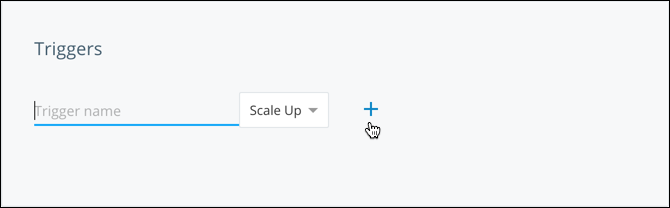
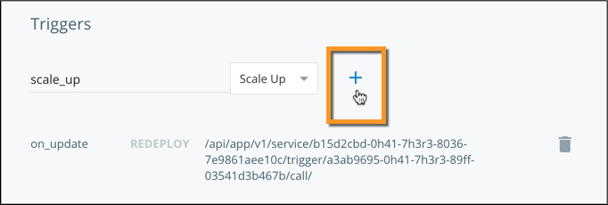
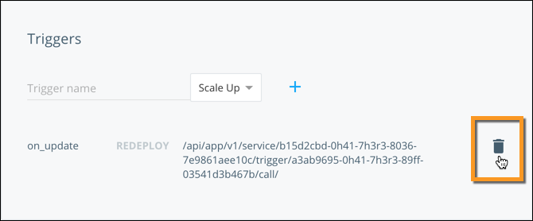

## What are triggers?

**Triggers** are API endpoints that redeploy or scale a specific service
whenever a `POST` HTTP request is sent to them. You can create one or more
triggers per service.

Triggers do not require any authentication. This allows third party services
like Docker Hub to call them, however because of this it is important that you
keep their URLs secret.

The body of the `POST` request is passed in to the new containers as an
environment variable called `DOCKERCLOUD_TRIGGER_BODY`.

### Trigger types

Docker Cloud supports two types of triggers:

* **Redeploy** triggers, which redeploy the service when called
* **Scale up** triggers, which scale the service by one or more containers when called

## Create a trigger

1. Click the name of the service you want to create a trigger for.
2. Go to the detail page and scroll down to the **Triggers** section.

    

3. In the **Trigger name** field, enter a name for the trigger.
4. Select a trigger type.
5. Click the **+** (plus sign) icon.

    

6. Use the POST request URL provided to configure the webhook in your
application or third party service.

## Revoke triggers

To stop a trigger from automatically scaling or redeploying, you must revoke it.

1. Go to the detail page of the service.
2. Scroll down to the **Triggers** section.
3. Click the **trashcan** icon for the trigger you want to revoke.

    

Once the trigger is revoked, it stops accepting requests.

## Use triggers in the API and CLI

See our [API and CLI documentation](/apidocs/docker-cloud.md#triggers) to learn how to use triggers with our API and the CLI.
