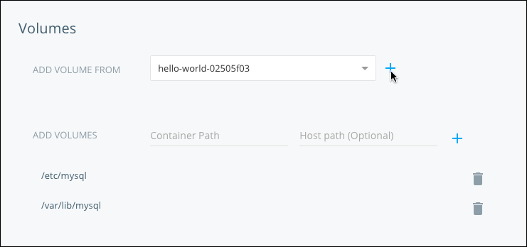
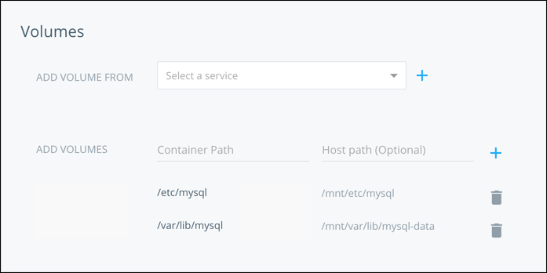

In Docker Cloud, you can define one or more data volumes for a service.
**Volumes** are directories that are stored outside of the container's
filesystem and which hold reusable and shareable data that can persist even when
containers are terminated. This data can be reused by the same service on
redeployment, or shared with other services.

## Add a data volume to a service

Data volumes can be either specified in the image's `Dockerfile` using the
[VOLUME instruction](/engine/reference/builder/#volume), or when
creating a service.

To define a data volume in a service, specify the **container path** where it
should be created in the **Volumes** step of the **Create new service** wizard.
Each container of the service has its own volume. Data volumes are reused
when the service is redeployed (data persists in this case), and deleted if the
service is terminated.



If you don't define a **host path**, Docker Cloud creates a new empty volume.
Otherwise, the specified **host path** is mounted on the **container path**.
When you specify a host path, you can also specify whether to mount the volume
read-only, or read/write.




## Reuse data volumes from another service

You can reuse data volumes from another service. To do this when creating a service, go through the **Create new service**, and continue to the **Volumes** step. From the **Volumes** page, choose a source service from the **Add volumes from** menu.


All reused data volumes are mounted on the same paths as in the source service.
Containers must be on the same host to share volumes, so the containers
of the new service deploy to the same nodes where the source service
containers are deployed.

> **Note**: A service with data volumes cannot be terminated until all services that are using its volumes have also been terminated.

## Back up data volumes

You might find it helpful to download or back up the data from volumes that are attached to running containers.

1. Run an SSH service that mounts the volumes of the service you want to back up.

   In the example snippet below, replace `mysql` with the actual service name.

   ```
   $ docker-cloud service run -n downloader -p 22:2222 -e AUTHORIZED_KEYS="$(cat ~/.ssh/id_rsa.pub)" --volumes-from mysql tutum/ubuntu
   ```

2. Run a `scp` (secure-copy) to download the files to your local machine.

   In the example snippet below, replace `downloader-1.uuid.cont.dockerapp.io` with the container's Fully Qualified Domain Name (FQDN), and replace `/var/lib/mysql` with the path within the container from which you want to download the data. The data is downloaded to the current local folder.

   ```
   $ scp -r -P 2222 root@downloader-1.uuid.cont.dockerapp.io:/var/lib/mysql .
   ```
