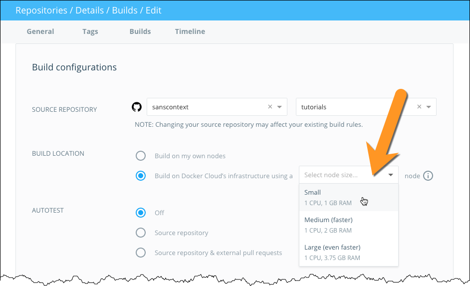
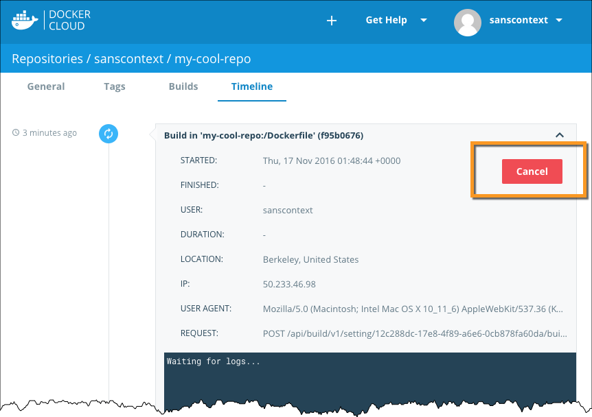

---
aliases:
- /docker-cloud/feature-reference/automated-build/
description: Automated builds
keywords:
- automated, build, images
menu:
  main:
    parent: builds
    weight: -50
title: Automated builds
---

# Automated builds

> **Note**: Docker Cloud's Build functionality is in BETA.

Docker Cloud can automatically build images from source code in an external
repository and automatically push the built image to your Docker
repositories.

When you set up automated builds (also called autobuilds), you create a list of
branches and tags of the images that you want to build. When you push code to a
source code branch (for example in Github) for one of those listed image tags,
the push uses a webhook to trigger a new build, which produces a Docker image.
The built image is then pushed to the Docker Cloud registry or  external
registry.

If you have automated tests configured, these run after building but before
pushing to the registry. You can use these tests to create a continuous
integration workflow. Automated tests do not push images to the registry on
their own. [Learn more about automated image testing here.](automated-testing.md)

You can also just use `docker push` to push pre-built images to these
repositories, even if you have automatic builds set up.

## Configure automated build settings

You can configure your repositories in Docker Cloud so that they automatically
build an image each time you push new code to your source provider. If you have
[automated tests](automated-testing.md) configured, the new image is only pushed
when the tests succeed.

Before you set up automated builds you need to [create a repository](repos.md) to build, and [link to your source code provider](link-source.md).

1. From the **Repositories** section, click into a repository to view its details.

2. Click the **Builds** tab.

3. If you are setting up automated builds for the first time, select
the code repository service where the image's source code is stored.

    Otherwise, if you are editing the build settings for an existing automated
    build, click **Configure automated builds**.

4. Select the **source repository** to build the Docker images from.

    You might need to specify an organization or user from the source code
    provider to find the code repository you want to build.

5. Choose where to run your build processes.

    You can either run the process on your own infrastructure and optionally
    [set up specific nodes to build on](automated-build.md#set-up-builder-nodes), or you can use the
    hosted build service offered on Docker Cloud's infrastructure. If you use
    Docker's infrastructure, select a builder size to run the build process on.
    This hosted build service is free while it is in Beta.

    

6. Optionally, enable [autotests](automated-testing.md#enable-automated-tests-on-a-repository).

8.  In the **Build Rules** section, enter one or more sources to build.

    For each source:

    * Select the **Source type** to build either a **tag** or a
    **branch**. This tells the build system what to look for in the source code
    repository.

    * Enter the name of the **Source** branch or tag you want to build.

        You can enter a name, or use a regex to match which source branch or tag
        names to build. To learn more, see
        [regexes](automated-build.md#regexes-and-automated-builds).

    * Enter the tag to apply to Docker images built from this source.

        If you configured a regex to select the source, you can reference the
        capture groups and use its result as part of the tag. To learn more, see
        [regexes](automated-build.md#regexes-and-automated-builds).

    * Specify the **Dockerfile location** as a path relative to the root of the source code repository. (If the Dockerfile is at the repository root, leave this path set to `/`.)

9. For each branch or tag, enable or disable the **Autobuild** toggle.

    Only branches or tags with autobuild enabled are built, tested, *and* have
    the resulting image pushed to the repository. Branches with autobuild
    disabled will be built for testing purposes if enabled, but not pushed.

10. Click **Save** to save the settings, or click **Save and build** to save and
run an initial test.

    A webhook is automatically added to your source code repository to notify
    Docker Cloud on every push. Only pushes to branches that are listed as the
    source for one or more tags will trigger a build.

### Environment variables for builds

You can set the values for environment variables used in your build processes
when you configure an automated build. Add your build environment variables by
clicking the plus sign next to the **Build environment variables** section, and
then entering a variable name and the value.

When you set variable values from the Docker Cloud UI, they can be used by the
commands you set in `hooks` files, but they are stored so that only users who
have `admin` access to the Docker Cloud repository can see their values. This
means you can use them to safely store access tokens or other information that
should remain secret.

> **Note**: The variables set on the build configuration screen are used during
the build processes _only_ and should not be confused with the environment
values used by your service (for example to create service links).

## Check your active builds

1. To view active builds, go to the repository view and click **Timeline**.

    The Timeline displays the pending, in progress, successful and failed builds
    for any tag of the repository.

2. Click to expand a timeline entry to check the build logs.

You can click the **Cancel** button for pending builds and builds in progress.
If a build fails, the cancel button is replaced by a **Retry** button.

## Disable an automated build

Automated builds are enabled per branch or tag, and can be disabled and
re-enabled easily. You might do this when you want to only build manually for
awhile, for example when you are doing major refactoring in your code. Disabling
autobuilds does not disable [autotests](automated-testing.md).

To disable an automated build:

1. From the **Repositories** page, click into a repository, and click the **Builds** tab.

2. Click **Configure automated builds** to edit the repository's build settings.

3. In the **Build Rules** section, locate the branch or tag you no longer want
to automatically build.

4. Click the **autobuild** toggle next to the configuration line.

    The toggle turns gray when disabled.

5. Click **Save** to save your changes.

## Regexes and automated builds

You can specify a regular expression (regex) so that only matching branches or
tags are built. You can also use the results of the regex to create the Docker
tag that is applied to the built image.

You can use the variable `{sourceref}` to use the branch or tag name that
matched the regex. (The variable includes the whole source name, not just the
portion that matched the regex.) You can also use up to nine regular expression
capture groups (expressions enclosed in parentheses) to select a source to
build, and reference these in the Docker Tag field using `{/1}` through `{/9}`.

**Regex example: build from version number branch and tag with version number**

You might want to automatically build any branches that end with a number
formatted like a version number, and tag their resulting Docker images using a
name that incorporates that branch name.

To do this, specify a `branch` build with the regex `/[0-9.]+$/` in the
**Source** field, and use the formula `version-{sourceref}` in the **Docker
tag** field.

<!-- Not a priority
#### Regex example: build from version number branch and tag with version number

You could also use capture groups to build and label images that come from various sources. For example, you might have

`/(alice|bob)-v([0-9.]+)/` -->

## Build repositories with linked private submodules

Docker Cloud sets up a deploy key in your source code repository that allows it
to clone the repository and build it, however this key only works for a single,
specific code repository. If your source code repository uses private Git
submodules (or requires that you clone other private repositories to build),
Docker Cloud cannot access these additional repos, your build will not complete,
and you'll see an error in your build timeline.

To work around this, you can set up your automated build using the `SSH_PRIVATE` environment variable to override the deployment key and grant Docker Cloud's build system access to the repositories.

> **Note**: If you are using autobuild for teams, use [the process below](automated-build.md#service-users-for-team-autobuilds) instead, and configure a service user for your source code provider. You can also do this for an individual account to limit Docker Cloud's access to your source repositories.

1. Generate a SSH keypair that you will use for builds only, and add the public key to your source code provider account.

    This step is optional, but allows you to revoke the build-only keypair without removing other access. <!-- (TODO: Link to instructions for GH & BB ) -->
2. Copy the private half of the keypair to your clipboard.
3. In Docker Cloud, navigate to the build page for the repository that has linked private submodules. (If necessary, follow the steps [here](automated-build.md#configure-automated-build-settings) to configure the automated build.)
4. At the bottom of the screen, click the plus sign ( **+** ) next to **Build Environment variables**.
5. Enter `SSH_PRIVATE` as the name for the new environment variable.
6. Paste the private half of the keypair into the **Value** field.
7. Click **Save**, or **Save and Build** to validate that the build now completes.

> **Note**: You must configure your private git submodules using git clone over SSH (`git@submodule.tld:some-submodule.git`) rather than HTTPS.

## Autobuild for Teams

When you create an automated build repository in your own account namespace, you can start, cancel, and retry builds, and edit and delete your own repositories.

These same actions are also available for team repositories from Docker Hub if
you are a member of the Organization's `Owners` team. If you are a member of a
team with `write` permissions you can start, cancel and retry builds in your
team's repositories, but you cannot edit the team repository settings or delete
the team repositories. If your user account has `read` permission, or if you're
a member of a team with `read` permission, you can view the build configuration
including any testing settings.

| Action/Permission     | read | write | admin | owner |
| --------------------- | ---- | ----- | ----- | ----- |
| view build details    |  x   |   x   |   x   |   x   |
| start, cancel, retry  |      |   x   |   x   |   x   |
| edit build settings   |      |       |   x   |   x   |
| delete build          |      |       |       |   x   |

### Service users for team autobuilds

> **Note**: Only members of the `Owners` team can set up automated builds for teams.

When you set up automated builds for teams, you grant Docker Cloud access to
your source code repositories using OAuth tied to a specific user account. This
means that Docker Cloud has access to everything that the linked source provider
account can access.

For organizations and teams, we recommend creating a dedicated service account
(or "machine user") to grant access to the source provider. This ensures that no
builds break as individual users' access permissions change, and that an
individual user's personal projects are not exposed to an entire organization.

This service account should have access to any repositories that will be built,
and must have administrative access to the source code repositories so it can
manage deploy keys. If needed, you can limit this account to only a specific
set of repositories required for a specific build.

If you are building repositories with linked private submodules (private
dependencies), you will also need to add an override `SSH_PRIVATE` environment
variable to automated builds associated with the account.

1. Create a service user account on your source provider, and generate SSH keys for it.
2. Create a "build" team in your organization.
3. Ensure that the new "build" team has access to each repository and submodule you'll be building.

    Go to the repository's **Settings** page. On Github, add the new "build" team to the list of **Collaborators and Teams**. On Bitbucket, add the "build" team to the list of approved users on the **Access management** screen.

4. Add the service user to the "build" team on the source provider.

5. Log in to Docker Cloud as a member of the `Owners` team, switch to the organization, and follow the instructions to [link to source code repository](link-source.md) using the service account.

    > **Note**: You may need to log out of your individual account on the source code provider to create the link to the service account.

6. Optionally, use the SSH keys you generated to set up any builds with private submodules, using the service account and [the instructions above](automated-build.md#build-repositories-with-linked-private-submodules).

## What's Next?

### Customize your build process

Additional advanced options are available for customizing your automated builds,
including utility environment variables, hooks, and build phase overrides. To
learn more see [Advanced options for Autobuild and Autotest](advanced.md).

### Set up builder nodes

If you are building on your own infrastructure, you can run the build process on
specific nodes by adding the `builder` label to them. If no builder nodes are
specified, the build containers are deployed using an "emptiest node" strategy.

You can also limit the number of concurrent builds (including `autotest` builds)
on a specific node by using a `builder=n` tag, where the `n` is the number of
builds to allow. For example a node tagged with `builder=5` only allows up to
five concurrent builds or autotest-builds at the same time.

### Autoredeploy services on successful build

You can configure your services to automatically redeploy once the build
succeeds. [Learn more about autoredeploy](../apps/auto-redeploy.md)

### Add automated tests

To test your code before the image is pushed, you can use
Docker Cloud's [Autotest](automated-testing.md) feature which
integrates seamlessly with autobuild and autoredeploy.

> **Note**: While the Autotest feature builds an image for testing purposes, it
does not push the resulting image to Docker Cloud or the external registry.
