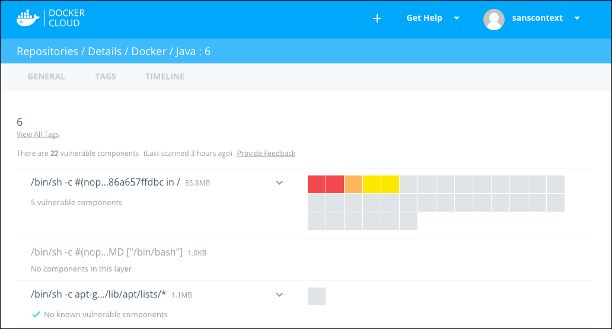
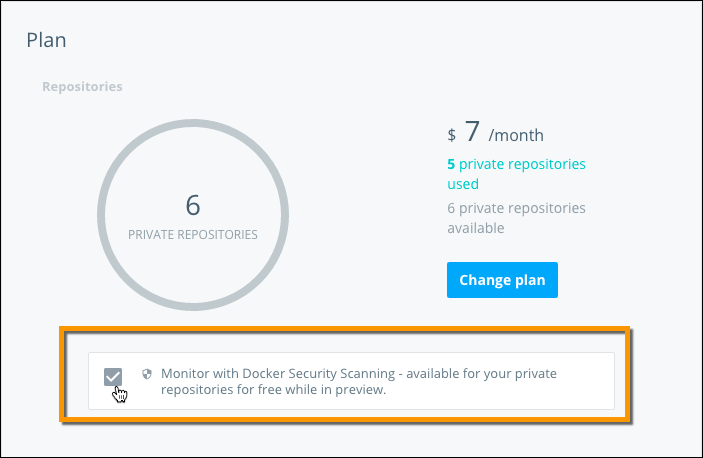
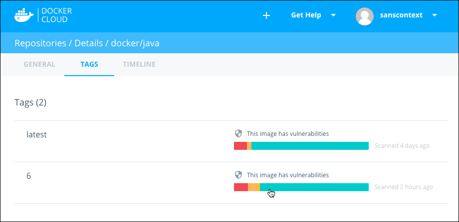
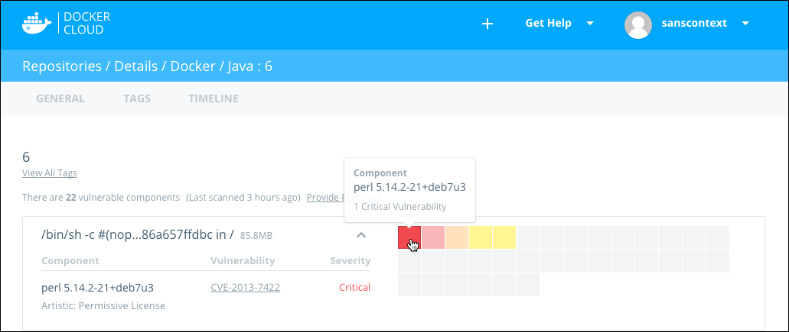
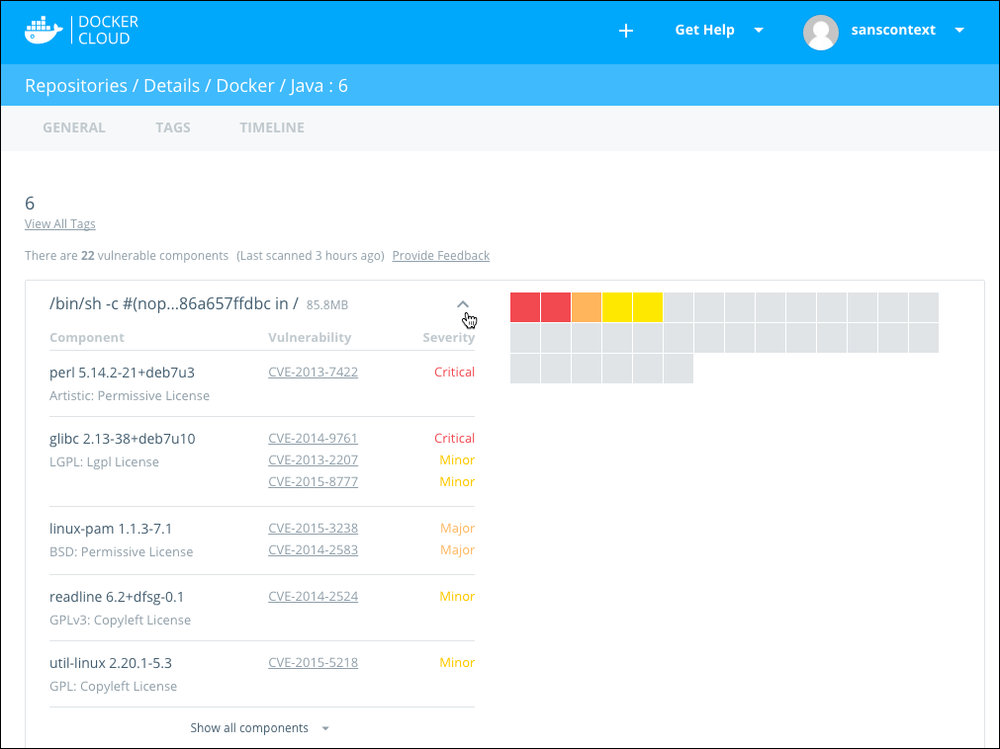

Docker Cloud and Docker Hub can scan images in private repositories to verify
that they are free from known security vulnerabilities or exposures, and report
the results of the scan for each image tag.

> **Note**: Docker Security Scanning uses an older user interface style on Docker Hub, and will look a little different than the images in this document.

Docker Security Scanning is available as an add-on to Docker hosted private
repositories on both Docker Cloud and Docker Hub. The feature is available as a
free preview for private repository subscribers for a limited time. You can
opt-in to begin using the service from the Plan page.

During the free period, Docker Security Scanning scans the three most recently
updated tags in each of your private repositories. You can push an update to an
older tag to trigger a scan. The scan runs on each new image push, and updates
the scan results when new information comes in from the CVE databases.

You can also view scan results for Official Images on Docker Hub if you are logged in.

## Opt in to Docker Security Scanning

> **Note**: Docker Hub can display Security Scan results for organizations and teams, however Security Scanning can only be enabled on Docker Cloud individual accounts at this time.

To opt in:

1. Log in to Docker Cloud or Docker Hub.

2. Go to the **Plan** details for your account

    On Docker Cloud these are located in the **Cloud Settings** in the lower left. On Docker Hub, these are in the **Billing and Plans** tab of the **Settings** menu.

3. Check **Monitor with Docker Security Scanning** to add the service to your plan.

    

The scanning process begins immediately for the three most recent tags in each
of your private repositories. The scan results should be available within 48
hours at most.

## View Docker Security Scanning results

Once you opt-in to the Docker Security Scanning and the scan process completes, you can view the scan results for your private repos.

To view scan results:

1. Log in to Docker Cloud or Docker Hub.

2. Navigate to the repository details page.

3. Click **Tags**.

    The Tag view displays a summarized view of each tag scan, and the age of the scan.

    

    A solid green bar indicates a clean scan without known vulnerabilities.
    Colored stripes in yellow, orange, and red indicate minor, major, critical
    vulnerabilities respectively.

4. Click a scan summary to see more detailed results for the specific tag.

    The scan results show the image's layers, and each layer can have one or more scannable components. Layers with components display them in a grid, with one square representing each component. These squares are color coded to indicate the seriousness of vulnerability.

    Only components that add software are scanned. If a layer has no scannable components, it shows a `No components in this layer` message.

    

    > **Note**: *Base Layers* contain components that are included in the parent image, but that you did not build and that you may not be able to edit. If a Base Layer contains a vulnerability, you should switch to a version of the parent image that does not have any vulnerabilities, or to a similar but more secure image.

5. Click a square in the grid to see the vulnerability report for that specific component.

    

6. Click the arrow icon to expand the list and show all of the vulnerable components and their CVE report codes.

    

7. From here, you can click one of the CVE codes to view the original report about the vulnerability.

> **Note**: You can also see scan results for Docker's Official Images as long as you are logged in to Docker Hub, regardless of if you are a subscriber or not.

### What do I do next?

If you are viewing scan results for an Official Image and you find a
vulnerability, you might want to check if there is an updated version available,
or contact the image's maintainers to ensure that the vulnerability is being
addressed.

When you enable scanning on your images, you can use the information in the
linked CVE reports to decide what to do. You might correct a vulnerability by
using an updated version of the component, or a different component entirely.
When you push an update to the code, the new image push re-triggers the scan.

If the vulnerability is in a `base layer` you might not be able to correct the
issue in the image. In this case, you might switch to a different version of the
base layer, or you might find an equivalent, less vulnerable base layer. You
might also decide that the vulnerability or exposure is acceptable.

## The Docker Security Scan process

Security scanning is enabled on a per-repository basis and is only available for
private repositories. Scans run each time a build pushes a new image to your
private repository. They also run when you add a new image or tag. Most scans
complete within an hour, however large repositories may take up to 24 hours to
scan. The scan traverses each layer of the image, identifies the software
components in each layer, and indexes the SHA of each component.

The scan compares the SHA of each component against the Common Vulnerabilities
and Exposures (CVE®) database. The CVE is a "dictionary" of known information
security vulnerabilities. When the CVE database is updated, the service reviews
the indexed components for any that match the new vulnerability. If the new
vulnerability is detected in an image, the service sends an email alert to the
maintainers of the image.

A single component can contain multiple vulnerabilities or exposures and Docker
Security Scanning reports on each one. You can click an individual vulnerability
report from the scan results and navigate to the specific CVE report data to
learn more about it.

## Frequently Asked Questions

Docker Security Scanning is available as a free preview for private repositories
for a limited time. Security scanning is only available for Docker Official
Images on Docker Hub, and for paid private repositories in Docker Cloud during
this free period.

<b>We invite you to try it out! Send us your feedback through our <a href="https://forums.docker.com/c/docker-cloud/docker-security-scanning" target="_blank" >Docker Product Forums</a>.</b>

#### Will Docker Security Scanning always be available for free?

No. We are making Security Scanning available as a free preview for a limited
time. After that, you'll be able to purchase Security Scanning for your private
repository subscriptions.

#### Can I scan my organization's repositories (public and/or private)?

Yes. You can view scans for your Organization's private repositories on both
Docker Hub and Docker Cloud.

#### Can I scan my public repositories?

Not yet. We’re working to make Docker Security Scanning available to teams and
organizations, as well as public repositories. Stay tuned!

#### Are my repositories automatically scanned on push?

Yes. The images in your repositories are automatically scanned each time a new
image is pushed. When you first sign up for Security Scanning, we scan three most recently pushed tags. We then scan any new image that you push.

#### Are my repositories automatically scanned when new vulnerabilities are discovered?

Docker Security Scanning indexes the components in your image, so we don't need
to re-scan your images when new vulnerabilities are reported. Instead, we match
the components in new CVE reports to what we know is already in your image, and
quickly generate an updated report.

#### What do I do if I think the scan results are incorrect?

If a scan shows a vulnerability that you think is incorrect, if you think a
vulnerability's category is incorrect, or if you believe there is a
vulnerability that has not been detected by the scanning process, contact Docker Support and include the information listed
[here](https://success.docker.com/Cloud/How_to_report_a_false_positive_in_Docker_Security_Scanning).

#### I just pushed to my repository, but the scan results aren't showing up or haven't been updated, why?

Docker Security Scanning generates and indexes a hash of the byte code of each
component in the image. This usually completes quickly, however scanning can
take up for 24 hours, especially if the image is large or contains many smaller
components.

## Related information

* [Learn about CVE and how it compiles data](https://cve.mitre.org/about/index.html).
* [How to create a Docker Official image](/docker-hub/official_repos/)
