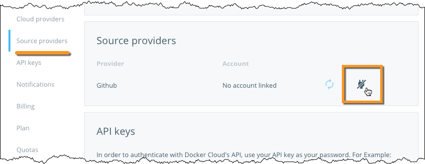
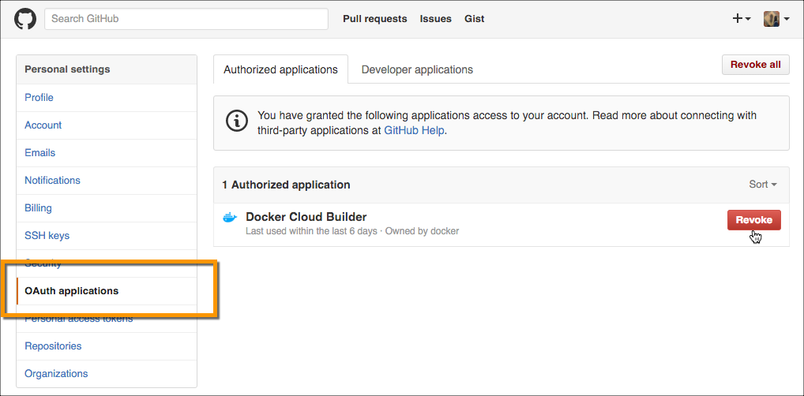
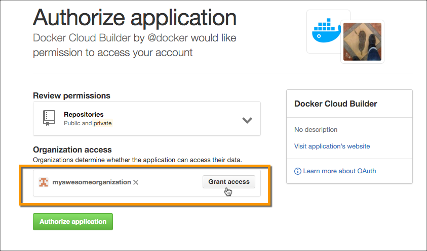
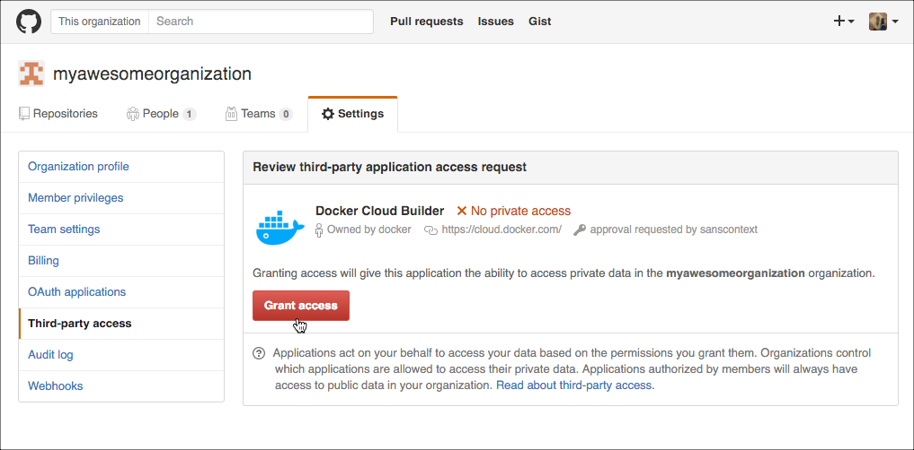
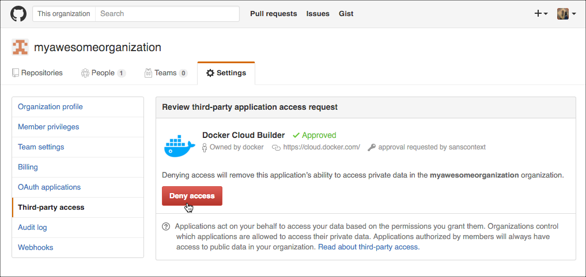

To automate building and testing of your images, you link to your hosted source
code service to Docker Cloud so that it can access your source code
repositories. You can configure this link for user accounts or
organizations.

If you only push pre-built images to Docker Cloud's registry, you do not
need to link your source code provider.

> **Note**: If you are linking a source code provider to create autobuilds for a team, follow the instructions to [create a service account](automated-build.md#service-users-for-team-autobuilds) for the team before linking the account as described below.

## Link to a GitHub user account

1. Click **Cloud settings** in the left navigation bar.

2. Click or scroll down to **Source providers**.

3. Click the plug icon for the source provider you want to link.

    

4. Review the settings for the **Docker Cloud Builder** OAuth application.
    

    >**Note**: If you are the owner of any Github organizations, you might see
    options to grant Docker Cloud access to them from this screen. You can also
    individually edit an organization's Third-party access settings to grant or
    revoke Docker Cloud's access. See [Grant access to a GitHub
    organization](link-source.md#grant-access-to-a-github-organization) to learn more.

5. Click **Authorize application** to save the link.

You are now ready to create a new image!

### Unlink a GitHub user account

To revoke Docker Cloud's access to your GitHub account, you must unlink it both
from Docker Cloud, *and* from your GitHub account.

1. Click **Cloud settings** in the left navigation, and click or scroll to the
**Source providers** section.

2. Click the plug icon next to the source provider you want to remove.

    The icon turns gray and has a slash through it when the account is disabled
    but not revoked. You can use this to _temporarily_ disable a linked source
    code provider account.

4. Go to your GitHub account's **Settings** page.

5. Click **OAuth applications** in the left navigation bar.
    

6. Click **Revoke** next to the Docker Cloud Builder application.

> **Note**: Each repository that is configured as an automated build source
contains a webhook that notifies Docker Cloud of changes in the repository.
This webhook is not automatically removed when you revoke access to a source
code provider.

## Grant access to a GitHub organization

If you are the owner of a Github organization you can grant or revoke Docker
Cloud's access to the organization's repositories. Depending on the GitHub
organization's settings, you may need to be an organization owner.

If the organization has not had specific access granted or revoked before, you
can often grant access at the same time as you link your user account. In this
case, a **Grant access** button appears next to the organization name in the
link accounts screen, as shown below.  If this button does not appear, you must
manually grant the application's access.

To manually grant Docker Cloud access to a GitHub organization:

1. Link your user account using the instructions above.

2. From your GitHub Account settings, locate the **Organization settings**
section at the lower left.

3. Click the organization you want to give Docker Cloud access to.

4. From the Organization Profile menu, click **Third-party access**.

    The page displays a list of third party applications and their access
    status.

5. Click the pencil icon next to Docker Cloud Builder.

6. Click **Grant access** next to the organization.
    

### Revoke access to a GitHub organization

To revoke Docker Cloud's access to an organization's GitHub repositories:

1. From your GitHub Account settings, locate the **Organization settings** section at the lower left.
2. Click the organization you want to revoke Docker Cloud's access to.
3. From the Organization Profile menu, click **Third-party access**.
    The page displays a list of third party applications and their access status.
4. Click the pencil icon next to Docker Cloud Builder.
    
5. On the next page, click **Deny access**.

## Link to a Bitbucket user account

1. Log in to Docker Cloud using your Docker ID.

2. Click the gear icon in the left navigation to go to your **Cloud settings**.

3. Scroll to the **Source providers** section.

4. Click the plug icon for the source provider you want to link.

    

5. If necessary, log in to Bitbucket.

6. On the page that appears, click **Grant access**.

### Unlink a Bitbucket user account

To permanently revoke Docker Cloud's access to your Bitbucket account, you must
unlink it both from Docker Cloud, *and* from your Bitbucket account.

1. From your **Cloud settings** page, click **Source providers**

2. Click the plug icon next to the source provider you want to remove.

    The icon turns gray and has a slash through it when the account is disabled,
    however access may not have been revoked. You can use this to _temporarily_
    disable a linked source code provider account.

4. Go to your Bitbucket account and click the user menu icon in the top right corner.

5. Click **Bitbucket settings**.

6. On the page that appears, click **OAuth**.

7. Click **Revoke** next to the Docker Cloud line.

> **Note**: Each repository that is configured as an automated build source
contains a webhook that notifies Docker Cloud of changes in the repository. This
webhook is not automatically removed when you revoke access to a source code
provider.
