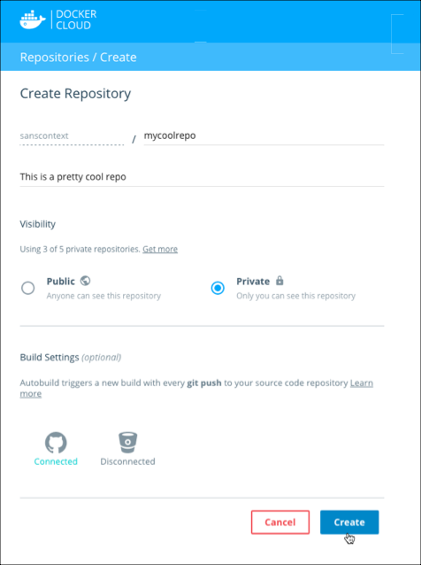
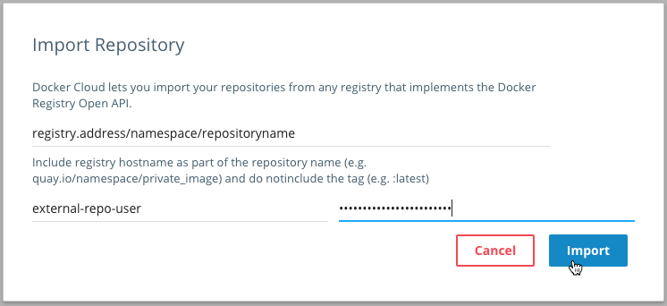

Repositories in Docker Cloud store your Docker images. You can create
repositories and manually [push images](push-images.md) using `docker push`, or
you can link to a source code provider and use [automated builds](automated-build.md) to build the images for you. These repositories
can be either public or private.

Additionally, you can access your Docker Hub repositories and automated builds
from within Docker Cloud.

## Create a new repository in Docker Cloud

To store your images in Docker Cloud, you create a repository. All individual users can create one private repository for free, and can create unlimited public repositories.

1. Click **Repositories** in the left navigation.
2. Click **Create**.
3. Enter a **name** and an optional **description**.
4. Choose a visibility setting for the repository.
5. Optionally, click a linked source code provider to set up automated builds.
    1. Select a namespace from that source code provider.
    2. From that namespace, select a repository to build.
    3. Optionally, expand the build settings section to set up build rules and enable or disable Autobuilds.

    > **Note**: You do not need to set up automated builds right away, and you can change the build settings at any time after the repository is created. If you choose not to enable automated builds, you can still push images to the repository using the `docker` or `docker-cloud` CLI.
6. Click **Create**.

  

### Repositories for Organizations

Only members of an organization's `Owners` team can create new repositories for
the organization. Members of `Owners` can also change the organization's billing
information, and link the organization to a source code provider to set up
automated builds.

A member of the `Owners` team must also set up the repository's access
permissions so that other teams within the organization can use it. To learn
more, see the [organizations and teams documentation](../orgs.md#set-team-permissions).

## Edit an existing repository in Docker Cloud

You can edit your repositories in Docker Cloud to change the description and
build configuration.

From the General page, you can edit the repository's short description, or click to edit the version of the ReadMe displayed on the repository page.

> **Note**: Edits to the Docker Cloud **ReadMe** are not reflected in the source code linked to a repository.

To run a build, or to set up or change automated build settings, click the Builds tab, and click **Configure Automated Builds**. See the documentation on [configuring automated build settings](automated-build.md#configure-automated-build-settings) for more
information.

## Link to a repository from a third party registry

You can link to repositories hosted on a third party registry. This allows you to deploy images from the third party registry to your nodes in Docker Cloud, and also allows you to enable automated builds which push built images back to the registry.

> **Note**: To link to a repository that you want to share with an organization, contact a member of the organization's `Owners` team. Only the Owners team can import new external registry repositories for an organization.

1. Click **Repositories** in the side menu.

2. Click the down arrow menu next to the **Create** button.

3. Select **Import**.

4. Enter the name of the repository that you want to add.

    For example, `registry.com/namespace/reponame` where `registry.com` is the
    hostname of the registry.
    

5. Enter credentials for the registry.

    > **Note**: These credentials must have **push** permission in order to push
    built images back to the repository. If you provide **read-only**
    credentials, you will be able to run automated tests and deploy from the
    repository to your nodes, but you will not be able to push built images to
    it.

6. Click **Import**.

7. Confirm that the repository on the third-party registry now appears in your **Repositories** dropdown list.

## What's next?

Once you create or link to a repository in Docker Cloud, you can set up [automated testing](automated-testing.md) and [automated builds](automated-build.md).
