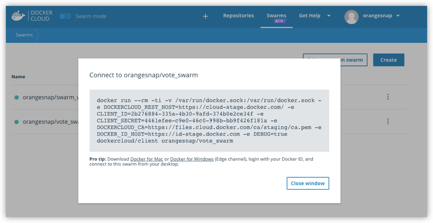
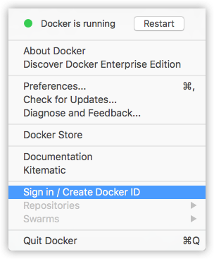
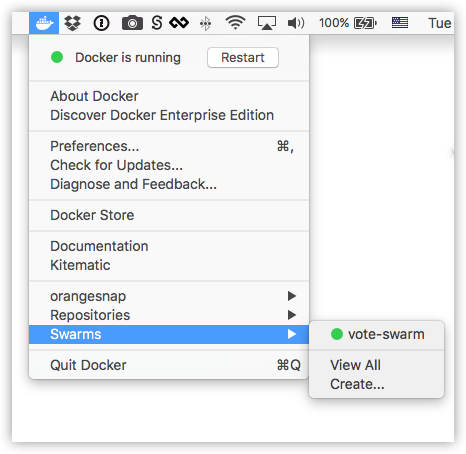

Docker Cloud allows you to connect your local Docker Engine to any swarm you
have access to in Docker Cloud. There are a couple of different ways to do this,
depending on how you are running Docker on your local system:

- [Connect to a swarm with a Docker Cloud generated run command](#connect-to-a-swarm-with-a-docker-cloud-generated-run-command)
- [Use Docker for Mac or Docker for Windows (Edge) to connect to swarms](#use-docker-for-mac-or-windows-edge-to-connect-to-swarms)

## Connect to a swarm with a Docker Cloud generated run command

On platforms other than Docker for Mac or Docker for Windows (Edge channel), you
can connect to a swarm manually at the command line by running a proxy container
in your local Docker instance, which connects to a manager node on the target
swarm.

1.  Log in to Docker Cloud in your web browser.
2.  Click **Swarms** in the top navigation, and click the name of the swarm you want to connect to.
3.  Copy the command provided in the dialog that appears.

    

4.  In a terminal window connected to your local Docker Engine, paste the command, and press **Enter**.

    You are prompted for your Docker ID and password, then the local Docker Engine downloads a containerized Docker Cloud client tool, and connects to the swarm.

    ```
    $ docker run --rm -ti -v /var/run/docker.sock:/var/run/docker.sock -e DOCKER_HOST dockercloud/client orangesnap/vote-swarm
    Use your Docker ID credentials to authenticate:
    Username: orangesnap
    Password:

    => You can now start using the swarm orangesnap/vote-swarm by executing:
    	export DOCKER_HOST=tcp://127.0.0.1:32770
```

5.  To complete the connection process, run the `export DOCKER_HOST` command  as provided in the output of the previous command. This connects your local shell to the client proxy.

    Be sure to include the given client connection port in the URL. For our example, the command is: `export DOCKER_HOST=tcp://127.0.0.1:32770`.

    (If you are connecting to your first swarm, the _command:port_ is likely to be `export DOCKER_HOST=tcp://127.0.0.1:32768`.)

6.  Now, you can run `docker node ls` to verify that the swarm is running.

    Here is an example of `docker node ls` output for a swarm running one manager and two workers on **Amazon Web Services**.

    ```
    $ docker node ls
    ID                            HOSTNAME                                      STATUS              AVAILABILITY        MANAGER STATUS
    dhug6p7arwrm3a9j62zh0a0hf     ip-172-31-23-167.us-west-1.compute.internal   Ready               Active              
    xmbxtffkrzaveqhyuouj0rxso     ip-172-31-4-109.us-west-1.compute.internal    Ready               Active              
    yha4q9bleg80kvbn9tqgxd69g *   ip-172-31-24-61.us-west-1.compute.internal    Ready               Active              Leader
    ```

    Here is an example of `docker node ls` output for a swarm running one manager and two workers on **Microsoft Azure Cloud Services**.

    ```
    $ docker node ls
    ID                            HOSTNAME              STATUS              AVAILABILITY        MANAGER STATUS
    6uotpiv8vyxsjzdtux13nkvj4     swarm-worker000001    Ready               Active               
    qmvk4swo9rdv1viu9t88dw0t3     swarm-worker000000    Ready               Active              
    w7kgzzdkka0k2svssz1dk1fzw *   swarm-manager000000   Ready               Active              Leader
    ```

    From this point on, you can use the
    [CLI commands](/engine/swarm/index.md#swarm-mode-cli-commands)
    to manage your cloud-hosted [swarm mode](/engine/swarm/) just as you
    would a local swarm.

7.  Now that your swarm is set up, try out the example to [deploy a service to the swarm](/engine/swarm/swarm-tutorial/deploy-service/),
and other subsequent tasks in the Swarm getting started tutorial.

### Switch between your swarm and Docker hosts in the same shell

To switch to Docker hosts:

* If you are running Docker for Mac or Docker for Windows, and want to
connect to the Docker Engine for those apps, run `docker-machine env -u`
as a preview, then run the unset command: `eval $(docker-machine env -u)`.
For example:

  ```
  $ docker-machine env -u
  unset DOCKER_TLS_VERIFY
  unset DOCKER_HOST
  unset DOCKER_CERT_PATH
  unset DOCKER_MACHINE_NAME
  # Run this command to configure your shell:
  # eval $(docker-machine env -u)
  ```

* If you are using Docker Machine, and want to switch to one of your local VMs,  be sure to unset `DOCKER_TLS_VERIFY`. Best practice is similar to the previous step.  Run `docker-machine env -u` as a preview, then run the unset command: `eval $(docker-machine env -u)`. Follow this with `docker-machine ls` to view your current machines, then connect to the one you want with `docker-machine env my-local-machine` and run the given `eval` command. For example:

  ```
  $ docker-machine env my-local-machine
  export DOCKER_TLS_VERIFY="1"
  export DOCKER_HOST="tcp://192.168.99.100:2376"
  export DOCKER_CERT_PATH="/Users/victoriabialas/.docker/machine/machines/my-local-machine"
  export DOCKER_MACHINE_NAME="my-local-machine"
  # Run this command to configure your shell:
  # eval $(docker-machine env my-local-machine)
  ```

To switch back to the deployed swarm, re-run the `export DOCKER_HOST` command with the  connection port for the swarm you want to work with. (For example, `export DOCKER_HOST=tcp://127.0.0.1:32770`)

To learn more, see [Unset environment variables in the current shell](/machine/get-started/#unset-environment-variables-in-the-current-shell).

## Use Docker for Mac or Windows (Edge) to connect to swarms

On Docker for Mac and Docker for Windows current Edge releases,
you can access your Docker Cloud account and connect directly to your swarms through those Docker desktop application menus.

* See [Docker Cloud (Edge feature) in Docker for Mac topics](/docker-for-mac/#docker-cloud-edge-feature)

* See [Docker Cloud (Edge feature) in Docker for Windows topics](/docker-for-windows/#docker-cloud-edge-feature)

> **Tip**: This is different from using Docker for Mac or Windows with
Docker Machine as described in previous examples. Here, we are
by-passing Docker Machine, and using the desktop Moby VM directly, so
there is no need to manually set shell environment variables.

This works the same way on both Docker for Mac and Docker for Windows.

Here is an example, showing the Docker for Mac UI.

1.  Make sure you are logged in to your Docker Cloud account on the desktop app.

    

2.  Choose the swarm you want from the menu.

    

3.  A new terminal window opens and connects to the swarm you chose. The swarm name is shown at the prompt. For this example, we connected to `vote-swarm`.

    ```shell
    [vote-swarm] ~
    ```  

4.  Now, you can run `docker node ls` to verify that the swarm is running.

    ```shell
    [vote-swarm] ~ $ docker node ls
    ID                            HOSTNAME                                      STATUS              AVAILABILITY        MANAGER STATUS
    7ex8inrg8xzgonaunwp35zxfl     ip-172-31-6-204.us-west-1.compute.internal    Ready               Active              
    ec3kxibdxqhgw5aele7x853er *   ip-172-31-0-178.us-west-1.compute.internal    Ready               Active              Leader
    z4ngrierv27wdm6oy0z3t9r1z     ip-172-31-31-240.us-west-1.compute.internal   Ready               Active              
    ```  

## Reconnect a swarm

If you accidentally unregister a swarm from Docker Cloud, or decide that you
want to re-register the swarm after it has been removed, you can
[re-register it](register-swarms.md#register-a-swarm) using the same
process as a normal registration. If the swarm is registered to
an organization, its access permissions were deleted when it was
unregistered, and must be recreated.

> **Note**: You cannot register a new or different swarm under the name of a
swarm that was unregistered. To re-register a swarm, it must have the same swarm
ID as it did when previously registered.

## Where to go next

Learn how to [create a new swarm in Docker Cloud](create-cloud-swarm.md).
