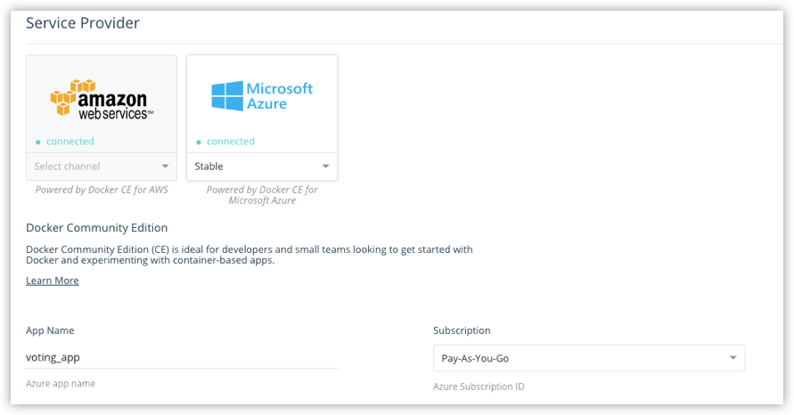
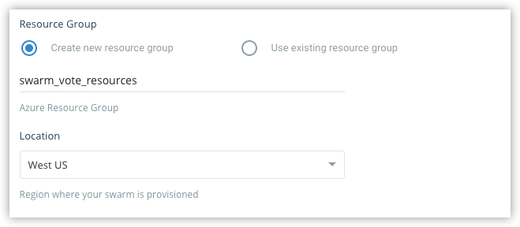
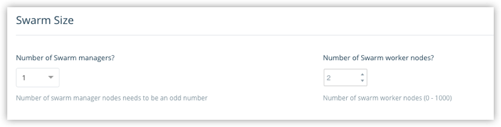
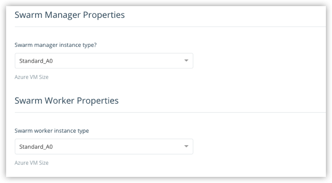
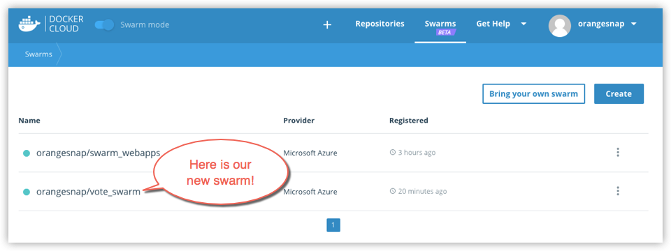

{:target="_blank" class="_"}



## Link Docker Cloud to your service provider

To create a swarm, you need to give Docker Cloud permission to deploy swarm
nodes on your behalf in your cloud services provider account.

If you haven't yet linked Docker Cloud to Azure, follow the steps in [Link Microsoft Azure Cloud Services to Docker Cloud](link-azure-swarm/). Once it's
linked, it shows up on the **Swarms -> Create** page as a connected service
provider.

> **Note:** If you are using a Microsoft Azure Visual Studio MSDN
subscription, you need to enable _programmatic deployments_ on the Docker CE
VM Azure Marketplace item. See the Microsoft Azure blog post on [Working with
Marketplace Images on Azure Resource
Manager](https://azure.microsoft.com/en-us/blog/working-with-marketplace-images-on-azure-resource-manager/){: target="_blank" class="_"} for instructions on how to do this.

## Create a swarm

1.  If necessary, log in to Docker Cloud and switch to Swarm Mode

2.  Click **Swarms** in the top navigation, then click **Create**.

    Alternatively, you can select **+ -> Swarm** from the top navigation to
    get to the same page.

3.  Enter a name for the new swarm.

    Your Docker ID is pre-populated. In the example, our swarm name
    is "vote_swarm".

    

    >**Tip:** Use all lower case letters for swarm names. No spaces, capitalized letters, or special characters other than `.`, `_`, or `-` are allowed.

4.  Select Microsoft Azure as the service provider, select a channel (`Stable` or `Edge`) from the drop-down menu, provide an App name, and select the Azure
Subscription you want to use.

    You can learn more about **stable** and **edge** channels in the [Install Docker overview](install/) and the [Docker CE Edge](/edge/) topics.

    In this example, we use the `Stable` channel, our app name is "voting_app" and we've selected a Pay-As-You-Go subscription.

    

5.  Make sure that **Create new resource group** is selected, provide a name for the group, and select a location from the drop-down menu.

    Our example app is called `swarm_vote_resources`, and it is located in West US.

    

    >**Tip:** Be sure to create a new resource group for a swarm. If you choose to use an existing group, the swarm fails as Azure does not currently support this.

6.  Choose how many swarm managers and worker nodes to deploy.

    Here, we create one manager and two worker nodes. (This maps nicely to the [Swarm tutorial setup](/engine/swarm/swarm-tutorial/index.md) and the [voting app sample in Docker Labs](https://github.com/docker/labs/blob/master/beginner/chapters/votingapp.md).)

    

8.  Configure swarm properties, SSH key and resource cleanup.

    Copy-paste the public [SSH key](ssh-key-setup.md) you want to use to connect to the nodes. (Provide the one for which you have the private key locally.)

    

    * To list existing SSH keys: `ls -al ~/.ssh`

    * To copy the public SSH key to your clipboard: `pbcopy < ~/.ssh/id_rsa.pub`

    Choose whether to provide daily resource cleanup. (Enabling this
    option helps avoid charges for resources that you are no longer
    using.)

7.  Select the machine sizes for the managers, and for the workers.

    

    The larger your swarm, the larger the machine size you should use.
    To learn more about resource setup, see [configuration options](/docker-for-azure/index.md#configuration) in the Docker
    for Azure topics.

    You can find Microsoft Azure Linux Virtual Machine pricing and options  [here](https://azure.microsoft.com/en-us/pricing/details/virtual-machines/linux/).

9.  Click **Create**.

    Docker for Azure bootstraps all of the recommended infrastructure to start
    using Docker on Azure automatically. You don’t need to worry about rolling
    your own instances, security groups, or load balancers when using Docker for
    Azure. (To learn more, see [Why Docker for Azure](/docker-for-azure/why.md).)

    This takes a few minutes. When the swarm is ready, its indicator on the Swarms page shows steady green.

    

    > **Note**: At this time, you cannot add nodes to a swarm from
    within Docker Cloud. To add new nodes to an existing swarm,
    log in to your Azure account, and add nodes manually. (You can
    unregister or dissolve swarms directly from Docker Cloud.)

## Where to go next

Learn how to [connect to a swarm through Docker Cloud](connect-to-swarm.md).

Learn how to [register existing swarms](register-swarms.md).

You can get an overivew of topics on [swarms in Docker Cloud](index.md).

To find out more about Docker swarm in general, see the Docker engine
[Swarm Mode overview](/engine/swarm/).
