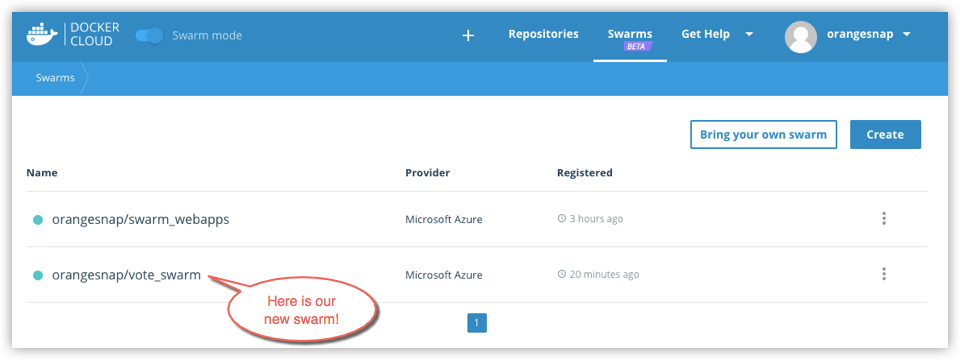



## Link Docker Cloud to your service provider

To create a swarm, you need to give Docker Cloud permission to deploy swarm
nodes on your behalf in your cloud services provider account.

If you haven't yet linked Docker Cloud to Azure, follow the steps in [Link Microsoft Azure Cloud Services to Docker Cloud](link-azure-swarm/). Once it's
linked, it will show up on the **Swarms -> Create** page as a connected service
provider.

## Create a swarm

1.  If necessary, log in to Docker Cloud and switch to Swarm Mode

2.  Click **Swarms** in the top navigation, then click **Create**.

    Alternatively, you can select **+ -> Swarm** from the top navigation to get to the same page.

3.  Enter a name for the new swarm.

    Your Docker ID is pre-populated. In the example, our swarm name is "vote_swarm".

    

    >**Tip:** Use all lower case letters for swarm names. No spaces, capitalized letters, or special characters other than `.`, `_`, or `-` are allowed.

4.  Select Microsoft Azure as the service provider, provide Docker Azure CE as the App name, and select your Azure subscription from the drop-down menu.

    In this example, our app name is "voting_app" and we use a Pay-As-You-Go subscription.

    

5.  Make sure that **Create new resource group** is selected, provide a name for the group, and select a location from the drop-down menu.

    We'll call our example app "swarm_vote_resources", and choose a location in West US.

    

    >**Tip:** Be sure to create a new resource group for a swarm. If you choose to use an existing group, the swarm will fail as Azure does not currently support this.

6.  Choose how many swarm managers and worker nodes to deploy.

    Here, we create one manager and two worker nodes. (This maps nicely to the [Swarm tutorial setup](/engine/swarm/swarm-tutorial/index.md) and the [voting app sample in Docker Labs](https://github.com/docker/labs/blob/master/beginner/chapters/votingapp.md).)

    

8.  Configure swarm properties, SSH key and resource cleanup.

    Copy-paste the public [SSH key](ssh-key-setup.md) you want to use to connect to the nodes. (Provide the one for which you have the private key locally.)

    

    * To list existing SSH keys: `$ ls -al ~/.ssh`

    * To copy the public SSH key to your clipboard: `$ pbcopy < ~/.ssh/id_rsa.pub`

    Chose whether to provide daily resource cleanup.

    RYAN, ALBERTO: Can you provide more detail here on what cleanup does and pros and cons of having this on/off?

7.  Select the machine sizes for the managers, and for the workers.

    

    RYAN, ALBERTO: Should we add more detail on machine sizes?

9.  Click **Create**.

    Docker for Azure bootstraps all of the recommended infrastructure to start
    using Docker on Azure automatically. You don’t need to worry about rolling
    your own instances, security groups, or load balancers when using Docker for
    Azure. (To learn more, see [Why Docker for Azure](/docker-for-azure/why.md).)

    This will take a few minutes. When the swarm is ready, its indicator on the Swarms page will show steady green.

    

> **Note**: At this time, you cannot add or remove nodes from a swarm from within Docker Cloud. To add new nodes or remove nodes from an existing swarm,
log in to your Azure account, and add or delete nodes manually. (You can
unregister or dissolve swarms directly from Docker Cloud.)

## Where to go next

Learn how to [connect to a swarm through Docker Cloud](connect-to-swarm.md).

Learn how to [register existing swarms](register-swarms.md).

You can get an overivew of topics on [swarms in Docker Cloud](index.md).

To find out more about Docker swarm in general, see the Docker engine
[Swarm Mode overview](/engine/swarm/).
