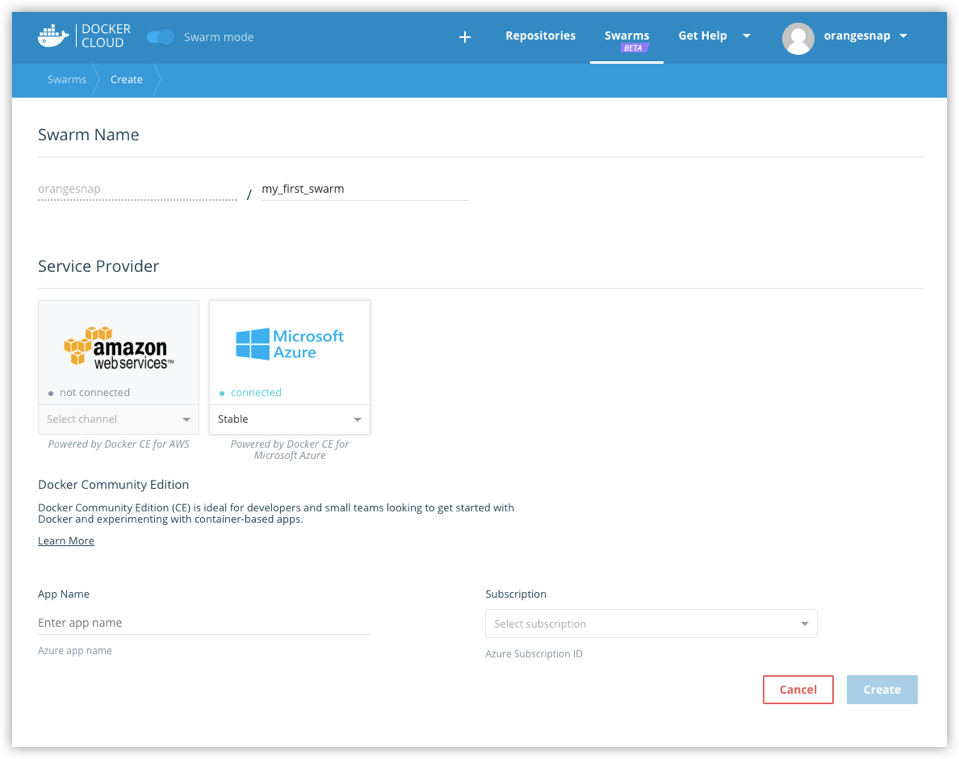



## Link Docker Cloud to your service provider

To create a swarm, you need to give Docker Cloud permission to deploy swarm
nodes on your behalf in your cloud services provider account.

If you haven't yet linked Docker Cloud to Azure, follow the steps in [Link Microsoft Azure Cloud Services to Docker Cloud](link-azure-swarm/). Once it's
linked, it will show up on the **Swarms -> Create** page as a connected service
provider.

## Create a swarm

1. If necessary, log in to Docker Cloud and switch to Swarm Mode

2. Click **Swarms** in the top navigation, then click **Create**.

    Alternatively, you can select **+ -> Swarm** from the top navigation to get to the same page.

3. Enter a name for the new swarm.

    >**Tip:** Use all lower case letters for swarm names. No spaces, capitalized letters, or special characters other than `.`, `_`, or `-` are allowed.

4. Select Microsoft Azure as the service provider, provide Docker Azure CE as the App name, and select your Azure subscription from the drop-down

    

    RYAN, ALBERTO: Need help here ^^ with screen snaps and proper instructions. (I don't have CE subscription enabled in Azure yet, and am not sure what to provide as "App name")

6. Choose how many swarm managers and swarm worker nodes to deploy.

TBD, RYAN, ALBERTO: More images and/or different Azure specific steps?

7. Select the machine sizes for the managers, and for the workers.

TBD, RYAN, ALBERTO: More images and/or different Azure specific steps?

8. Copy-paste the public SSH key you want to use to connect to the nodes.

    Provide the one for which you have the private key locally.

    >**Tip:** If you already have an SSH key, see instructions for how to [copy the key to your clipboard](ssh-key-setup.md#copy-your-public-key-for-use-with-docker-cloud). If you haven't yet identified an existing SSH key to use or created one, see [Set up SSH keys](ssh-key-setup.md).

9. Click **Create**.

Docker Cloud connects to your Microsoft Azure account, deploys Docker for Azure virtual machines, forms a Swarm, and joins the nodes to it.

> **Note**: At this time, you cannot dissolve swarms or delete swarm nodes from within Docker Cloud - you can only unregister the swarm from the Docker Cloud UI. To delete the swarm and its members, log in to your AWS account and delete them manually.

## Where to go next

Learn how to [connect to a swarm through Docker Cloud](connect-to-swarm.md).

Learn how to [register existing swarms](register-swarms.md).

You can get an overivew of topics on [swarms in Docker Cloud](index.md).

To find out more about Docker swarm in general, see the Docker engine
[Swarm Mode overview](/engine/swarm/).
