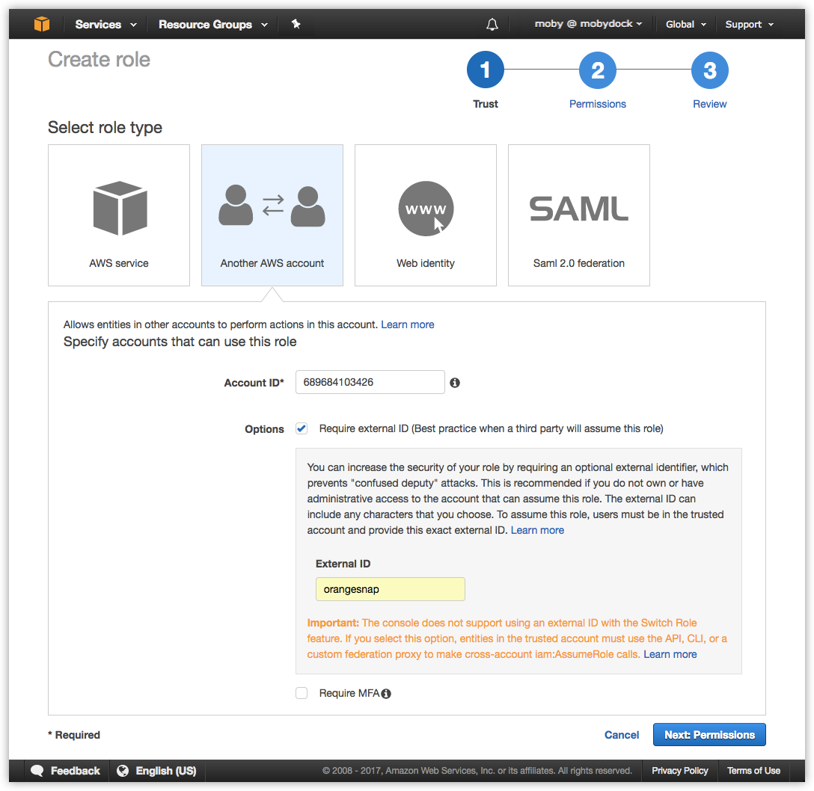
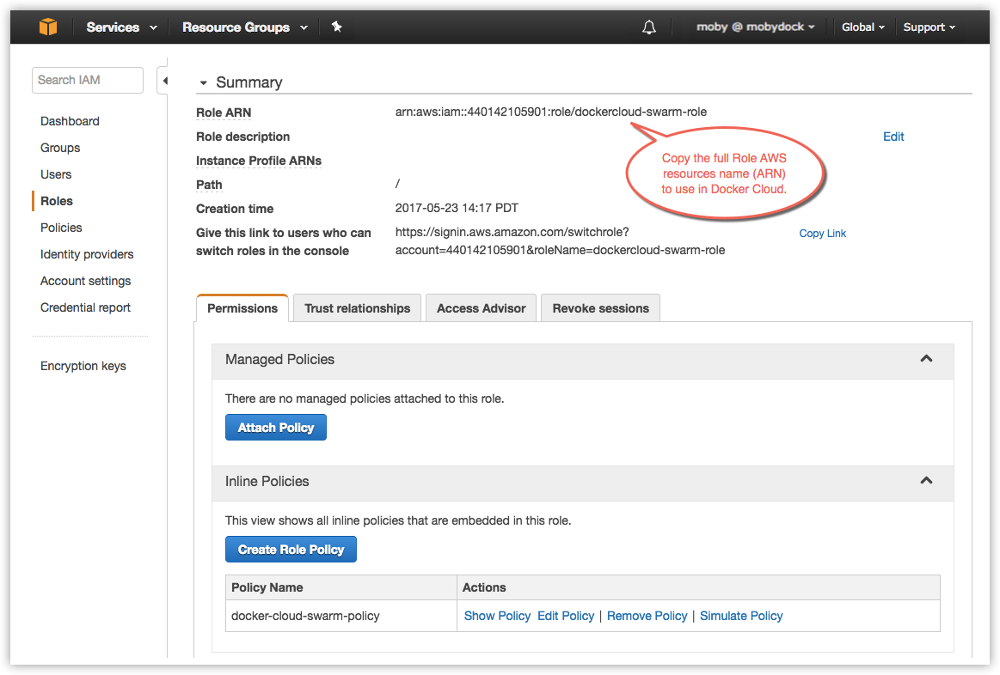
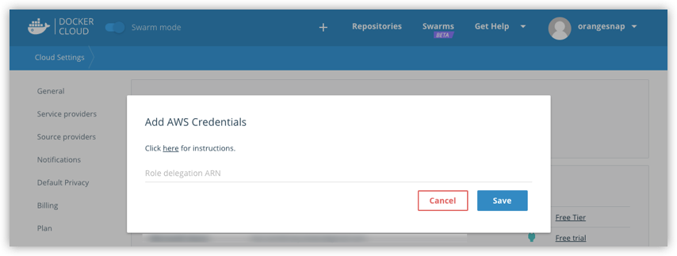

You can create a role with AWS IAM (Identity and Access Management) so that
Docker Cloud can provision and manage swarms on your behalf.

> **Note**: Your AWS account must support EC2-VPC in order to deploy swarms, and
you must also have an [SSH key in each AWS region](https://docs.aws.amazon.com/AWSEC2/latest/UserGuide/ec2-key-pairs.html)
you will deploy swarms in.

If you used Docker Cloud with AWS to deploy classic Node Clusters, you can add
the new policy to your existing role by following the instructions
[below](#attach-a-policy-for-legacy-aws-links).

## Create a dockercloud-swarm-role role with an embedded policy

1.  Go to the AWS IAM Role creation panel at  <a href="https://console.aws.amazon.com/iam/home#roles">https://console.aws.amazon.com/iam/home#roles</a>. Click **Create new role**.

2.  Select **Role for cross-account access**, and in the submenu that opens select **Provide access between your AWS account and a 3rd party AWS account**.

  

3.  In the **Account ID** field, enter the ID for the Docker Cloud service: `689684103426`.

4.  In the **External ID** field, enter the namespace you will be linking.

    This will either be your Docker Cloud username, or if you are using Organizations in Docker Cloud, the organization name.
    Failure to use the correct name will result in the following error message: `Invalid AWS credentials or insufficient EC2 permissions` when attempting to link your Docker account to your AWS account.

5.  Leave **Require MFA** unchecked. Click **Next Step**.

6.  On the next screen, do not select a policy. Click **Next Step**.

    You will add the policy in a later step.

7.  Give the new role a name, such as `dockercloud-swarm-role`.

    > **Note**: You must use one role per Docker Cloud account namespace, so if
    you will be using a single AWS account for multiple Docker Cloud accounts,
    you should add an identifying namespace to the end of the name. For example,
    you might have `dockercloud-swarm-role-moby` and
    `dockercloud-swarm-role-teamawesome`.

8.  Click **Create Role**.

    AWS IAM creates the new role and returns you to the **Roles** list.

9.  Click the name of the role you just created to view its details.

10. On the **Permissions** tab, click the carat icon next to **Inline Policies** to expand the section.

11. In the **Inline Policies** section, click the link to create a policy.

12. On the next page, click **Custom Policy** and click **Select**.

13. On the **Policy Editor** page that appears, give the policy a name like `dockercloud-swarm-policy`.

14. In the **Policy Document** section, copy and paste the policy document found in the [Docker for AWS page](/docker-for-aws/iam-permissions/).

15. Click **Apply Policy**.

16. Back on the role view, click into the new role to view details, and copy the full **Role ARN** string.

    The ARN string should look something like `arn:aws:iam::123456789123:role/dockercloud-swarm-role`. You'll use the ARN in the next step.

    

## Attach a policy for legacy AWS links

If you already have your AWS account connected to Docker Cloud and used the
legacy node cluster functionality you will need to create and attach a new
policy, and re-link your account.

1.  Go to the AWS IAM Roles list at  <a href="https://console.aws.amazon.com/iam/home#roles">https://console.aws.amazon.com/iam/home#roles</a>.

2.  Click your existing version of the `dockercloud-role`.

3.  On the **Permissions** tab, click the carat icon next to **Inline Policies** to expand the section.

4.  Click the link in the **Inline Policies** section to create a policy.

5.  On the next page, click **Custom Policy** and click **Select**.

6.  On the **Policy Editor** page that appears, give the policy a name like `dockercloud-swarm-policy`.

7.  In the **Policy Document** section, copy and paste the policy document found in the [Docker for AWS page](/docker-for-aws/iam-permissions/).

8.  Click **Validate Policy**.

9.  If the validation succeeds, click **Apply Policy**.

10.  Select and copy the **Role ARN** on the role screen.
    It shouldn't have changed, but you'll use it to re-link your account.

Because you edited the role's permissions, you need to re-link to your account.
Back in Docker Cloud, click the account menu and select **Cloud Settings**, and
in the **Service providers** section, click the green plug icon to _unlink_ your
AWS account.

Then, follow the instructions below to re-link your account.

## Add your AWS account credentials to Docker Cloud

Once you've created the a `dockercloud-swarm-policy`, added the
`dockercloud-swarm-role` inline, and have the role's Role ARN, go back to Docker
Cloud to connect the account.

1.  In Docker Cloud, click the account menu at the upper right and select **Cloud settings**.
2.  In the **Service providers** section, click the plug icon next to Amazon Web Services.

    

3.  Enter the full `Role ARN` for the role you just created.
4.  Click **Save**.

    

You are now ready to deploy a swarm!

## Where to go next

**Ready to create swarms on AWS?** See [Create a new swarm on Amazon Web Services in Docker Cloud](create-cloud-swarm-aws.md).

You can get an overivew of topics on [swarms in Docker Cloud](index.md).
