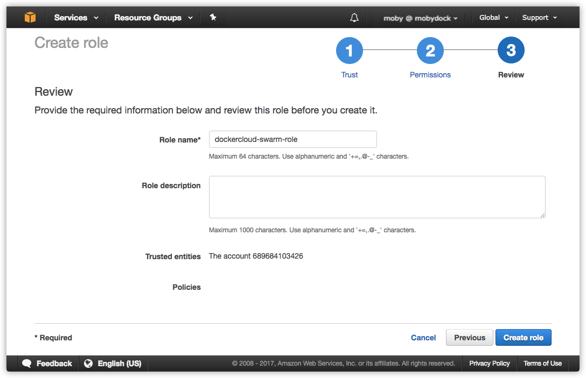
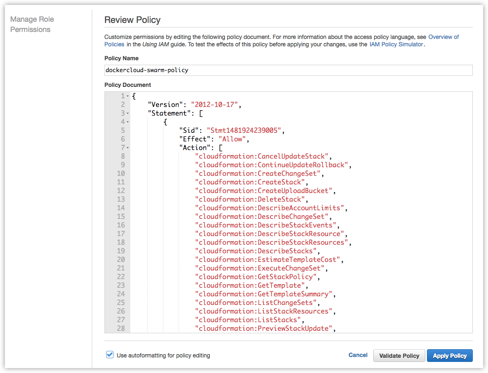

You can create a role with AWS IAM (Identity and Access Management) so that
Docker Cloud can provision and manage swarms on your behalf.

> **Note**: Your AWS account must support EC2-VPC to deploy swarms, and
you must also have an [SSH key in each AWS region](https://docs.aws.amazon.com/AWSEC2/latest/UserGuide/ec2-key-pairs.html)
you deploy swarms in.

If you used Docker Cloud with AWS to deploy classic Node Clusters, you can add
the new policy to your existing role by following the instructions
[below](#attach-a-policy-for-legacy-aws-links).

## Create a dockercloud-swarm-role role with an embedded policy

1.  Go to the AWS IAM Role creation panel at  <a href="https://console.aws.amazon.com/iam/home#roles">https://console.aws.amazon.com/iam/home#roles</a>. Click **Create role**.

2.  Select **Another AWS account** to allow your Docker Cloud account to perform actions in this AWS account.

    

3.  In the **Account ID** field, enter the ID for the Docker Cloud service: `689684103426`.

4. Select **Require external ID (Best practice when a third party will assume this role)**.

    * In the **External ID** field, enter the namespace
    to link.

      This is either your Docker Cloud username,
      or if you are using Organizations in Docker Cloud,
      the organization name. Failure to use the correct
      name results in the following error
      message: `Invalid AWS credentials or insufficient
      EC2 permissions` when attempting to link your
      Docker account to your AWS account.

    * Leave **Require MFA** unchecked.

    Click **Next: Permissions**.

5.  On the next screen, do not select a policy (you add the policy in a later step).

    Click **Next: Review**.

    

6.  Give the new role a name, such as `dockercloud-swarm-role`.

    > **Note**: You must use one role per Docker Cloud account
    namespace, so if you use a single AWS account for
    multiple Docker Cloud accounts, you should add an
    identifying namespace to the end of the name. For example,
    you might have `dockercloud-swarm-role-moby` and
    `dockercloud-swarm-role-teamawesome`.

7.  Click **Create Role**.

    AWS IAM creates the new role and returns you to the **Roles** list.

8.  Click the name of the role you just created to view its details.

9.  On the **Permissions** tab, click **+ Add an inline policy**.

11. Choose the **JSON** tab.

12. Copy and paste the following policy document:

    
    ```none
    {
        "Version": "2012-10-17",
        "Statement": [
            {
                "Sid": "Stmt1481924239005",
                "Effect": "Allow",
                "Action": [
                    "cloudformation:CancelUpdateStack",
                    "cloudformation:ContinueUpdateRollback",
                    "cloudformation:CreateChangeSet",
                    "cloudformation:CreateStack",
                    "cloudformation:CreateUploadBucket",
                    "cloudformation:DeleteStack",
                    "cloudformation:DescribeAccountLimits",
                    "cloudformation:DescribeChangeSet",
                    "cloudformation:DescribeStackEvents",
                    "cloudformation:DescribeStackResource",
                    "cloudformation:DescribeStackResources",
                    "cloudformation:DescribeStacks",
                    "cloudformation:EstimateTemplateCost",
                    "cloudformation:ExecuteChangeSet",
                    "cloudformation:GetStackPolicy",
                    "cloudformation:GetTemplate",
                    "cloudformation:GetTemplateSummary",
                    "cloudformation:ListChangeSets",
                    "cloudformation:ListStackResources",
                    "cloudformation:ListStacks",
                    "cloudformation:PreviewStackUpdate",
                    "cloudformation:SetStackPolicy",
                    "cloudformation:SignalResource",
                    "cloudformation:UpdateStack",
                    "cloudformation:ValidateTemplate"
                ],
                "Resource": [
                    "*"
                ]
            },
            {
                "Sid": "Stmt1481924344000",
                "Effect": "Allow",
                "Action": [
                    "ec2:AllocateHosts",
                    "ec2:AssignPrivateIpAddresses",
                    "ec2:AssociateRouteTable",
                    "ec2:AttachInternetGateway",
                    "ec2:AttachNetworkInterface",
                    "ec2:AttachVolume",
                    "ec2:AuthorizeSecurityGroupEgress",
                    "ec2:AuthorizeSecurityGroupIngress",
                    "ec2:CreateInternetGateway",
                    "ec2:CreateNatGateway",
                    "ec2:CreateNetworkAcl",
                    "ec2:CreateNetworkAclEntry",
                    "ec2:CreateNetworkInterface",
                    "ec2:CreateRoute",
                    "ec2:CreateRouteTable",
                    "ec2:CreateSecurityGroup",
                    "ec2:CreateSubnet",
                    "ec2:CreateTags",
                    "ec2:CreateVolume",
                    "ec2:CreateVpc",
                    "ec2:DeleteInternetGateway",
                    "ec2:DeleteNatGateway",
                    "ec2:DeleteNetworkAcl",
                    "ec2:DeleteNetworkAclEntry",
                    "ec2:DeleteNetworkInterface",
                    "ec2:DeleteRoute",
                    "ec2:DeleteRouteTable",
                    "ec2:DeleteSecurityGroup",
                    "ec2:DeleteSubnet",
                    "ec2:DeleteTags",
                    "ec2:DeleteVolume",
                    "ec2:DeleteVpc",
                    "ec2:DescribeAccountAttributes",
                    "ec2:DescribeAvailabilityZones",
                    "ec2:DescribeHosts",
                    "ec2:DescribeImageAttribute",
                    "ec2:DescribeImages",
                    "ec2:DescribeInstanceStatus",
                    "ec2:DescribeInstances",
                    "ec2:DescribeInternetGateways",
                    "ec2:DescribeKeyPairs",
                    "ec2:DescribeNetworkInterfaces",
                    "ec2:DescribeRegions",
                    "ec2:DescribeRouteTables",
                    "ec2:DescribeSecurityGroups",
                    "ec2:DescribeSubnets",
                    "ec2:DescribeTags",
                    "ec2:DescribeVolumeAttribute",
                    "ec2:DescribeVolumeStatus",
                    "ec2:DescribeVolumes",
                    "ec2:DescribeVpcAttribute",
                    "ec2:DescribeVpcs",
                    "ec2:DetachInternetGateway",
                    "ec2:DetachNetworkInterface",
                    "ec2:DetachVolume",
                    "ec2:DisassociateAddress",
                    "ec2:DisassociateRouteTable",
                    "ec2:GetConsoleOutput",
                    "ec2:GetConsoleScreenshot",
                    "ec2:ImportKeyPair",
                    "ec2:ModifyNetworkInterfaceAttribute",
                    "ec2:ModifyVpcAttribute",
                    "ec2:ModifySubnetAttribute",
                    "ec2:RebootInstances",
                    "ec2:ReleaseAddress",
                    "ec2:ReleaseHosts",
                    "ec2:RevokeSecurityGroupEgress",
                    "ec2:RevokeSecurityGroupIngress",
                    "ec2:RunInstances",
                    "ec2:StartInstances",
                    "ec2:StopInstances",
                    "ec2:TerminateInstances"
                ],
                "Resource": [
                    "*"
                ]
            },
            {
                "Sid": "Stmt1481924651000",
                "Effect": "Allow",
                "Action": [
                    "autoscaling:AttachInstances",
                    "autoscaling:AttachLoadBalancers",
                    "autoscaling:CompleteLifecycleAction",
                    "autoscaling:CreateAutoScalingGroup",
                    "autoscaling:CreateLaunchConfiguration",
                    "autoscaling:CreateOrUpdateTags",
                    "autoscaling:DeleteAutoScalingGroup",
                    "autoscaling:DeleteLaunchConfiguration",
                    "autoscaling:DeleteLifecycleHook",
                    "autoscaling:DeleteNotificationConfiguration",
                    "autoscaling:DeletePolicy",
                    "autoscaling:DeleteScheduledAction",
                    "autoscaling:DeleteTags",
                    "autoscaling:DescribeAccountLimits",
                    "autoscaling:DescribeAutoScalingGroups",
                    "autoscaling:DescribeAutoScalingInstances",
                    "autoscaling:DescribeAutoScalingNotificationTypes",
                    "autoscaling:DescribeLaunchConfigurations",
                    "autoscaling:DescribeLifecycleHookTypes",
                    "autoscaling:DescribeLifecycleHooks",
                    "autoscaling:DescribeLoadBalancers",
                    "autoscaling:DescribeScalingActivities",
                    "autoscaling:DescribeScheduledActions",
                    "autoscaling:DescribeTags",
                    "autoscaling:DetachInstances",
                    "autoscaling:DetachLoadBalancers",
                    "autoscaling:DisableMetricsCollection",
                    "autoscaling:EnableMetricsCollection",
                    "autoscaling:EnterStandby",
                    "autoscaling:ExecutePolicy",
                    "autoscaling:ExitStandby",
                    "autoscaling:PutLifecycleHook",
                    "autoscaling:PutNotificationConfiguration",
                    "autoscaling:PutScalingPolicy",
                    "autoscaling:PutScheduledUpdateGroupAction",
                    "autoscaling:RecordLifecycleActionHeartbeat",
                    "autoscaling:ResumeProcesses",
                    "autoscaling:SetDesiredCapacity",
                    "autoscaling:SetInstanceHealth",
                    "autoscaling:SetInstanceProtection",
                    "autoscaling:SuspendProcesses",
                    "autoscaling:TerminateInstanceInAutoScalingGroup",
                    "autoscaling:UpdateAutoScalingGroup"
                ],
                "Resource": [
                    "*"
                ]
            },
            {
                "Sid": "Stmt1481924759004",
                "Effect": "Allow",
                "Action": [
                    "dynamodb:CreateTable",
                    "dynamodb:DeleteItem",
                    "dynamodb:DeleteTable",
                    "dynamodb:DescribeTable",
                    "dynamodb:GetItem",
                    "dynamodb:ListTables",
                    "dynamodb:PutItem",
                    "dynamodb:Query",
                    "dynamodb:UpdateItem",
                    "dynamodb:UpdateTable"
                ],
                "Resource": [
                    "*"
                ]
            },
            {
                "Sid": "Stmt1481924854000",
                "Effect": "Allow",
                "Action": [
                    "logs:CreateLogGroup",
                    "logs:CreateLogStream",
                    "logs:DeleteLogGroup",
                    "logs:DeleteLogStream",
                    "logs:DescribeLogGroups",
                    "logs:GetLogEvents",
                    "logs:PutLogEvents",
                    "logs:PutRetentionPolicy"
                ],
                "Resource": [
                    "*"
                ]
            },
            {
                "Sid": "Stmt1481924989003",
                "Effect": "Allow",
                "Action": [
                    "sqs:ChangeMessageVisibility",
                    "sqs:CreateQueue",
                    "sqs:DeleteMessage",
                    "sqs:DeleteQueue",
                    "sqs:GetQueueAttributes",
                    "sqs:GetQueueUrl",
                    "sqs:ListQueues",
                    "sqs:ReceiveMessage",
                    "sqs:SendMessage",
                    "sqs:SetQueueAttributes"
                ],
                "Resource": [
                    "*"
                ]
            },
            {
                "Sid": "Stmt1481924989002",
                "Effect": "Allow",
                "Action": [
                    "iam:AddRoleToInstanceProfile",
                    "iam:CreateInstanceProfile",
                    "iam:CreateRole",
                    "iam:DeleteInstanceProfile",
                    "iam:DeleteRole",
                    "iam:DeleteRolePolicy",
                    "iam:GetRole",
                    "iam:PassRole",
                    "iam:PutRolePolicy",
                    "iam:RemoveRoleFromInstanceProfile"
                ],
                "Resource": [
                    "*"
                ]
            },
            {
                "Sid": "Stmt1481924989001",
                "Effect": "Allow",
                "Action": [
                    "elasticloadbalancing:AddTags",
                    "elasticloadbalancing:ApplySecurityGroupsToLoadBalancer",
                    "elasticloadbalancing:AttachLoadBalancerToSubnets",
                    "elasticloadbalancing:ConfigureHealthCheck",
                    "elasticloadbalancing:CreateListener",
                    "elasticloadbalancing:CreateLoadBalancer",
                    "elasticloadbalancing:CreateLoadBalancerListeners",
                    "elasticloadbalancing:CreateLoadBalancerPolicy",
                    "elasticloadbalancing:CreateRule",
                    "elasticloadbalancing:CreateTargetGroup",
                    "elasticloadbalancing:DeleteListener",
                    "elasticloadbalancing:DeleteLoadBalancer",
                    "elasticloadbalancing:DeleteLoadBalancerListeners",
                    "elasticloadbalancing:DeleteLoadBalancerPolicy",
                    "elasticloadbalancing:DeleteRule",
                    "elasticloadbalancing:DeleteTargetGroup",
                    "elasticloadbalancing:DeregisterInstancesFromLoadBalancer",
                    "elasticloadbalancing:DeregisterTargets",
                    "elasticloadbalancing:DescribeInstanceHealth",
                    "elasticloadbalancing:DescribeListeners",
                    "elasticloadbalancing:DescribeLoadBalancerAttributes",
                    "elasticloadbalancing:DescribeLoadBalancerPolicyTypes",
                    "elasticloadbalancing:DescribeLoadBalancerPolicies",
                    "elasticloadbalancing:DescribeLoadBalancers",
                    "elasticloadbalancing:DescribeRules",
                    "elasticloadbalancing:DescribeSSLPolicies",
                    "elasticloadbalancing:DescribeTags",
                    "elasticloadbalancing:DescribeTargetGroupAttributes",
                    "elasticloadbalancing:DescribeTargetGroups",
                    "elasticloadbalancing:DescribeTargetHealth",
                    "elasticloadbalancing:DetachLoadBalancerFromSubnets",
                    "elasticloadbalancing:DisableAvailabilityZonesForLoadBalancer",
                    "elasticloadbalancing:EnableAvailabilityZonesForLoadBalancer",
                    "elasticloadbalancing:ModifyListener",
                    "elasticloadbalancing:ModifyLoadBalancerAttributes",
                    "elasticloadbalancing:ModifyRule",
                    "elasticloadbalancing:ModifyTargetGroup",
                    "elasticloadbalancing:ModifyTargetGroupAttributes",
                    "elasticloadbalancing:RegisterTargets",
                    "elasticloadbalancing:RegisterInstancesWithLoadBalancer",
                    "elasticloadbalancing:RemoveTags",
                    "elasticloadbalancing:SetLoadBalancerListenerSSLCertificate",
                    "elasticloadbalancing:SetLoadBalancerPoliciesForBackendServer",
                    "elasticloadbalancing:SetLoadBalancerPoliciesOfListener",
                    "elasticloadbalancing:SetRulePriorities",
                    "elasticloadbalancing:SetSecurityGroups",
                    "elasticloadbalancing:SetSubnets"
                ],
                "Resource": [
                    "*"
                ]
            },
            {
                "Sid": "Stmt1487169681000",
                "Effect": "Allow",
                "Action": [
                    "elasticfilesystem:*"
                ],
                "Resource": [
                    "*"
                ]
            },
            {
                "Sid": "Stmt1487169681009",
                "Effect": "Allow",
                "Action": [
                    "lambda:CreateFunction",
                    "lambda:DeleteFunction",
                    "lambda:GetFunctionConfiguration",
                    "lambda:InvokeFunction",
                    "lambda:UpdateFunctionCode",
                    "lambda:UpdateFunctionConfiguration"
                ],
                "Resource": [
                    "*"
                ]
            }
        ]
    }
    ```
    

    

13. Click **Review Policy**. The policy validator reports any syntax errors.
    Give the policy a name like `dockercloud-swarm-policy` and an optional
    description.

14.  Click **Create Policy** to save your work.

15. Back on the role view, click into the new role to view details, and copy the full **Role ARN** string.

    The ARN string should look something like `arn:aws:iam::123456789123:role/dockercloud-swarm-role`. The next step requires the.

    

Now skip down to the topic on how to
[Add your AWS account credentials to Docker Cloud](#add-your-aws-account-credentials-to-docker-cloud).

## Attach a policy for legacy AWS links

If you already have your AWS account connected to Docker Cloud and used the
legacy node cluster functionality you need to create and attach a new
policy, and re-link your account.

1.  Go to the AWS IAM Roles list at  <a href="https://console.aws.amazon.com/iam/home#roles">https://console.aws.amazon.com/iam/home#roles</a>.

2.  Click your existing version of the `dockercloud-role`.

3.  On the **Permissions** tab, click **+ Add an inline policy**.

5.  On the next page, click **Custom Policy** and click **Select**.

6.  On the **Policy Editor** page that appears, give the policy a name like `dockercloud-swarm-policy`.

7.  In the **Policy Document** section, copy and paste the following policy:

    
    ```none
    {
        "Version": "2012-10-17",
        "Statement": [
            {
                "Sid": "Stmt1481924239005",
                "Effect": "Allow",
                "Action": [
                    "cloudformation:CancelUpdateStack",
                    "cloudformation:ContinueUpdateRollback",
                    "cloudformation:CreateChangeSet",
                    "cloudformation:CreateStack",
                    "cloudformation:CreateUploadBucket",
                    "cloudformation:DeleteStack",
                    "cloudformation:DescribeAccountLimits",
                    "cloudformation:DescribeChangeSet",
                    "cloudformation:DescribeStackEvents",
                    "cloudformation:DescribeStackResource",
                    "cloudformation:DescribeStackResources",
                    "cloudformation:DescribeStacks",
                    "cloudformation:EstimateTemplateCost",
                    "cloudformation:ExecuteChangeSet",
                    "cloudformation:GetStackPolicy",
                    "cloudformation:GetTemplate",
                    "cloudformation:GetTemplateSummary",
                    "cloudformation:ListChangeSets",
                    "cloudformation:ListStackResources",
                    "cloudformation:ListStacks",
                    "cloudformation:PreviewStackUpdate",
                    "cloudformation:SetStackPolicy",
                    "cloudformation:SignalResource",
                    "cloudformation:UpdateStack",
                    "cloudformation:ValidateTemplate"
                ],
                "Resource": [
                    "*"
                ]
            },
            {
                "Sid": "Stmt1481924344000",
                "Effect": "Allow",
                "Action": [
                    "ec2:AllocateHosts",
                    "ec2:AssignPrivateIpAddresses",
                    "ec2:AssociateRouteTable",
                    "ec2:AttachInternetGateway",
                    "ec2:AttachNetworkInterface",
                    "ec2:AttachVolume",
                    "ec2:AuthorizeSecurityGroupEgress",
                    "ec2:AuthorizeSecurityGroupIngress",
                    "ec2:CreateInternetGateway",
                    "ec2:CreateNatGateway",
                    "ec2:CreateNetworkAcl",
                    "ec2:CreateNetworkAclEntry",
                    "ec2:CreateNetworkInterface",
                    "ec2:CreateRoute",
                    "ec2:CreateRouteTable",
                    "ec2:CreateSecurityGroup",
                    "ec2:CreateSubnet",
                    "ec2:CreateTags",
                    "ec2:CreateVolume",
                    "ec2:CreateVpc",
                    "ec2:DeleteInternetGateway",
                    "ec2:DeleteNatGateway",
                    "ec2:DeleteNetworkAcl",
                    "ec2:DeleteNetworkAclEntry",
                    "ec2:DeleteNetworkInterface",
                    "ec2:DeleteRoute",
                    "ec2:DeleteRouteTable",
                    "ec2:DeleteSecurityGroup",
                    "ec2:DeleteSubnet",
                    "ec2:DeleteTags",
                    "ec2:DeleteVolume",
                    "ec2:DeleteVpc",
                    "ec2:DescribeAccountAttributes",
                    "ec2:DescribeAvailabilityZones",
                    "ec2:DescribeHosts",
                    "ec2:DescribeImageAttribute",
                    "ec2:DescribeImages",
                    "ec2:DescribeInstanceStatus",
                    "ec2:DescribeInstances",
                    "ec2:DescribeInternetGateways",
                    "ec2:DescribeKeyPairs",
                    "ec2:DescribeNetworkInterfaces",
                    "ec2:DescribeRegions",
                    "ec2:DescribeRouteTables",
                    "ec2:DescribeSecurityGroups",
                    "ec2:DescribeSubnets",
                    "ec2:DescribeTags",
                    "ec2:DescribeVolumeAttribute",
                    "ec2:DescribeVolumeStatus",
                    "ec2:DescribeVolumes",
                    "ec2:DescribeVpcAttribute",
                    "ec2:DescribeVpcs",
                    "ec2:DetachInternetGateway",
                    "ec2:DetachNetworkInterface",
                    "ec2:DetachVolume",
                    "ec2:DisassociateAddress",
                    "ec2:DisassociateRouteTable",
                    "ec2:GetConsoleOutput",
                    "ec2:GetConsoleScreenshot",
                    "ec2:ImportKeyPair",
                    "ec2:ModifyNetworkInterfaceAttribute",
                    "ec2:ModifyVpcAttribute",
                    "ec2:ModifySubnetAttribute",
                    "ec2:RebootInstances",
                    "ec2:ReleaseAddress",
                    "ec2:ReleaseHosts",
                    "ec2:RevokeSecurityGroupEgress",
                    "ec2:RevokeSecurityGroupIngress",
                    "ec2:RunInstances",
                    "ec2:StartInstances",
                    "ec2:StopInstances",
                    "ec2:TerminateInstances"
                ],
                "Resource": [
                    "*"
                ]
            },
            {
                "Sid": "Stmt1481924651000",
                "Effect": "Allow",
                "Action": [
                    "autoscaling:AttachInstances",
                    "autoscaling:AttachLoadBalancers",
                    "autoscaling:CompleteLifecycleAction",
                    "autoscaling:CreateAutoScalingGroup",
                    "autoscaling:CreateLaunchConfiguration",
                    "autoscaling:CreateOrUpdateTags",
                    "autoscaling:DeleteAutoScalingGroup",
                    "autoscaling:DeleteLaunchConfiguration",
                    "autoscaling:DeleteLifecycleHook",
                    "autoscaling:DeleteNotificationConfiguration",
                    "autoscaling:DeletePolicy",
                    "autoscaling:DeleteScheduledAction",
                    "autoscaling:DeleteTags",
                    "autoscaling:DescribeAccountLimits",
                    "autoscaling:DescribeAutoScalingGroups",
                    "autoscaling:DescribeAutoScalingInstances",
                    "autoscaling:DescribeAutoScalingNotificationTypes",
                    "autoscaling:DescribeLaunchConfigurations",
                    "autoscaling:DescribeLifecycleHookTypes",
                    "autoscaling:DescribeLifecycleHooks",
                    "autoscaling:DescribeLoadBalancers",
                    "autoscaling:DescribeScalingActivities",
                    "autoscaling:DescribeScheduledActions",
                    "autoscaling:DescribeTags",
                    "autoscaling:DetachInstances",
                    "autoscaling:DetachLoadBalancers",
                    "autoscaling:DisableMetricsCollection",
                    "autoscaling:EnableMetricsCollection",
                    "autoscaling:EnterStandby",
                    "autoscaling:ExecutePolicy",
                    "autoscaling:ExitStandby",
                    "autoscaling:PutLifecycleHook",
                    "autoscaling:PutNotificationConfiguration",
                    "autoscaling:PutScalingPolicy",
                    "autoscaling:PutScheduledUpdateGroupAction",
                    "autoscaling:RecordLifecycleActionHeartbeat",
                    "autoscaling:ResumeProcesses",
                    "autoscaling:SetDesiredCapacity",
                    "autoscaling:SetInstanceHealth",
                    "autoscaling:SetInstanceProtection",
                    "autoscaling:SuspendProcesses",
                    "autoscaling:TerminateInstanceInAutoScalingGroup",
                    "autoscaling:UpdateAutoScalingGroup"
                ],
                "Resource": [
                    "*"
                ]
            },
            {
                "Sid": "Stmt1481924759004",
                "Effect": "Allow",
                "Action": [
                    "dynamodb:CreateTable",
                    "dynamodb:DeleteItem",
                    "dynamodb:DeleteTable",
                    "dynamodb:DescribeTable",
                    "dynamodb:GetItem",
                    "dynamodb:ListTables",
                    "dynamodb:PutItem",
                    "dynamodb:Query",
                    "dynamodb:UpdateItem",
                    "dynamodb:UpdateTable"
                ],
                "Resource": [
                    "*"
                ]
            },
            {
                "Sid": "Stmt1481924854000",
                "Effect": "Allow",
                "Action": [
                    "logs:CreateLogGroup",
                    "logs:CreateLogStream",
                    "logs:DeleteLogGroup",
                    "logs:DeleteLogStream",
                    "logs:DescribeLogGroups",
                    "logs:GetLogEvents",
                    "logs:PutLogEvents",
                    "logs:PutRetentionPolicy"
                ],
                "Resource": [
                    "*"
                ]
            },
            {
                "Sid": "Stmt1481924989003",
                "Effect": "Allow",
                "Action": [
                    "sqs:ChangeMessageVisibility",
                    "sqs:CreateQueue",
                    "sqs:DeleteMessage",
                    "sqs:DeleteQueue",
                    "sqs:GetQueueAttributes",
                    "sqs:GetQueueUrl",
                    "sqs:ListQueues",
                    "sqs:ReceiveMessage",
                    "sqs:SendMessage",
                    "sqs:SetQueueAttributes"
                ],
                "Resource": [
                    "*"
                ]
            },
            {
                "Sid": "Stmt1481924989002",
                "Effect": "Allow",
                "Action": [
                    "iam:AddRoleToInstanceProfile",
                    "iam:CreateInstanceProfile",
                    "iam:CreateRole",
                    "iam:DeleteInstanceProfile",
                    "iam:DeleteRole",
                    "iam:DeleteRolePolicy",
                    "iam:GetRole",
                    "iam:PassRole",
                    "iam:PutRolePolicy",
                    "iam:RemoveRoleFromInstanceProfile"
                ],
                "Resource": [
                    "*"
                ]
            },
            {
                "Sid": "Stmt1481924989001",
                "Effect": "Allow",
                "Action": [
                    "elasticloadbalancing:AddTags",
                    "elasticloadbalancing:ApplySecurityGroupsToLoadBalancer",
                    "elasticloadbalancing:AttachLoadBalancerToSubnets",
                    "elasticloadbalancing:ConfigureHealthCheck",
                    "elasticloadbalancing:CreateListener",
                    "elasticloadbalancing:CreateLoadBalancer",
                    "elasticloadbalancing:CreateLoadBalancerListeners",
                    "elasticloadbalancing:CreateLoadBalancerPolicy",
                    "elasticloadbalancing:CreateRule",
                    "elasticloadbalancing:CreateTargetGroup",
                    "elasticloadbalancing:DeleteListener",
                    "elasticloadbalancing:DeleteLoadBalancer",
                    "elasticloadbalancing:DeleteLoadBalancerListeners",
                    "elasticloadbalancing:DeleteLoadBalancerPolicy",
                    "elasticloadbalancing:DeleteRule",
                    "elasticloadbalancing:DeleteTargetGroup",
                    "elasticloadbalancing:DeregisterInstancesFromLoadBalancer",
                    "elasticloadbalancing:DeregisterTargets",
                    "elasticloadbalancing:DescribeInstanceHealth",
                    "elasticloadbalancing:DescribeListeners",
                    "elasticloadbalancing:DescribeLoadBalancerAttributes",
                    "elasticloadbalancing:DescribeLoadBalancerPolicyTypes",
                    "elasticloadbalancing:DescribeLoadBalancerPolicies",
                    "elasticloadbalancing:DescribeLoadBalancers",
                    "elasticloadbalancing:DescribeRules",
                    "elasticloadbalancing:DescribeSSLPolicies",
                    "elasticloadbalancing:DescribeTags",
                    "elasticloadbalancing:DescribeTargetGroupAttributes",
                    "elasticloadbalancing:DescribeTargetGroups",
                    "elasticloadbalancing:DescribeTargetHealth",
                    "elasticloadbalancing:DetachLoadBalancerFromSubnets",
                    "elasticloadbalancing:DisableAvailabilityZonesForLoadBalancer",
                    "elasticloadbalancing:EnableAvailabilityZonesForLoadBalancer",
                    "elasticloadbalancing:ModifyListener",
                    "elasticloadbalancing:ModifyLoadBalancerAttributes",
                    "elasticloadbalancing:ModifyRule",
                    "elasticloadbalancing:ModifyTargetGroup",
                    "elasticloadbalancing:ModifyTargetGroupAttributes",
                    "elasticloadbalancing:RegisterTargets",
                    "elasticloadbalancing:RegisterInstancesWithLoadBalancer",
                    "elasticloadbalancing:RemoveTags",
                    "elasticloadbalancing:SetLoadBalancerListenerSSLCertificate",
                    "elasticloadbalancing:SetLoadBalancerPoliciesForBackendServer",
                    "elasticloadbalancing:SetLoadBalancerPoliciesOfListener",
                    "elasticloadbalancing:SetRulePriorities",
                    "elasticloadbalancing:SetSecurityGroups",
                    "elasticloadbalancing:SetSubnets"
                ],
                "Resource": [
                    "*"
                ]
            },
            {
                "Sid": "Stmt1487169681000",
                "Effect": "Allow",
                "Action": [
                    "elasticfilesystem:*"
                ],
                "Resource": [
                    "*"
                ]
            },
            {
                "Sid": "Stmt1487169681009",
                "Effect": "Allow",
                "Action": [
                    "lambda:CreateFunction",
                    "lambda:DeleteFunction",
                    "lambda:GetFunctionConfiguration",
                    "lambda:InvokeFunction",
                    "lambda:UpdateFunctionCode",
                    "lambda:UpdateFunctionConfiguration"
                ],
                "Resource": [
                    "*"
                ]
            }
        ]
    }
    ```
    

8.  Click **Validate Policy**.

9.  If the validation succeeds, click **Apply Policy**.

10.  Select and copy the **Role ARN** on the role screen.
     It shouldn't have changed, but you need it to re-link your account.

Because you edited the role's permissions, you need to re-link
to your account. Back in Docker Cloud, click the account menu and
select **Cloud Settings**, and in the **Service providers** section,
click the green plug icon to _unlink_ your AWS account.

Then, follow the instructions below to re-link your account.

## Add your AWS account credentials to Docker Cloud

Once you've created the a `dockercloud-swarm-policy`,
added the `dockercloud-swarm-role` inline, and have the role's
Role ARN, go back to Docker Cloud to connect the account.

1.  In Docker Cloud, click the account menu at the upper right and select **Cloud settings**.
2.  In the **Service providers** section, click the plug icon next to Amazon Web Services.

    

3.  Enter the full `Role ARN` for the role you just created.
4.  Click **Save**.

    

You are now ready to deploy a swarm!

## Where to go next

**Ready to create swarms on AWS?** See [Create a new swarm on Amazon Web Services in Docker Cloud](create-cloud-swarm-aws.md).

You can get an overview of topics on [swarms in Docker Cloud](index.md).

**Using Standard Mode to managing Docker nodes on AWS?** If you are
setting up nodes on AWS in [Standard Mode](/docker-cloud/standard/),
go back to [What's next in Standard Mode](/docker-cloud/infrastructure/link-aws.md##whats-next).
