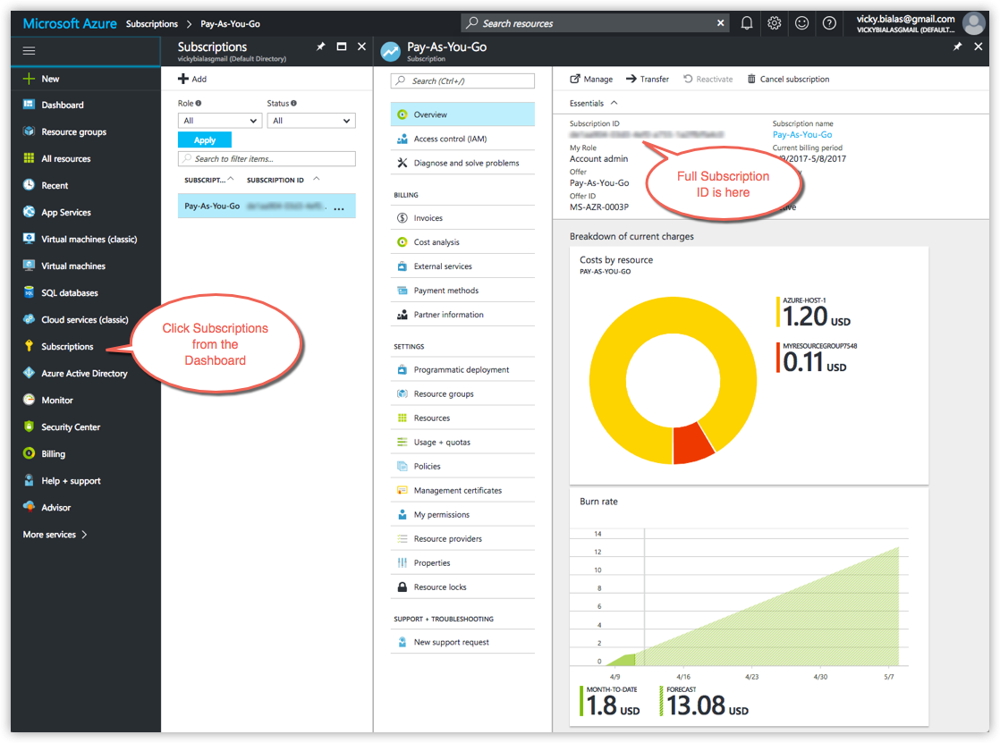
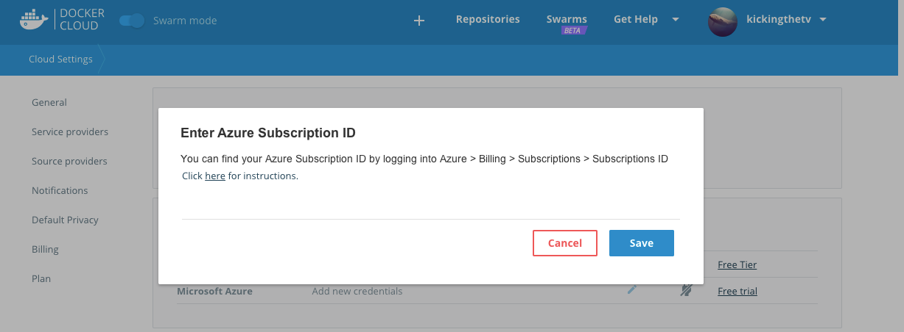
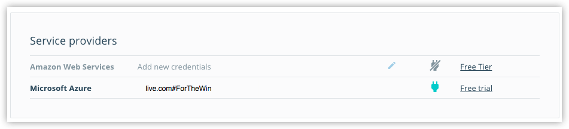
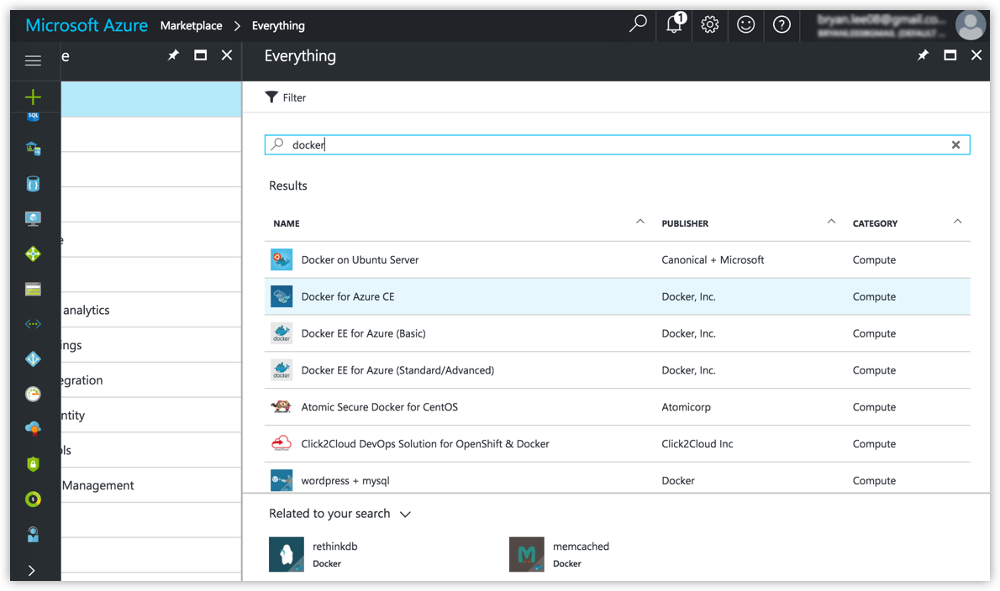
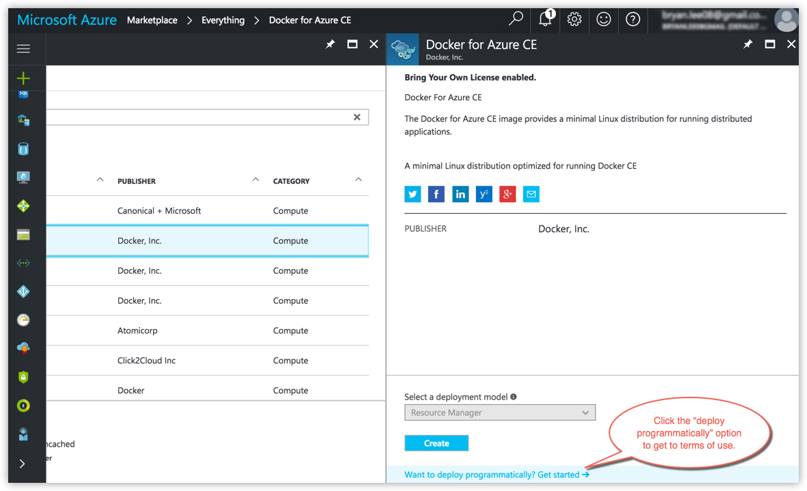
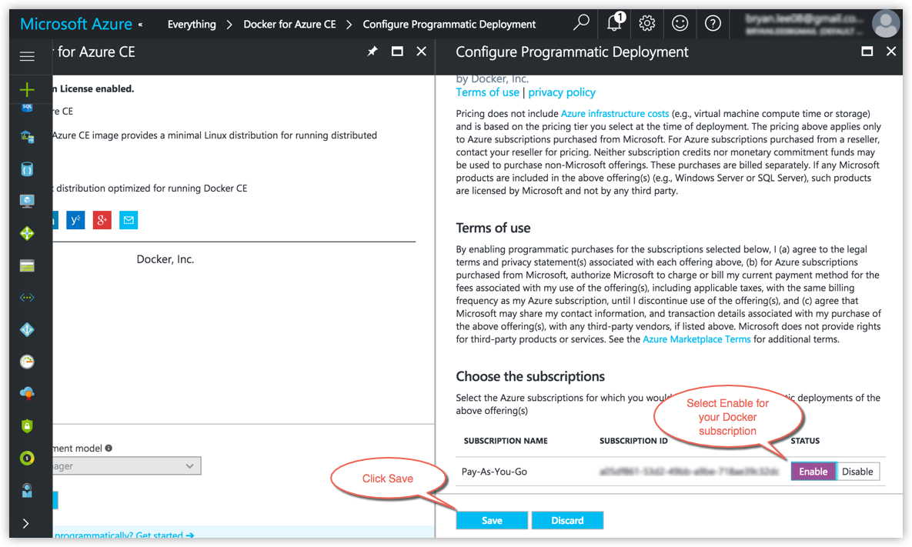
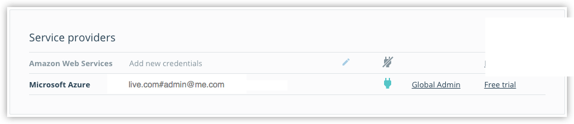
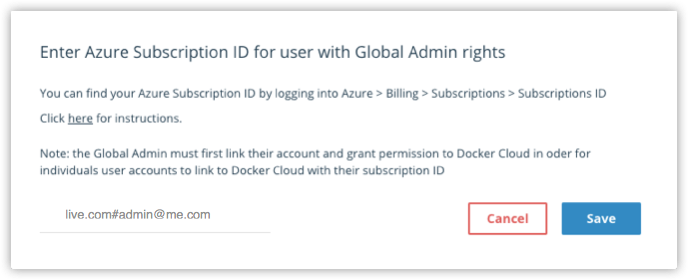

You can link your [Microsoft Azure Cloud Services](https://portal.azure.com/) account so that Docker Cloud can provision and
manage swarms on your behalf.

For this, you need an SSH key and your Azure subscription ID to authenticate Docker to your service provider. Also, you need to enable your Azure subscription on behalf of Docker Cloud.

## Create or locate the SSH key you want to use

When you are ready to create and deploy swarms, you must have an [SSH](`/engine/reference/glossary.md#ssh`) key to authenticate Docker Cloud to your Azure account. See the topic [Set up SSH keys](/docker-cloud/cloud-swarm/ssh-key-setup.md) to learn how to check for existing keys or set up a new one, and copy the public key.

## Find your Azure subscription ID

You also need your Azure Cloud Services subscription ID to provide to
Docker Cloud. There are a few ways to navigate to it on Azure.

You can click a resource from the Dashboard and find the subscription ID under
"Essentials" on the resulting display. Alternatively, from the left menu, go to
**Billing -> Subscriptions -> Subscription ID** or simply click
**Subscriptions**, then click a subscription in the list to drill down.

When you are ready to add your subscription ID to Docker Cloud,
copy it from your Azure Dashboard.

## Add your Azure account credentials to Docker Cloud

Go to Docker Cloud to connect the account.

1.  In Docker Cloud, click the account menu at the upper right and
select **Cloud settings**.

2.  In the **Service Providers** section, click the plug icon next to
Microsoft Azure.

    

    >**Tip:** If you are a member of an Azure Organization, your
    administrator must first link to Docker Cloud as described in
    [Link an Azure Organization as Global Admin](#link-an-azure-organization-as-global-admin).

3.  Provide your subscription ID and click **Save**.

    This grants Docker Cloud access to your Microsoft Azure account, and links
    the two accounts. Your Azure login credentials automatically populate
    to Docker Cloud under **Service Providers -> Microsoft Azure**.

    

## Enable your Azure subscription for Docker Cloud

You need to verify Microsoft Azure terms of use and manually enable your Azure subscription on behalf of Docker Cloud. You need do this only once, before you attempt to deploy a Docker Cloud Microsoft Azure swarm for the first time.

>**Tip:** If your Azure subscription is not enabled first, the swarm deployment fails. The error shows up on your **Azure portal -> resource groups -> _ResourceGroupForYourSwarm_ -> deployments**.

1.  Go to the [Microsoft Azure Marketplace](https://portal.azure.com/#blade/Microsoft_Azure_Marketplace/GalleryFeaturedMenuItemBlade/selectedMenuItemId/home) and search for **Docker**, or specifically **Docker for Azure CE**.

    

2. Select **Docker for Azure CE** and click the option on the lower right to deploy programmatically.

    

3. Read the terms of use, click **Enable** for your subscription, and click **Save**.

    

4. Verify that your subscription is enabled.

    Go to **Dashboard -> Subscriptions** to view details on your current subscriptions. Docker for Azure CE should be listed as enabled Programmatic deployment.

    

You are now ready to deploy a swarm!

## Link an Azure Organization as Global Admin

For members of Azure Organizations, your gobal administrator first needs to link
their account and grant permissions to Docker Cloud for the organization as a
whole. Then, you can link your individual user account to Docker Cloud with your
subscription ID.

The Global Admin steps are as follows:

1.  Go to [Microsoft Azure](https://portal.azure.com/), find your
    Subscription ID for Global Admin rights (**Azure -> Billing ->
    Subscriptions -> Subscriptions ID**), and copy the ID.

2.  On Docker Cloud, go to **Cloud Settings -> Service Providers**.

    

3. Click **Global Admin**, paste your Global Admin Subscription ID from
Azure into the field, and click **Save**.

    

   Azure Organization members can now link their user accounts to
   Docker Cloud per the individual user instructions above.

## Where to go next

**Ready to create swarms on Azure?** See [Create a new swarm on Microsoft Azure in Docker Cloud](create-cloud-swarm-azure.md).

You need an SSH key to provide to Docker Cloud during the swarm create
process. If you haven't done so yet, check out how to [Set up SSH
keys](ssh-key-setup.md).

You can get an overivew of topics on [swarms in Docker Cloud](index.md).

**Using Standard Mode to managing Docker nodes on Azure?** If you are
setting up nodes on Azure in [Standard Mode](/docker-cloud/standard/),
go back to [What's next in Standard Mode](/docker-cloud/infrastructure/link-azure.md##whats-next).
