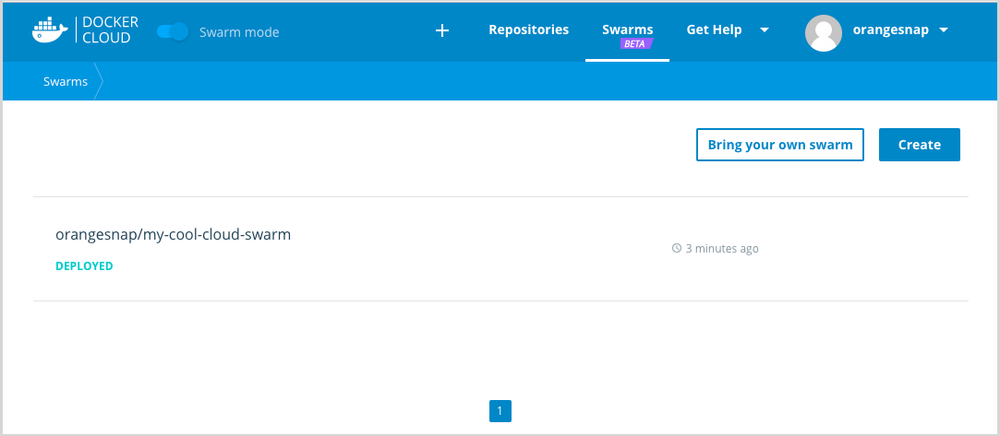

With Beta Swarm Mode, you can register existing
swarms with Docker Cloud to easily
manage multiple swarms running anywhere.

Before you begin, you need the following:

- a Docker ID
- a Docker swarm composed of v1.13 (or later) Docker Engine nodes
- a terminal session connected to one of the swarm's manager nodes
- incoming port 2376 unblocked on that manager node

> **Note**: The IP to the manager node for your swarm must be open and publicly accessible so that Docker Cloud can connect and run commands.

## Register a swarm

To register an existing swarm in Docker Cloud:

1. Log in to Docker Cloud if necessary.
2. If necessary, click the **Swarm Mode** toggle to activate the Swarm Mode interface.
3. Click **Swarms** in the top navigation.
4. Click **Bring your own swarm**.
5. Select the whole command displayed in the dialog, and copy it to your clipboard.
6. In terminal or another shell, connect to the Docker Engine running in the swarm's manager node using SSH.
7. Paste the command you copied into the terminal session connected to the manager node.
8. When prompted, log in using your Docker ID and password.

    The registration process uses your Docker ID to determine which namespaces you have access to<!--are allowed to register the swarm under TODO:CLOUD-4079 -->. Once you log in, the CLI lists these namespaces to help you with the next step.

9.  Enter a name, with a namespace before the name if needed, and press Enter.

    If you do not enter a name, the swarm is registered to your Docker ID account using the swarm ID, which is the long string displayed before the shell prompt. For example, the prompt might look like this:

    ```none
    Enter a name for the new cluster [mydockerid/5rdshkgzn1sw016zimgckzx3j]:
    ```

    Enter a name at the prompt to prevent Docker Cloud from registering the swarm using the long swarm ID as the name.

    To register a swarm with an organization, prefix the new name with the organization name, for example `myorganization/myteamswarm`.

The manager node pulls the `dockercloud/registration` container which creates a
global service called `dockercloud-server-proxy`. This service runs on _all_ of
the swarm's manager nodes.

The swarm then appears in the **Swarms** screen in Docker Cloud.

### Swarm Registration example

```none
$ docker run -ti --rm -v /var/run/docker.sock:/var/run/docker.sock dockercloud/registration
Use your Docker ID credentials to authenticate:
Username: myusername
Password:

Available namespaces:
* myorganization
* pacificocean
* sealife
Enter name for the new cluster [myusername/1btbwtge4xwjj0mjpdpr7jutn]: myusername/myswarm
Registering this Docker cluster with Docker Cloud...
Successfully registered the node as myswarm
You can now access this cluster using the following command in any Docker Engine:
	docker run --rm -ti -v /var/run/docker.sock:/var/run/docker.sock -e DOCKER_HOST dockercloud/client myswarm
```



## Swarm states in Docker Cloud

Swarms that are registered in Docker Cloud appear in the Swarms list. Each line in the list shows the swarm's state. The states are:

|     State     |                    Description                          | Actions available |
|:---------------|:--------------------------------------------------------|:---------------------------------|
| **DEPLOYING**  | Docker Cloud is in the process of provisioning the swarm. | None |
| **DEPLOYED**   | The swarm is running, connected, and sending heartbeat pings to Docker Cloud, and Cloud can contact it to run a health check. | All (Edit endpoint, remove) |
| **UNREACHABLE**        | The swarm is sending heartbeat pings and Docker Cloud is receiving them, but Cloud cannot connect to the swarm. | Remove |
| **UNAVAILABLE**        | Docker Cloud is not receiving heartbeats from the swarm. | Remove |
| **TERMINATING**        | Docker Cloud is in the process of destroying this swarm. | None |
| **TERMINATED**        | The swarm has been destroyed and is removed from the list in 5 minutes. | None |
| **REMOVED**        | The swarm was unregistered from Docker Cloud but not destroyed. The swarm is removed from list in 5 minutes. | None |
| **FAILED**        | Provisioning failed. | Remove |

### Understanding and resolving problems

* If a swarm is UNREACHABLE, it may be behind a firewall or NAT.

* If a swarm is UNAVAILABLE check the swarm from your infrastructure provider. The manager node(s) may be unresponsive or the server proxy service might not be running. You can SSH into an UNAVAILABLE swarm.

* Removing a swarm only removes the swarm from the interface in Docker Cloud, effectively
  [unregistering](#unregister-a-swarm-from-docker-cloud) it. It does not
  change the swarm itself or any processes running on the swarm.

## Unregister a swarm from Docker Cloud

Unregistering a swarm from Docker Cloud only removes the swarm from Docker
Cloud, deletes any access rights granted to teams, and disables proxy
connections. Unregistering does not stop the services, containers, or processes on the swarm, and it does not disband the swarm or terminate the nodes.

To unregister a swarm from Docker Cloud:

1. Log in to Docker Cloud if necessary.
2. Click **Swarms** in the top navigation.
3. Put your mouse cursor on the swarm you want to unregister.
4. Click the trash can icon that appears.
5. In the confirmation dialog that appears, click **Remove**.

Docker Cloud marks the swarm as `REMOVED` and removes the swarm from the list in
the next few minutes.  

## Where to go next

Learn how to [connect to a swarm through Docker Cloud](connect-to-swarm.md).
