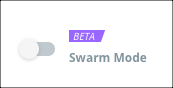

Docker Cloud now allows you to connect to clusters of Docker Engines running in v1.13 [swarm mode](/engine/swarm/).

## Swarm Mode

The current release of Docker Cloud automatically opts in new users to Beta
Swarm Mode.

> **Note**: All Swarm management features in Docker Cloud are free while in Beta.

### New to Docker Cloud?

If you just signed up as a new Docker Cloud user,
Swarm Mode is baked into the standard web
interface. Once you sign in, you are ready to
get started managing and deploying your apps in
Docker Cloud!

### Already a Docker Cloud user?

If you are already a Docker Cloud user, you still have access to legacy
features for managing [node clusters](/docker-cloud/infrastructure/). You also
have the option to switch to the Beta Swarm Mode interface. Swarm management
replaces node cluster management features when Swarm Mode is enabled.

#### Enable Swarm Mode in Docker Cloud

Click the **Swarm Mode** toggle to enable the Swarm Mode interface.

You can switch between node cluster and Swarm Mode at any time, and enabling
Swarm Mode does _not_ remove or disconnect existing node clusters. The content,
stacks, and node clusters you already created are available to you and
collaborators.

## Swarm Mode and organizations

If you use Docker Cloud in an [organization](/docker-cloud/orgs/), you can
use Swarm Mode to access any Docker swarms available to your organization.
Members of the `owners` team grant each team in an organization access to the
swarms they need. If necessary, you can create new teams to manage beta swarm
access.

If you use Swarm Mode as a member of a team other than the `owners` team,
you only see the swarms that you have been granted access to.

Members of the `owners` team must switch to the Swarm Mode Docker Cloud
interface to grant teams access to an organization's swarms. Swarms only appear
in the [resource management](/docker-cloud/orgs/#/set-team-permissions) screens
for teams when in the Swarm Mode interface.

## Where to go next

Learn how to [register an existing swarm](register-swarms.md).
