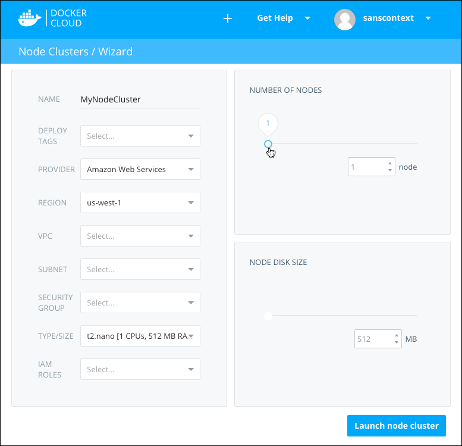

In this step you create your first node (inside a node cluster) on Docker Cloud.

After you link your Docker Cloud account with your hosts (either your own hosts or one or more cloud providers), the next step is to launch your first node.

When launching a node you actually create a _node cluster_. Node clusters are groups of nodes of the same type and from the same cloud provider, and they allow you to scale the infrastructure by provisioning more nodes with a drag of a slider.

 To start, go to the **Nodes** section and click **Create**.

Enter the following:

  -   **Name**: name for the node cluster. This can contain alphanumeric characters, dashes, and underscores.
  -   **Deploy tags**: (optional) these are used to limit what can be deployed on the specific cluster. Read more about deployment tags [here](../apps/deploy-tags.md).
  -   **Provider**: the cloud provider or host to use. Only providers you have configured appear in this menu.
  -  **Region**: the region on which to provision the node cluster.
  -  **Type/size**: the type and size of the nodes in the cluster.
  -  **Number of nodes**: the number of nodes to create in the node cluster. This can be modified later.
  -  **Disk size**: the disk size for each node.

> **Note**: You might see more or different options in this screen depending on which hosts or providers you're using. For example, DigitalOcean nodes have a fixed disk size depending on the type and size of the node you choose.

Click **Launch node cluster** to provision this node cluster. It may take several minutes for the cluster to launch. To view and follow along with deployment progress, click into the node cluster, click the **Timeline** tab, then expand the **Node Cluster Deploy** item to view the console.

Once the node cluster is deployed,  a Success message appears near the top of the page.

From the Node cluster detail view you can see the status of your nodes, destroy individual nodes or the whole cluster, upgrade individual nodes, and scale your node cluster from 1 to 10 nodes. You can also click an individual node's hostname to see which containers are running on it.

## What's next?

Now that you've got at least one **node** deployed, it's time to deploy your first **service**.

Remember that a service is a group of containers from the same container image. Services make it simple to scale your application across a number of nodes. They can also be linked one to another even if they are deployed on different nodes, regions, or even on different cloud providers.

[Continue the tutorial and deploy your first service](your_first_service.md).
