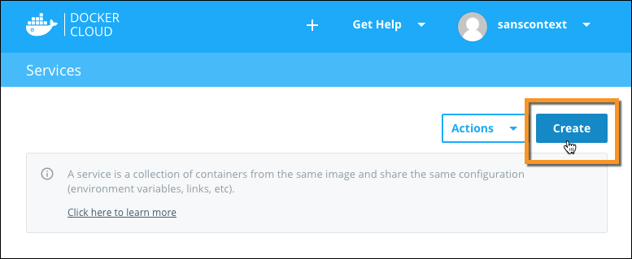
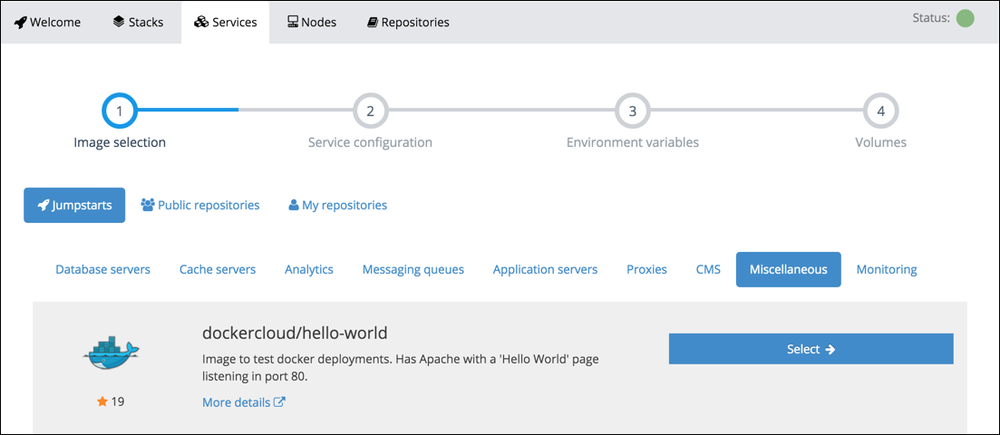
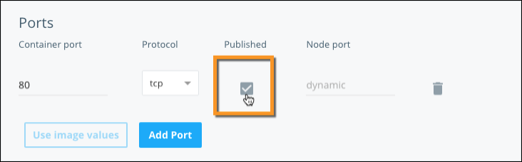
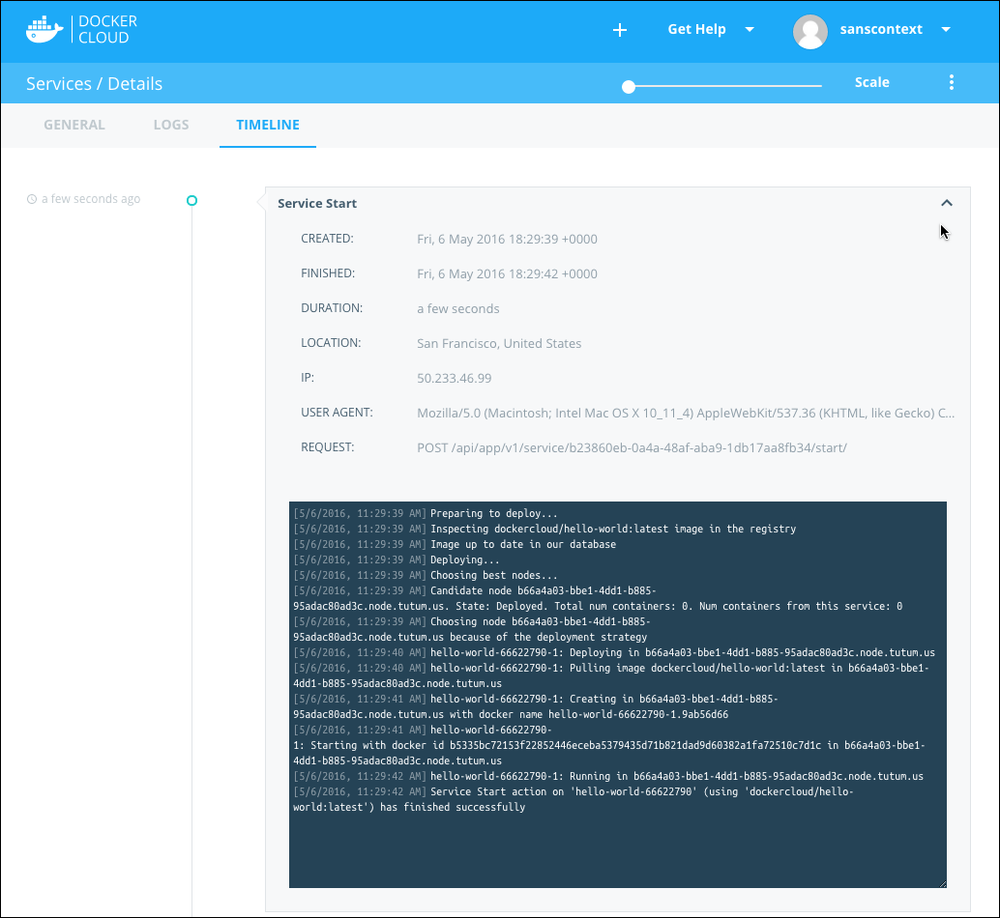
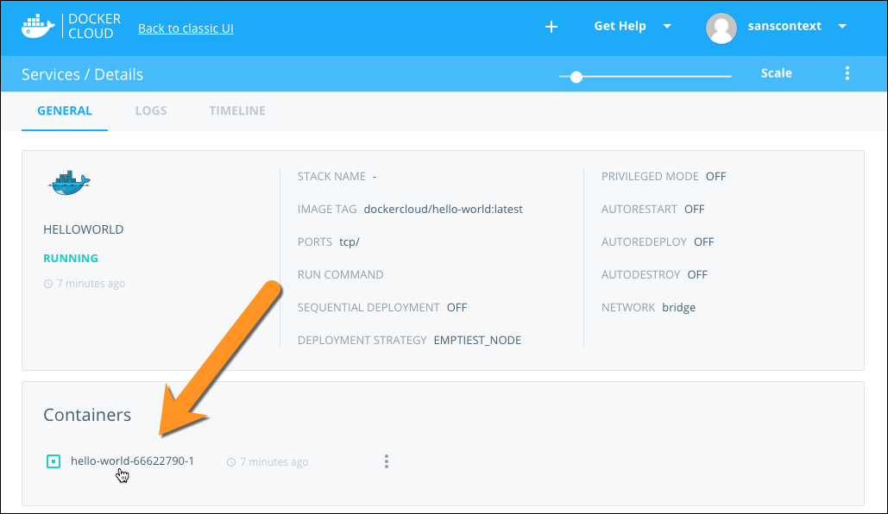
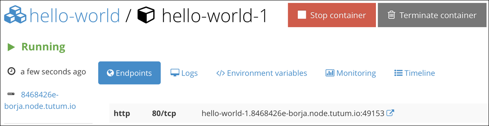
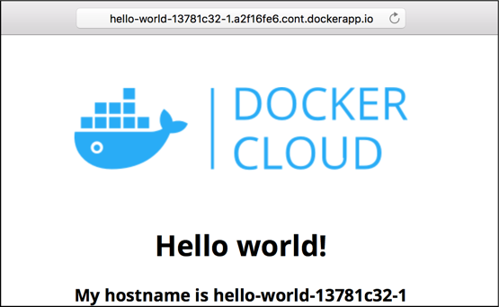

This page describes how to create a service on Docker Cloud.

## What is a service?

A service is a group of containers of the same **image:tag**. Services make it simple to scale your application. With Docker Cloud, you simply drag a slider to change the number of containers in a service.

Before you can deploy a service in Docker Cloud, you must have at least one node deployed. If you haven't done this yet [follow the tutorial to deploy a node](your_first_node.md).

When you create a service in the Docker Cloud web interface, a wizard walks you through configuring the service in three steps.

1. **Choose a Container Image** Images can come from Docker Cloud's Jumpstarts library, your personal Docker Hub account or Docker Hub's public index, or from third party registries you connect.
1. **Configure the Service** From here, give the service a name, set the initial number of containers, expose/publish ports, modify the run command or entrypoint, set memory and CPU limits.
1. **Set Environment variables** Set the edit environment variables and link your service to other existing services in Docker Cloud.

> **Note**: In this Quickstart tutorial we don't work with environment variables or connect [data volumes](../apps/volumes.md), but these are also available as optional steps in the wizard.

## Select a Service Image

From any page on Docker Cloud, click the **Services** section, then click **Create**.



For the purposes of this tutorial, click the rocket icon and look for the **Miscellaneous** section.

You see an image called `dockercloud/hello-world`.


Click the **dockercloud/hello-world** image. This image creates a container that runs NGINX, and shows a simple *hello world* web page.

## Configure the Service

In this step Docker Cloud loads all of the Image tags available for the image. In this case our tutorial image **dockercloud/hello-world** only has one image tag called **latest**.

For the purposes of this tutorial, you don't actually need to enter or change
anything for most of the fields on the Create Service page.

### Publishing a port

Since we need to access this container over the Internet, we first need to publish a port. By default, ports are not accessible publicly. To learn more about ports click [here](../apps/ports.md).

Click the **Ports** table, where it says *Click to override ports defined in image*. This activates that section so you can make changes. Then click the **Published** checkbox.



For this tutorial leave the Node port set to *dynamic*. This means that **port 80** of the container is mapped to a random available port in the node in which the container is deployed. To force a specific port in the node, click *dynamic* and specify a port.

> **Note**: Two containers in the same node cannot publish to the same *node port*.

## Create and Deploy

You don't need to modify anything else in this service for the tutorial, so click **Create and deploy**. Docker Cloud creates, and deploys your new service (just like it says on the tin!)


Next, Cloud sends you to the Service's detailed view. The detailed view contains six informational sections:

  - **Containers**: lists the containers that are part of this service and their status. This is also where you'd go to launch more containers to scale a service.
  - **Endpoints**: shows a list of available service and container endpoints.
  - **Triggers**: allows you to set triggers that perform automatic actions such as scaling a node or redeploying an image when the source updates.
  - **Links**: lists the links between services. For this tutorial this section is empty.
  - **Volumes**: lists the volumes attached to the service to store data. For this tutorial this section is empty.
  - **Environment Variables**: lists the environment variables for the service.

Two additional tabs of information are available for each service:

  - **Logs**: shows check the recent logs from all the containers in this service.
  - **Timeline**: a timeline of all the API calls, and accompanying logs, that were performed against this service.


Click the **Timeline** tab to see a log output similar to the one below. It can take a couple of minutes for the container to deploy.

```
Deploying...
Creating 1 new containers
Preparing to deploy container f93b1a05-4444-49e5-98b0-9dc3a7618453
hello-world-1: Choosing best node. Deployment strategy: BALANCE
hello-world-1: Deploying in 8468426e-tutorial.node.dockerapp.io
hello-world-1: Pulling image dockercloud/hello-world:latest in 8468426e-tutorial.node.dockerapp.io
hello-world-1: Creating in 8468426e-tutorial.node.dockerapp.io
hello-world-1: Starting with docker id df9525795bef5394e1a33b2ef42e26ba991bdccece4bc4f4f34e1def5c095fe9 in 8468426e-tutorial.node.dockerapp.io
hello-world-1: Inspecting and checking its configuration
hello-world-1: Running in 8468426e-tutorial.node.dockerapp.io
```

The web interface looks something like this:



The **hello-world** status line updates to **Running** once the container deploys successfully.

The **Containers** list shows all of the containers in this service. There should just be one for now.



Click the container's name to go to the Container's detail view. From
this page you can see additional information about the containers, such as
endpoints, logs, environment variables, volumes, a terminal, and the console
timeline.



The **Endpoints** section lists the endpoints (ports) that this container is publishing. In the screenshot above, there is a single endpoint: **hello-world-66622790-1.9ab56d66.container.docker.io:32768**. The endpoint is composed of both the container's hostname and a port number.

Click the links icon to the right of the endpoint. This opens a new tab and shows the webpage that the **hello-world** container is hosting.



**Congratulations!** You've successfully deployed your first service using Docker Cloud.

## Optional cleanup

You probably don't need the `hello-world` container to run for very long after you complete the tutorial. To clean up and remove all of the resources you created during this tutorial:

- Click **Services**, hover over the `hello-world` container and click the selection box that appears, then click the **Terminate** icon to the right of the service information.
- Click **Node Clusters**, select the node cluster you created, and click the **Terminate** icon at the right end of the cluster information.

Both terminated Services and Node Clusters remain in the UI for about five minutes. After that time, they no longer appear.

## What's next?

Learn more about [scaling your service](../apps/service-scaling.md), or check out some of our other [Deploy an app tutorial](deploy-app/index.md).
