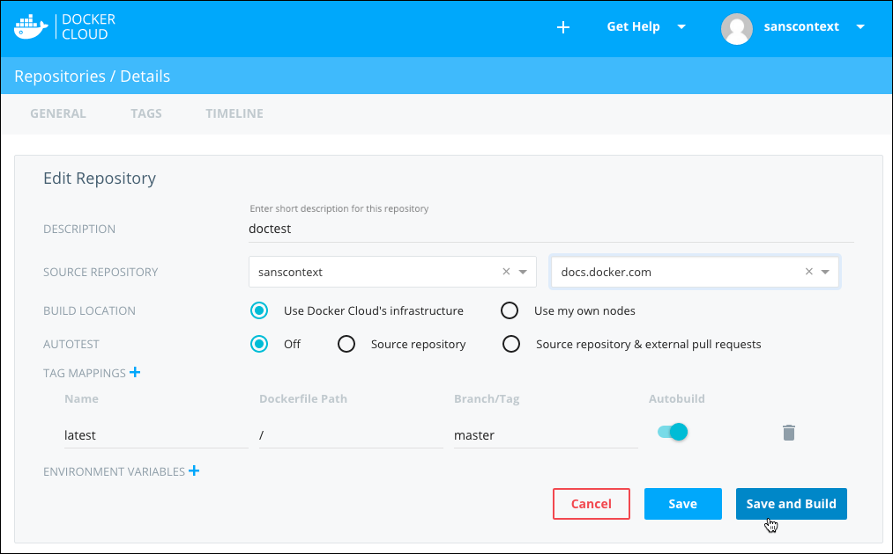
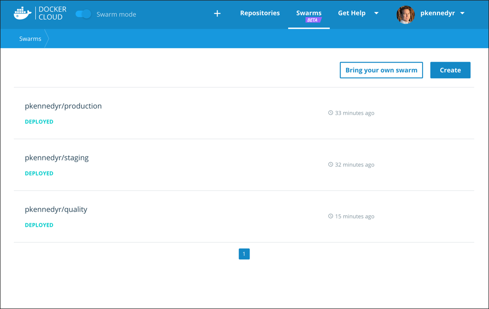
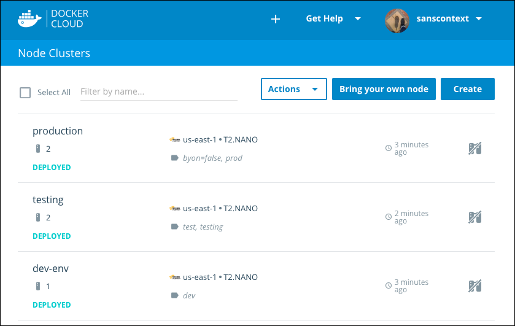
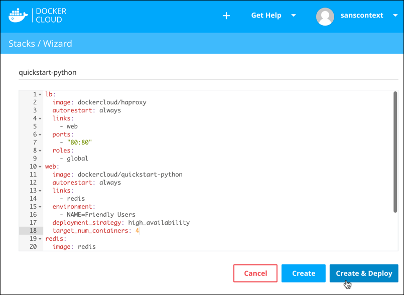

Docker Cloud provides a hosted [registry service](builds/repos.md) with
[build](builds/automated-build.md) and [testing](builds/automated-testing.md)
facilities for Dockerized application images; tools to help you set up and
[manage host infrastructure](infrastructure/); and [application lifecycle features](apps/) to automate deploying (and redeploying) services created from
images.

Log in to Docker Cloud using your free [Docker ID](../docker-id/).

<table class="tg">
  <tr>
    <td class="bluebar" width="50%"><a href="builds/index.md"><b>Manage Builds and Images</b></a></td>
    <td class="bluebar" width="50%"><a href="cloud-swarm/index.md"><b>Manage Swarms (Beta Swarm Mode)</b></a></td>
  </tr>
  <tr>
    <td class="plain" width="50%">
Build and test your code, and build Docker images. Link Cloud repositories to your source code provider to automate building images and pushing them to Cloud. 
</td>
    <td class="plain" width="50%">
Provision swarms to popular cloud providers, register existing swarms, and use your Docker ID to authenticate and securely access personal or team swarms.
</td>
  </tr>
  <tr>
    <td class="bluebar" width="50%"><a href="infrastructure/index.md"><b>Manage Infrastructure (Standard Mode)</b></a></td>
    <td class="bluebar" colspan="2"><a href="standard/index.md"><b>Manage Nodes and Apps (Standard Mode)</b></a></td>
  </tr>
  <tr>
    <td class="plain" width="50%">
Link to your hosts, upgrade the Docker Cloud agent, and manage container distribution. See the <a href="infrastructure/cloud-on-aws-faq.md">AWS FAQ</a> and <a href="infrastructure/cloud-on-packet.net-faq.md">Packet.net FAQ.</a>
</td>
    <td class="plain" width="50%">
Deploy and manage nodes, services, and applications in Docker Cloud (Standard Mode).
</td>
  </tr>
  <tr>
    <td class="bluebar" colspan="2"><b><a href="/apidocs/docker-cloud/">API Docs</a> &nbsp;&nbsp; ● &nbsp;&nbsp; <a href="docker-errors-faq.md">Frequently Asked Questions</a> &nbsp;&nbsp; ● &nbsp;&nbsp; <a href="https://forums.docker.com/c/docker-cloud/release-notes">Release Notes</a></b></td>
  </tr>
</table>

## About Docker Cloud

### Images, Builds, and Testing

Docker Cloud uses the hosted Docker Cloud Registry, which allows you to publish
Dockerized images on the internet either publicly or privately. Docker Cloud can
also store pre-built images, or link to your source code so it can build the
code into Docker images, and optionally test the resulting images before pushing
them to a repository.

### Swarm Management (Beta Swarm Mode)

With [Beta Swarm Mode](/docker-cloud/cloud-swarm/index.md), you can create new
swarms from within Docker Cloud, register existing swarms to Docker Cloud, or
provision swarms to your cloud providers. Your Docker ID authenticates and
securely accesses personal or team swarms. Docker Cloud allows you to connect
your local Docker Engine to any swarm you have access to in Docker Cloud.

### Infrastructure management (Standard Mode)

Before you can do anything with your images, you need somewhere to run them.
Docker Cloud allows you to link to your infrastructure or cloud services
provider so you can provision new nodes automatically. Once you have nodes set
up, you can deploy images directly from Docker Cloud repositories.

### Services, Stacks, and Applications (Standard Mode)

Images are just one layer in containerized applications. Once you've built an
image, you can use it to deploy services (which are composed of one or more
containers created from an image), or use Docker Cloud's
[stackfiles](apps/stacks.md) to combine it with other services and
microservices, to form a full application.

