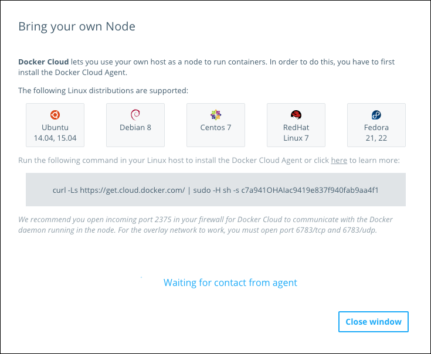

Docker Cloud allows you to use any Linux host ("bring your own host") as a node which you can then use to deploy containers. To do this, you must install the **Docker Cloud Agent** on your Linux host so that Docker Cloud can remotely manage it.

> **Note**: The Docker Cloud Agent only supports x64 architecture at this time.

The **Docker Cloud Agent** installs its own Docker binary, and automatically removes any prior installation of the Docker Engine packages. See the [Known Limitations](byoh.md#known-limitations) section for more information.

You can still run `docker` CLI commands on a host that is running the Docker Cloud Agent. If you do this, you might see the Docker Cloud system containers that start with `dockercloud/`.


## Install the Docker Cloud Agent

1. Before you begin, make sure that ports **6783/tcp** and **6783/udp** are open on the target host. Optionally, open port **2375/tcp** too.

    The first two ports allow the node to join the overlay network that allows [service discovery](../apps/service-links.md) among nodes on a Docker Cloud account. Port 2375 allows Docker Cloud to contact the Docker daemon on the host directly using TLS mutual authentication. If this port is not open, Docker Cloud sets up a reverse tunnel from the host to access this port.

2. Log in to Docker Cloud and go to the **Node dashboard**.

3. Click **Bring your own node**.

    The dialog that appears lists the currently supported distributions of Linux, and provides a command that you can copy.
    This command includes a token that allows the agent to talk to Docker Cloud.

    

4. Copy the command to your clipboard.

5. Execute this command on your Linux host.

    The command downloads a script which installs and configures the Docker Cloud Agent, and registers it with Docker Cloud.

6. Confirm that the new Linux host appears in the Node dashboard in Docker Cloud. The node is now ready to accept container deployments!

7. Repeat this process for each host.

## Install the Docker Cloud Agent using the CLI

If you prefer not to use the web interface, you can generate the command needed
to install and configure the **Docker Cloud Agent** using the `docker-cloud`
CLI.

To generate the command with the token, run:

```
$ docker-cloud node byo
```

The command outputs the following, including the installation command instructions and the associated registration token.

```
Docker Cloud lets you use your own servers as nodes to run containers. For
this you have to install our agent.

Run the following command on your server:

curl -Ls https://get.cloud.docker.com/ | sudo -H sh -s 63ad1c63ec5d431a9b31133e37e8a614
```

Copy and paste this command, and execute it on your host. The host automatically
appears in the list of nodes once the process completes.

## Uninstall the Docker Cloud Agent

To uninstall `dockercloud-agent` from your host, execute the following command:

```
$ apt-get remove dockercloud-agent
```

## Upgrade Docker Cloud Agent

To upgrade `dockercloud-agent`, execute the following command on the host:

```
$ apt-get update && apt-get install -y dockercloud-agent
```

## Restart Docker Cloud Agent

To restart the `dockercloud-agent`, execute the following command from your BYON host:

```
$ service dockercloud-agent restart
```

## Known limitations

### Firewall requirements

The following ports **must** be opened in any firewalls:

* **6783/tcp** and **6783/udp**: These ports allow the node to join the private overlay network for containers in other nodes.

You should also open the following ports:

* **2375/tcp**: This allows Docker Cloud to communicate with the Docker daemon running in the node. If port 2375 is not accessible, Docker Cloud attempts to connect with the node through a secure reverse tunnel.

You must also open any ports that you plan to publish in your services, however these are not required to install the Docker Cloud Agent.

### Supported Linux distributions

The **Docker Cloud Agent** has been tested on:

- Ubuntu 14.04, 15.04, 15.10
- Debian 8
- Centos 7
- Red Hat Enterprise Linux 7
- Fedora 21, 22, 23

Contact Docker support if you have a different distribution that you would like
to have supported.

### Install Docker Cloud Agent on a node with Docker already installed

If you install the Docker Cloud Agent on a node which already has Docker Engine
installed, `apt-get` removes the older `docker` installation, then installs the
`docker` binary that is bundled with `dockercloud-agent`. The installation
script also tries to install the kernel headers required for `AUFS` support.

> **Note**: If you remove, upgrade, or install over the version of Docker Engine bundled with the Docker Cloud Agent, your nodes may not maintain a connection with Docker Cloud correctly. You must reinstall a compatible Engine version (currently version 1.11.2-cs5). Contact Docker Support for more information.

* If you were already using the `AUFS` storage driver before installing `dockercloud-agent`, your existing containers and images appear automatically once installation finishes.
* If you were using `devicemapper` or any other storage driver, and the `AUFS` driver installs successfully you can't use your existing containers and images. You can check if the installation succeeded by running `docker info | grep Storage`.
