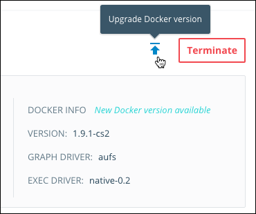

Docker Cloud helps you manage nodes that have Docker Engine installed on them.
You can upgrade the version of Docker Engine on your nodes when new versions are
released. Docker Cloud doesn't *automatically* upgrade your nodes for you
because your containers would need to be restarted to complete the upgrade.
Instead, we allow you to choose when you want to upgrade so you can plan for potential outage time during the restart.

## Upgrade Docker Engine in a node

Before you upgrade your nodes, go to the detail page of the node that you want to upgrade. On the left side is a **Docker Info** section that lists the currently installed version of Docker Engine.

If a new version is available, an up-arrow icon and a **New Docker version available** message appear above the current version line. Click the up-arrow
icon to start the upgrade process.

After upgrading Docker Engine, any containers that was running before the
upgrade is automatically restarted, regardless of the
[autorestart](../apps/autorestart.md) setting. Containers that were stopped are not
restarted.

## Upgrade nodes using the API and CLI

See our [API and CLI documentation](/apidocs/docker-cloud.md#upgrade-docker-daemon34) for more information on how to upgrade nodes with our API, SDKs, and the CLI.
