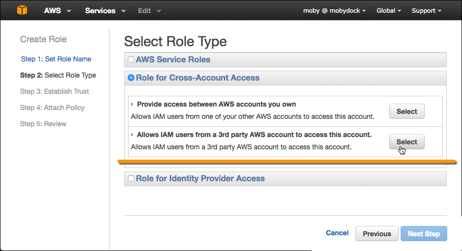
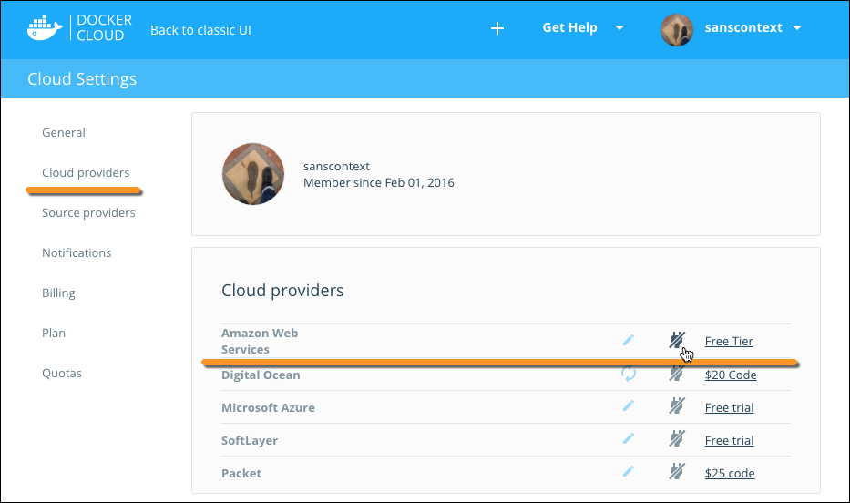
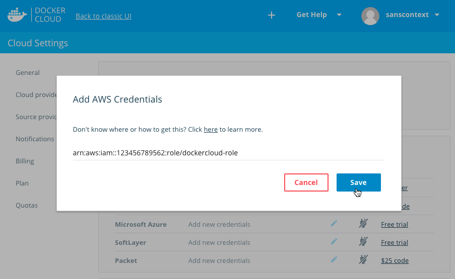

> **Legacy instructions**:
>
> This topic has been superseded by [the AWS instructions that enable swarm mode](/docker-cloud/cloud-swarm/link-aws-swarm.md).

You can create a role with AWS IAM (Identity and Access Management) so that
Docker Cloud can provision and manage **node clusters** and **nodes** on your
behalf.

[Previously](https://docs.docker.com/v1.11/docker-cloud/infrastructure/link-aws), we
recommended that you create a service user that Docker Cloud would use to access
your AWS account. If you used this method, you can [create a new
role](https://console.aws.amazon.com/iam/home#policies){: target="_blank"
class="_" }, attach the policy you created for this purpose (see
[https://console.aws.amazon.com/iam/home#policies](https://console.aws.amazon.com/iam/home#policies){:
target="_blank" class="_" }), unlink your AWS credentials, and relink them using
the new ARN method. You can then delete the `dockercloud-user` on AWS.

## Create a dockercloud-policy

Create an access control policy that will grant specific privileges to Docker Cloud so it can provision EC2 resources on your behalf. 

1.  Go to the AWS IAM panel at [https://console.aws.amazon.com/iam/home#policies](https://console.aws.amazon.com/iam/home#policies){: target="_blank" class="_"} .
2.  Click **Create Policy**.
3.  On the next screen click **Create Your Own Policy**.
4.  Name the policy `dockercloud-policy` and paste the following text in the space provided for **Policy Document**.

    ```json
    {
      "Version": "2012-10-17",
      "Statement": [
        {
          "Action": [
            "ec2:*",
            "iam:ListInstanceProfiles"
          ],
          "Effect": "Allow",
          "Resource": "*"
        }
      ]
    }
    ```

    To limit the user to a specific region, use the [policy below](link-aws.md#limit-dockercloud-policy-to-a-specific-ec2-region) instead.

    `ec2:*` allows the user to perform any operation in EC2.

    `iam:ListInstanceProfiles` allows the user to retrieve instance profiles to apply to your nodes.

    > **Note**: You cannot use an instance profile that has more permissions than the IAM user you are using with Docker Cloud. If you do that, you will get an "unauthorized operation" error. You can fix this issue by adding the `"Action":"iam:PassRole"` permission to the policy for the service user. You can read more about this [here](http://blogs.aws.amazon.com/security/post/Tx3M0IFB5XBOCQX/Granting-Permission-to-Launch-EC2-Instances-with-IAM-Roles-PassRole-Permission){: target="_blank" class="_"}.

6.  Click **Validate Policy**.
7.  If the validation succeeds, click **Create Policy**.

### Limit dockercloud-policy to a specific EC2 region

You can use the following `dockercloud-policy` to limit Docker Cloud to a specific EC2 region. Replace the example region `us-west-2` US West (Oregon) with the region you want.

```json
{
  "Version": "2012-10-17",
  "Statement": [
      {
        "Action": [
           "ec2:*"
        ],
        "Effect": "Allow",
        "Resource": "*",
        "Condition": {
            "StringEquals": {
                "ec2:Region": "us-west-2"
            }
        }
      },
      {
        "Action": [
            "iam:ListInstanceProfiles"
        ],
        "Effect": "Allow",
        "Resource": "*"
      }
  ]
}
```

## Create a dockercloud-role role

1. Go to the AWS IAM Role creation panel at <a href="https://console.aws.amazon.com/iam/home#roles">https://console.aws.amazon.com/iam/home#roles</a>  Click **Create new role**.

2.  Select **Role for cross-account access**, and in the submenu that opens select **Provide access between your AWS account and a 3rd party AWS account**.

    

3. In the **Account ID** field, enter the ID for the Docker Cloud service: `689684103426`.

4. In the **External ID** field, enter your Docker Cloud username.

   This might be your Docker ID username, or if you are using Organizations in Docker Cloud enter the organization name.

5. Leave **Require MFA** unchecked. Click **Next Step**.

6. On the next screen, select the `dockercloud-policy` you created to attach to the role. Click **Next Step**.

7. Give the new role a name, such as `dockercloud-role`.

    > **Note**: You must use one role per Docker Cloud account namespace, so if you will be using nodes from a single AWS account for multiple Docker Cloud accounts, you should add an identifying the namespace to the end of the name. For example, you might have `dockercloud-role-docker` and `dockercloud-role-teamawesome`.

8.  Click **Create Role**.

    AWS IAM creates the new role and returns you to the **Roles** list.

9. Click into the new role to view details, and copy the full **Role ARN** string.

    The ARN string should look something like
    `arn:aws:iam::123456789123:role/dockercloud-role`. You'll use the
    ARN in the next step. If you forget to copy the ARN here, view the
    Role in IAM to see its related information including the ARN.

    

## Add AWS account credentials

Once you've created a `dockercloud-policy`, attached it to a `dockercloud-role`,
and have the role's Role ARN, go back to Docker Cloud to connect the account.

1. In Docker Cloud, click **Cloud settings** at the lower left.
2. In the Cloud Providers section, click the plug icon next to Amazon Web Services.

    

3. Enter the full `Role ARN` for the role you just created.

    

4. Click **Save**.

## What's next?

You're ready to start using AWS as the infrastructure provider
for Docker Cloud! If you came here from the tutorial, [continue the tutorial and deploy your first node](../getting-started/your_first_node.md).
