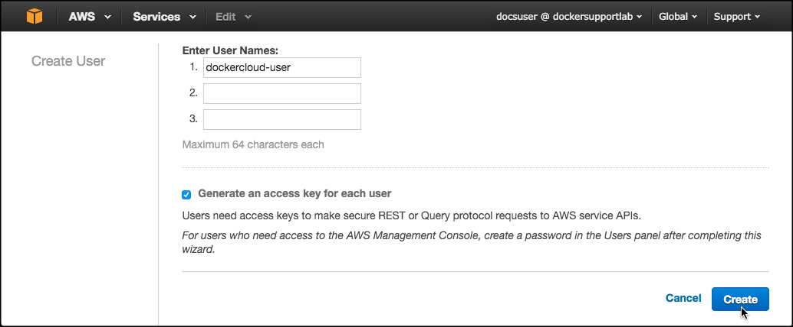

---
aliases:
- /docker-cloud/getting-started/beginner/link-aws/
- /docker-cloud/getting-started/link-aws/
description: Link your Amazon Web Services account
keywords:
- AWS, Cloud, link
menu:
  main:
    parent: infrastructure
title: Link to Amazon Web Services hosts
---

# Link your Amazon Web Services account

You can register your AWS account credentials in your Docker Cloud account to deploy **node clusters** and **nodes** using Docker Cloud's dashboard, API or CLI. AWS Security Credentials are required so that Docker Cloud can interact with AWS on your behalf to create and manage your nodes (EC2 instances).

We recommend that you create a `dockercloud-user` service user with AWS IAM (Identity and Access Management). If you have already done this, [skip to Add AWS Account Credentials](#add-aws-account-credentials)

## Create a dockercloud-user in AWS IAM

Although you can use any AWS credentials with the correct privileges, we
recommend creating a new service user called **dockercloud-user** in AWS IAM. 

1. Go to <a href="https://console.aws.amazon.com/iam/#users" target="_blank">https://console.aws.amazon.com/iam/\#users</a> to access the IAM panel in AWS.

2. In AWS IAM, click **Create New Users**.

3. On the next screen enter `dockercloud-user` as the username.

4. Make sure the **Generate an access key for each user** checkbox is selected.
    

5. Click **Create**.

    AWS shows you the `Access Key ID` and `Secret Access Key` for the new service user. These credentials will not be shown again.
6. Copy both or click **Download Credentials** to save them to a file on your local machine.
    

## Create dockercloud-user policy

Before Docker Cloud can use the new user you just created, you need to give it specific privileges so it can provision EC2 resources on your behalf. 

1. Go to the AWS IAM panel at <a href="https://console.aws.amazon.com/iam/home#policies" target ="_blank">https://console.aws.amazon.com/iam/home#policies</a>
2. Click **Create Policy**.
3. On the next screen click **Create Your Own Policy**.
4. Name the policy `dockercloud-policy` and paste the following text in the space provided for **Policy Document**.
    ```json
    {
      "Version": "2012-10-17",
      "Statement": [
        {
          "Action": [
            "ec2:*",
            "iam:ListInstanceProfiles"
          ],
          "Effect": "Allow",
          "Resource": "*"
        }
      ]
    }
    ```
    To limit the user to a specific region, use the [policy below](#limit-dockercloud-user-to-a-specific-ec2-region) instead.

    `ec2:*` allows the user to perform any operation in EC2.

    `iam:ListInstanceProfiles` allows the user to retrieve instance profiles to apply to your nodes.

    > **Note**: You cannot use an instance profile that has more permissions than the IAM user you are using with Docker Cloud. If you do that, you will get an "unauthorized operation" error. You can fix this issue by adding the `"Action":"iam:PassRole"` permission to the policy for the service user. You can read more about this <a href="http://blogs.aws.amazon.com/security/post/Tx3M0IFB5XBOCQX/Granting-Permission-to-Launch-EC2-Instances-with-IAM-Roles-PassRole-Permission" target="_blank">here</a>
6. Click **Validate Policy**.
7. If the validation is successful click **Create Policy**.

### Limit dockercloud-user to a specific EC2 region

You can limit the dockercloud-user to a specific EC2 region using the following policy instead of the standard one presented above. To do this, replace the example region `us-west-2` US West (Oregon) with your desired region.

```json
{
  "Version": "2012-10-17",
  "Statement": [
      {
        "Action": [
           "ec2:*"
        ],
        "Effect": "Allow",
        "Resource": "*",
        "Condition": {
            "StringEquals": {
                "ec2:Region": "us-west-2"
            }
        }
      },
      {
        "Action": [
            "iam:ListInstanceProfiles"
        ],
        "Effect": "Allow",
        "Resource": "*"
      }
  ]
}
```

## Attach policy

1. Return to the **Users** list in the AWS IAM panel at <a href="https://console.aws.amazon.com/iam/#users" target="_blank">https://console.aws.amazon.com/iam/#users</a>.
2. Click the **dockercloud-user** to edit it.
3. Click the **Permissions** tab.
4. Click **Attach Policy** to open a list of access policies.
    
5. Select the policy you just created.
6. Click **Attach Policy**.
    

## Add AWS account credentials

Once you've created the new `dockercloud-user` service user, have its
credentials, and set the custom policy that allows
Docker Cloud to use it, go back to Docker Cloud to add the service user's credentials.

1. In Docker Cloud, click **Account info \> Cloud Providers**.
2. Click **Add credentials** next to Amazon Web Services.
    
3. Enter the `Access Key ID` and `Secret Access Key` for the service user account.

    You can copy and paste these from the file you downloaded.

    

4. Click **Save credentials**.

## What's next?

You're ready to start using AWS as the infrastructure provider
for Docker Cloud! If you came here from the tutorial, click here to [continue the tutorial and deploy your first node](../getting-started/your_first_node.md).
