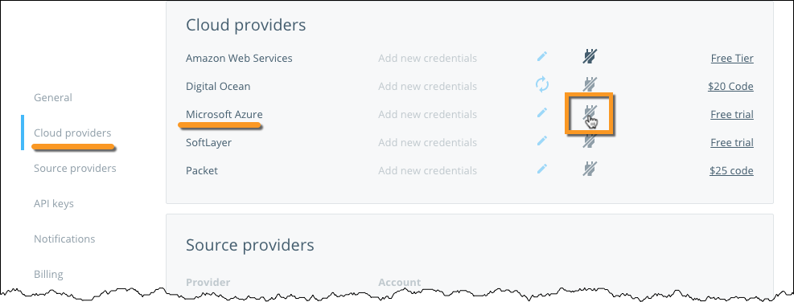
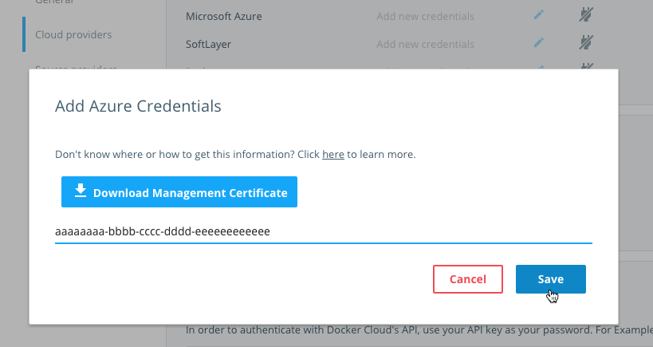
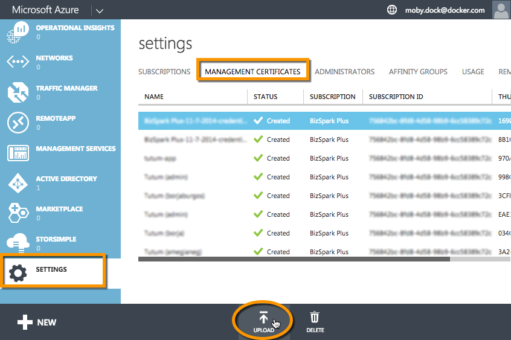
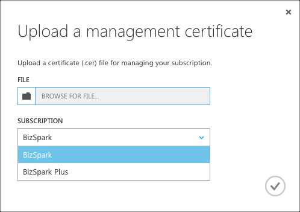

You can link your Microsoft Azure account to your Docker Cloud account to deploy **nodes** and **node clusters** using Docker Cloud's Dashboard, API, or CLI. You must link your Azure account so that Docker Cloud can interact with Azure on your behalf to create and manage your **nodes** (virtual machines).

## How to create the link

Navigate to **Account info \> Cloud Providers**. You'll see a list of all the providers that you can link to Docker Cloud. Click **Add credentials** next to Microsoft Azure:

You'll see the following screen:

First, click **Download management certificate** to download the public certificate generated for your Docker Cloud account.

Then, in another tab go to the Azure Portal at [https://manage.windowsazure.com/](https://manage.windowsazure.com/)

> **Note**: At this time, you must use the old Azure portal to upload management certificates.

Scroll to the bottom of the left navigation bar and click **Settings**.  In the page that loads, click the **Management certificates** tab, then click **Upload** near the bottom of the screen:

Still in Azure, in the **Upload a management certificate** dialog, select the certificate you downloaded from Docker Cloud in the **File** field, and choose the subscription you want to use with Docker Cloud:

Once uploaded, copy the **subscription ID** (which looks like `aaaaaaaa-bbbb-cccc-dddd-eeeeeeeeeeee`).

Go back to Docker Cloud and enter the subscription ID in the **Azure credentials** dialog, and click **Save credentials**.

## What's next?

You're ready to start using Microsoft Azure as the infrastructure provider for Docker Cloud! If you came here from the tutorial, click here to [continue the tutorial and deploy your first node](../getting-started/your_first_node.md).