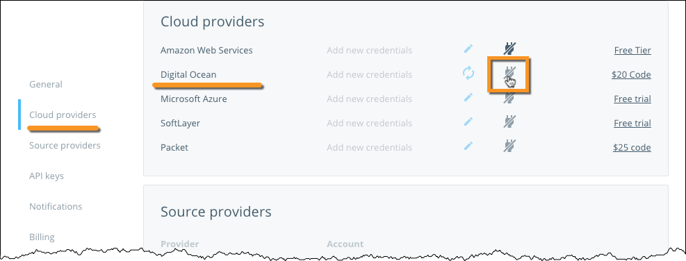
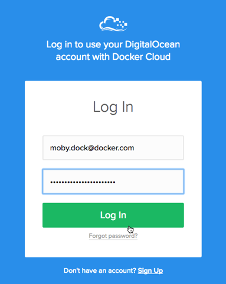
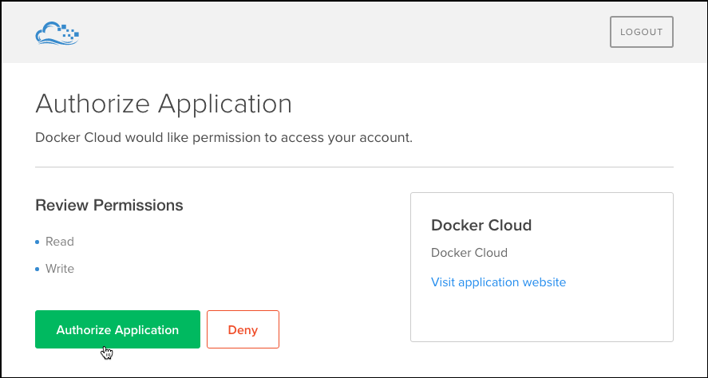

You can link your DigitalOcean account to your Docker Cloud account to deploy
**nodes** and **node clusters** using Docker Cloud's Dashboard, API, and CLI.
You must link your DigitalOcean account so that Docker Cloud can interact with
DigitalOcean on your behalf to create and manage your **nodes** (droplets).

If you don't have a **DigitalOcean** account, you can sign up with this link to
get a $10 credit:
[https://www.digitalocean.com/?refcode=bc0c34035aa5](https://www.digitalocean.com/?refcode=bc0c34035aa5)

## Link your DigitalOcean Account

To link your DigitalOcean account so you can launch **nodes** using Docker
Cloud, navigate to **Account info \> Cloud Providers**. A list of all
the providers that you can link to Docker Cloud is shown. Click **Link account** next to
DigitalOcean.

You're redirected to a DigitalOcean login screen. Use your **DigitalOcean**
credentials to log in to your account.

Once you log in, a message appears prompting you to confirm the link.

## What's next?

You're ready to start using DigitalOcean as the infrastructure provider for
Docker Cloud! If you came here from the tutorial, click here to [continue the
tutorial and deploy your first node](../getting-started/your_first_node.md).
