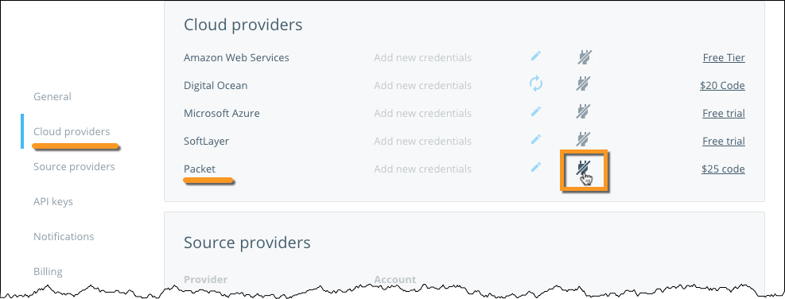
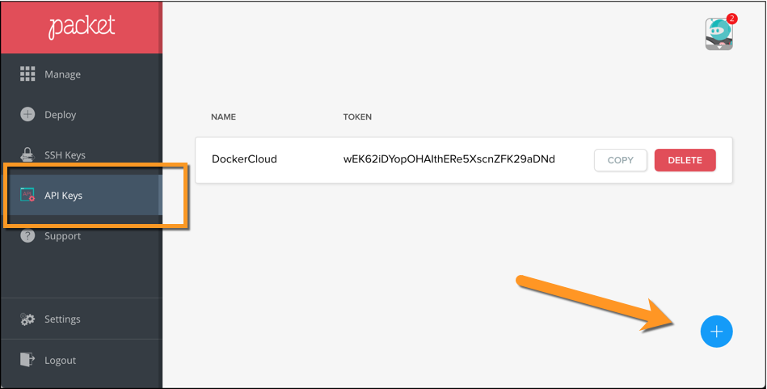

You can register your [Packet](https://www.packet.net/promo/docker-cloud/)
account credentials in your Docker Cloud account to deploy **nodes** and **node
clusters** using Docker Cloud's Dashboard, API, and CLI. Your Packet API key is
required so Docker Cloud can interact with Packet on your behalf to create and
manage your **nodes** (Packet devices).

To link your Packet account so you can launch **nodes** from Docker Cloud,
navigate to **Account info \> Cloud Providers**. Click **Add credentials**.

If you already have an API key to use with Docker Cloud, enter it in the
`Authentication token`.

Otherwise, open a new tab and log into your Packet account. Click  **API Keys**
from the left menu. Then, click the **+** button at the bottom right corner,
enter a description for your new API key, and click **Generate**.

Copy the **Token** of the new API key.

Go back to the Docker Cloud tab and paste the new API key in the `Authentication
token` field of the `Packet credentials` dialog.

## What's next?

You're ready to start using Packet as the infrastructure provider for Docker
Cloud! If you came here from the tutorial, click here to [continue the tutorial
and deploy your first node](../getting-started/your_first_node.md).
