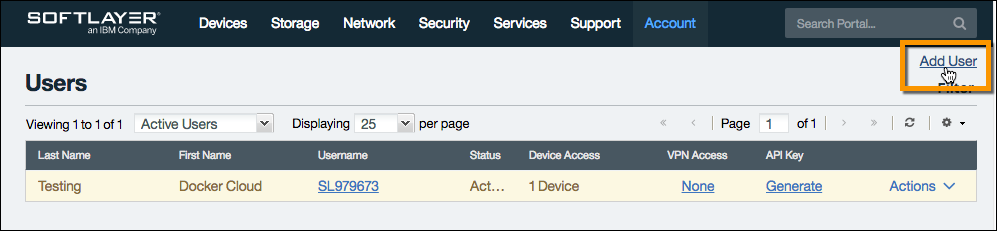
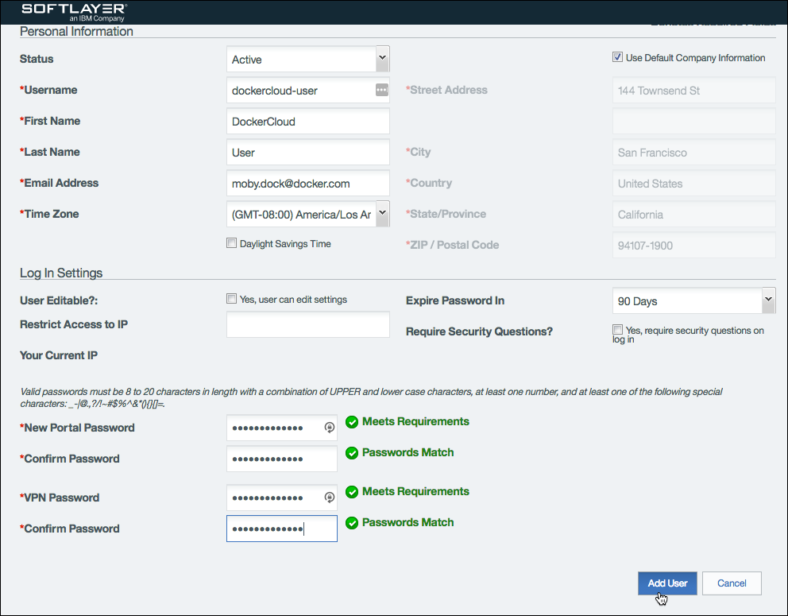
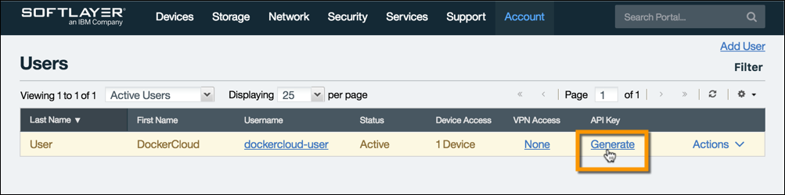
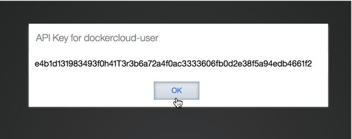
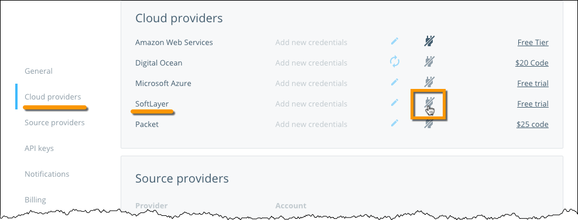
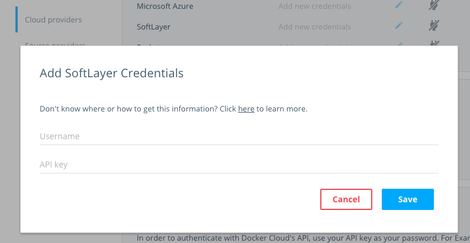

You can register your SoftLayer account credentials in your Docker Cloud account
to deploy **nodes** using Docker Cloud's Dashboard, API, or CLI. Docker Cloud
uses your SoftLayer username and API key to interact with SoftLayer on your
behalf to create and manage your **nodes** (virtual servers).

Although any SoftLayer account with the right privileges works, we recommend
creating a new **dockercloud-user** user. If you have already created a service
user, or do not wish to do so, continue to [Add SoftLayer Account
Credentials](link-softlayer.md#add-softlayer-account-credentials).

### Create dockercloud-user in SoftLayer

Go to the **Users** section in SoftLayer (using the following URL):
[https://control.softlayer.com/account/users](https://control.softlayer.com/account/users)

Click **Add User**:

Fill out the **Add User - Profile** form, and enter `dockercloud-user` in the
username field. Docker Cloud uses the service user's API key, so the password
you set is less important. Click **Add User**.

In the next step, **Permissions**, select the following permissions:

* Support
	* View Tickets
	* Add Tickets
	* Edit Tickets
* Devices
	* View Virtual Server Details
* Services
	* Manage SSH keys
* Account
	* Cancel Server
	* Cancel Services
	* Add Server

Click **Add Portal Permissions**.

Go back to the **Users** list, and click **Generate** under the **API Key** column:

Once generated, click the **View** link under the **API Key** column, and copy the generated API Key.

Once you create the new user `dockercloud-user`, have its
credentials, and set its permissions, go back to Docker Cloud.

## Add SoftLayer account credentials

To link your SoftLayer account so you can launch **nodes** from Docker Cloud,
navigate to **Account info \> Cloud providers**. Click **Add
credentials**.

Copy and paste the `username` and the `API Key` you received from SoftLayer into their corresponding fields in dialog that appears.

## What's next?

You're ready to start using SoftLayer as the infrastructure provider
for Docker Cloud! If you came here from the tutorial, click here to [continue the tutorial and deploy your first node](../getting-started/your_first_node.md).
