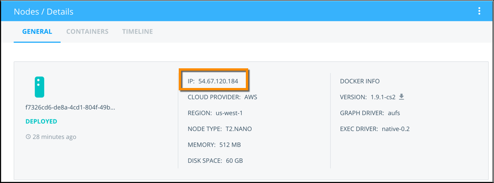

You can use add a public SSH key to the *authorized_keys* file in each of your nodes so you can access Docker Cloud provisioned nodes. The quickest way to do this is to run our **<a href="https://hub.docker.com/r/dockercloud/authorizedkeys" target="_blank">dockercloud/authorizedkeys</a>)** container image.

## Create pair of keys

First, generate a keypair using `ssh-keygen -t rsa`. If you have an existing keypair you prefer to use, you can skip this step, copy the public key to your clipboard and continue on to [create the authorizedkeys stack](ssh-into-a-node.md#create-a-stack-in-docker-cloud).

```none
$ ssh-keygen -t rsa
Generating public/private rsa key pair.
Enter file in which to save the key (/Users/borjaburgos/.ssh/id_rsa): dockercloud
Enter passphrase (empty for no passphrase):
Enter same passphrase again:
Your identification has been saved in dockercloud.
Your public key has been saved in dockercloud.pub.
The key fingerprint is:
ac:76:05:19:51:fa:3e:f0:c8:80:73:0d:9f:6b:b7:8f borjaburgos@MacBookPro
The key's randomart image is:
+--[ RSA 2048]----+
|        oo.      |
|         +       |
|      . +        |
|     . = +       |
|    o o S o      |
|     o + B       |
|      o * =      |
|     . o . +     |
|          E..    |
+-----------------+
```

Print your public key to the terminal and copy it to your clipboard.

```
$ more dockercloud.pub
ssh-rsa AAAAB3NzaC1yc2EAAAADAQABAAABAQC4PHh4WJqUgiWedmkIJS+L1IwxfXHkfYC0N9NZ28quXyL4zQq2CDeCQrS0RDESklnuZVCe9p5fjgEHcy+FsiTUaBbjzCndeO++gqAM6pKy4ziEY1JNpIBpbuyVIK6AJIqTWzcqprhw4G8PZetLoHug3BWiiwsIW7WHhNNsrEVEsTCnCc5vG97IHZ0A6TlP6HGvVSfCFPZiAxP48hsoEsEGjcCvY9tgJa4k60XWtHbPWtjOi90RFt9OKcbUsZa+vq/3lBG50XbMoQm3NS6A+UQQ7SKvzmwJSIYCqo5lu9UzQbVKy9o00NqXa5jkmZ9Yd0BJBjFmb3WwUR8sJWZVTPFL
```

### Create a stack in Docker Cloud

Next, we'll run the **authorizedkeys** service.

You can create a new stack in Docker Cloud and enter the following stackfile to create the service manually.

You can also click the button below to automatically create a new stack in Docker Cloud with the **authorizedkeys** service mostly configured. (Either way you still need to add your public key.)
<a href="https://cloud.docker.com/stack/deploy/?repo=https://github.com/docker/dockercloud-authorizedkeys" target="_blank"></a>


```yml
authorizedkeys:
  image: dockercloud/authorizedkeys
  deployment_strategy: every_node
  autodestroy: always
  environment:
    - AUTHORIZED_KEYS=ssh-rsa AAAAB3NzaC1yc2EAAAADAQABAAABAQC4PHh4WJqUgiWedmkIJS+L1IwxfXHkfYC0N9NZ28quXyL4zQq2CDeCQrS0RDESklnuZVCe9p5fjgEHcy+FsiTUaBbjzCndeO++gqAM6pKy4ziEY1JNpIBpbuyVIK6AJIqTWzcqprhw4G8PZetLoHaiTh343wsIW7WHhNNsrEVEsTCnCc5vG97IHZ0A6TlP6HGvVSfCFPZiAxP48hsoEsEGjcCvY9tgJa4k60XWtHbPWtjOi90RFt9OKcbUsZa+vq/3lBG50XbMoQm3NS6A+UQQ7SKvzmwJSIYCqo5lu9UzQbVKy9o00NqXa5jkmZ9Yd0BJBjFmb3WwUR8sJWZVTPFL
  volumes:
    - /root:/user:rw
```

Change the **AUTHORIZED_KEYS** value to the public key you copied to your clipboard in the previous step.

From the stack page, click **Create and deploy**.

The service runs, copies your public key to all of your nodes, then terminates
and automatically destroys the container.

> **Note**: the default configuration of this service copies the public key you enter to ALL of your existing nodes.

### SSH into Docker Cloud node

Next, get the node's IP from Docker Cloud from the Node details page.



With that IP number, you can then SSH to the node as `root`.

```none
$ ssh -i ~/dockercloud root@104.236.69.138
The authenticity of host '104.236.69.138 (104.236.69.138)' can't be established.
RSA key fingerprint is 4b:22:71:39:53:4a:88:51:4b:a7:2e:ed:03:dd:a3:7f.
Are you sure you want to continue connecting (yes/no)? yes
Warning: Permanently added '104.236.69.138' (RSA) to the list of known hosts.
Welcome to Ubuntu 14.04.1 LTS (GNU/Linux 3.13.0-40-generic x86_64)
 * Documentation:  https://help.ubuntu.com/
  System information as of Mon Feb  2 23:29:53 EST 2015
  System load:  0.2                Users logged in:        0
  Usage of /:   16.0% of 19.56GB   IP address for eth0:    104.236.69.138
  Memory usage: 52%                IP address for eth1:    10.132.224.214
  Swap usage:   0%                 IP address for docker0: 172.17.42.1
  Processes:    111
  Graph this data and manage this system at:
    https://landscape.canonical.com/
Last login: Mon Feb  2 23:29:54 2015 from pool-108-30-19-181.nycmny.fios.verizon.net
root@13e9d739-admin:~#
```