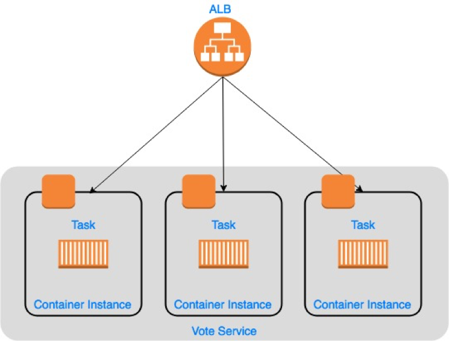

## Elastic Container Service (ECS)

This page explains how to prepare your applications for migration from Docker Cloud to [Amazon Elastic Container Service (ECS)](https://aws.amazon.com/ecs/) clusters. ECS is a managed container orchestration service from AWS that is responsible for managing cluster state and scheduling containers onto a fleet of container instances. It exposes an API and comes with tooling that you can use to migrate your containerized applications with minimized effort.

At a high level, migrating your Docker Cloud applications requires that you:

- **Build** a target environment
- **Convert** your Docker Cloud YAML stackfiles to Docker compose files or ECS task definitions
- **Test** the new task definitions in the new environment
- **Point** your application CNAMES to new service endpoints.
- **Migrate** your applications from Docker Cloud to the new environment.

To demonstrate, we **build** an ECS cluster, **convert** the Docker Cloud stackfile for [example-voting-app](https://github.com/dockersamples/example-voting-app) to an ECS task definition, and **test** the task definition in a sandboxed environment to ensure that it is safe to migrate.

> The actual process of migrating -- switching customers from your Docker Cloud applications to AWS ECS or EKS applications -- will vary by application and environment.

## Amazon Elastic Container Service for Kubernetes (EKS)

If you'd rather migrate your Docker Cloud applications to Amazon EKS after it becomes generally available, follow the [guidance](https://docs.docker.com/docker-cloud/migration/cloud-to-kube-gke/#db-service) Docker has written for converting your stackfiles to Kubernetes manifests.  Although the steps for creating and connecting to an EKS cluster will be slightly different than GKE and AKS, the manifests that you will create will be identical.

## Voting-app example

The Docker Cloud stack that we're going to use for our example is a voting application as defined in [dockercloud.yml](https://raw.githubusercontent.com/dockersamples/example-voting-app/master/dockercloud.yml). The rest of this document describes a couple of approaches you could use to convert this file into a set of ECS task definitions.

In the [dockercloud.yml](https://raw.githubusercontent.com/dockersamples/example-voting-app/master/dockercloud.yml), the voting app is defined as a stack of six microservices:

- **vote**: Web front-end that displays voting options
- **redis**: In-memory k/v store that collects votes
- **worker**: Stores votes in database
- **db**: Persistent store for votes
- **result**: Web server that pulls and displays results from database
- **lb**: Container-based load balancer

{:width="500px"}

Votes are accepted with the `vote` service and stored in persistent backend database `db` with the help of services, `redis`, `worker`, and `lb`. The vote tally is displayed with the `result` service.

## Migration prerequisites

To complete the migration from Docker Cloud to ECS, you'll need:

1.  An AWS account
2.  An ECS cluster
3.  A IAM user with permission to perform the actions outlined in this document


## Build a test environment

Amazon Elastic Container Service (Amazon ECS) is a highly scalable, high-performance [container](https://aws.amazon.com/containers/) orchestration service that supports [Docker](https://aws.amazon.com/docker/) containers and allows you to easily run and scale containerized applications on AWS. Amazon ECS eliminates the need for you to install and operate your own container orchestration software, manage and scale a cluster of virtual machines, or schedule containers on those virtual machines.

With simple API calls, you can launch and stop Docker-enabled applications, query the complete state of your application, and access many familiar features such as IAM roles, security groups, load balancers, Amazon CloudWatch Events, AWS CloudFormation templates, and AWS CloudTrail logs

To build an ECS cluster, you will need to:

1.  [Create an AWS account](https://aws.amazon.com/premiumsupport/knowledge-center/create-and-activate-aws-account/)
2.  [Create an IAM user](https://aws.amazon.com/premiumsupport/knowledge-center/create-new-iam-user/)
3.  Create an IAM policy which will allow you to perform the actions in this document
4.  [Attach this policy to an IAM user](https://docs.aws.amazon.com/IAM/latest/UserGuide/access_policies_manage-attach-detach.html#attach-managed-policy-console)
5.  Create an ECS cluster


### Create an ECS cluster

In this section we'll describe how to provision a cluster using ecs-cli, a purpose built CLI that you can use to manage and deploy services onto an ECS cluster. 

If you don't have the CLI installed on your machine, follow the steps outlined in this [document](https://docs.aws.amazon.com/AmazonECS/latest/developerguide/ECS_CLI_installation.html). 

### Configure the Amazon ecs-cli

Set up a CLI profile with the following command, substituting `profile_name` with your desired profile name, `AWS_ACCESS_KEY_ID` and `AWS_SECRET_ACCESS_KEY` environment variables with your AWS credentials.

```
ecs-cli configure profile --profile-name <profile_name> --access-key <AWS_ACCESS_KEY_ID> --secret-key <AWS_SECRET_ACCESS_KEY>
```

Complete the configuration with the following command, substituting `region_name` with your desired AWS region, `cluster_name` with the name of an existing Amazon ECS cluster or a new cluster to use, and `configuration_name` for the name you'd like to give this configuration.

```
ecs-cli configure --cluster <cluster_name> --region <region_name> --config-name <configuration_name>
```

### Provision a new ECS cluster

To provision a cluster, execute the following command:

```
ecs-cli up --keypair <key_pair_name> --capability-iam --size 5 --instance-type t2.large --cluster-config <config_name>
```

### Convert Docker Cloud stackfile

The following sections deal with each service definition separately.

To migrate your application from Docker Cloud to ECS, you can either recreate your Docker cloud stackfile as ECS task definitions or you can convert your stackfile to docker compose files which can be consumed directly by the ecs-cli or converted into an ECS task definition using the [container-transform](https://github.com/micahhausler/container-transform) utility.  

In the Docker Cloud stackfile, the six Docker _services_ in our `example-voting-app` stack are defined as **top-level keys**:

```
db: 
redis:
result:
lb:
vote:
worker:
```

An ECS task definition is a declarative way to describe the container images and run time parameters, e.g. environment variables, placement constraints, and so forth, that are part of your application stack and/or microservice.  You reference these task definitions when you create ECS service definitions which describe a variety of things including how many replicas of your task you want to run, how updates should be handled, what scaling policies to use, and whether the service should be fronted by a load balancer.

You can think of an ECS task as the smallest unit of deployment; all of the containers that are defined with a task definition are deployed as a unit.  When tasks are run as part of an ECS service, the ECS service scheduler is responsible for maintaining the desired state for that service, i.e. the number of tasks to run and/or scaling that service in accordance with your scaling policies.  The ECS service is also how you specify which the version of your task definition you want do deploy onto the ECS cluster.  

An ECS service is an abstraction that provides stable networking for a set of tasks.  Using AWS [Service Discovery](https://docs.aws.amazon.com/AmazonECS/latest/developerguide/service-discovery.html), it's now possible to register a service's endpoints in a [Route 53](https://aws.amazon.com/route53/) hosted zone which allows services to discover each other by querying DNS.  ECS services can also be fronted by an application, network, or classic load balancer.

The following diagram shows three tasks deployed as part of a single ECS service that is being fronted by an application load balancer.



### db service

**Docker Cloud stackfile**: The Docker Cloud stackfile defines an image and a restart policy for the `db` service.

```
db:
  image: 'postgres:9.4'
  restart: always
```

**ECS task definition**: before you can create a service from this stackfile, you first need to create a task definition. 

```
cat > db-taskdef.json <<EOF 
{
     "containerDefinitions": [{
         "cpu": 0,
         "memory": 512,
         "image": "postgres",
         "name": "db",
         "portMappings": [{
             "containerPort": 5432 
         }]
     }],
     "memory": "512",
     "requiresCompatibilities": [
         "EC2"
     ],
     "family": "db",
     "networkMode": "awsvpc",
     "cpu": "1024"
}
EOF
```

For a complete description of the parameters in an ECS task definition, please refer to the [documentation](https://docs.aws.amazon.com/AmazonECS/latest/developerguide/task_definition_parameters.html). 

If you've already written a Docker compose file for your service, you can import it as an ECS task definition using the `ecs-cli`, a purpose-built CLI for interacting with the ECS APIs.  It's also possible to create an ECS service directly from a Docker compose file.  The following is an example of a docker compose file for the `db` service.

```
version: '2'

services:
  db:
    image: postgres:9.4
    container_name: db
    volumes:
      - "db-data:/var/lib/postgresql/data" 
```

To create a task that supports [task networking](https://docs.aws.amazon.com/AmazonECS/latest/developerguide/task-networking.html), or to add other ECS specific parameters to this compose file, an additional file, called an ecs parameters file, is needed.  The following is an example of an ecs parameters file.  
```
cat > ecs-params.yml <<EOF
version: 1
task_definition:
  ecs_network_mode: awsvpc
  services:
    db:
run_params: 
  network_configuration:
    awsvpc_configuration:
      - subnet-abcd1234
      - subnet-abcd4321
    security_groups:
      - sg-abcd1234
      - sg-abcd4321
EOF
```

At this stage, we don't know enough information about the environment we're deploying this task into to configure all of these parameters, so _this is only meant to show an approach that you could use to migrate from Docker Cloud to ECS_ using the `ecs-cli`.  Once you've collect the missing information, you could create an ECS task definition by executing the following commands from a terminal:
```
ecs-cli compose --file <compose_file> --ecs-params ecs-params.yml --project-name <project_name> create 
```
To create a service directly from a compose file, you'd use this command:
```
ecs-cli compose --file <compose_file> --ecs-params ecs-params.yml --project-name <project_name> up 
```
For a list of the available options for the `ecs-cli`, see the [ecs-cli command line reference](https://docs.aws.amazon.com/AmazonECS/latest/developerguide/ECS_CLI_reference.html). 

***At present, the ecs-cli can only ingest docker compose files that are version 2.0 or below.***

If your compose file is newer than version 2.0, you can use the [container-transform](http://container-transform.readthedocs.io/en/latest/) utility to convert the compose file to a task definition.  

When you're ready to register the task definition, execute the following command: 
```
aws ecs register-task-definition --cli-input-json file://db-taskdef.json  
```
Now that we've created a task definition for the Postgres database, we need to create an ECS service.  When you create a service, the tasks are automatically monitored by the ECS scheduler which will restart tasks when they fail in order to maintain your desired state.  With ECS, you can also associate a name with your service in Route 53 so other services can discover it by querying DNS.  For this service, you're going to create an A record. 

The first step involves creating a namespace for our `db` service, for example, `corp.local`.  The following command creates a private hosted zone in Route 53 that will be used for our namespace.  

**Note**: _You only need to create the namespace once.  All subsequent services will be registered under the same namespace_. 
```
export OPERATION_ID=$(aws servicediscovery create-private-dns-namespace --name local --vpc <vpc_id> --region <region> --query 'Operation.Id' --output text)
```
Get the namespace id for the namespace that was created.
```
export NAMESPACE_ID=$(aws servicediscovery get-operation --operation-id $OPERATION_ID --region <region> | jq '.Operation.Targets.NAMESPACE')
```
Register the db service with the namespace.  This will create an A record for the service in a Route 53 private hosted zone that our services will use for service discovery. 
```
export SERVICE_ARN=$(aws servicediscovery create-service --name db --dns-config 'NamespaceId='$NAMESPACE_ID',DnsRecords=[{Type="A",TTL="300"}]' --health-check-custom-config FailureThreshold=1 --region <region> | jq '.Service.Arn')
```
Since we've configured this task to use `awsvpc` networking mode, we need to specify the list of target subnets and security group(s) for this task.  To get a list of the available subnets in a VPC, execute the following command.  Replace `vpc_id` with the id of the target VPC: 
```
export SUBNETS=$(aws ec2 describe-subnets --filters Name=vpc-id,Values=<vpc_id> --region <region> --query 'Subnets[].SubnetId' --output json)
```
Get the CIDR range for the VPC. 
```
export VPC_CIDR=$(aws ec2 describe-vpcs --vpc-id <vpc_id> --region <region> --query 'Vpcs[].CidrBlock' --output text)
```
Create a security group. 
```
export SG_ID=$(aws ec2 create-security-group --group-name <group_name> --description "Allow inbound access from the VPC" --vpc-id <vpc_id> --region <region> --output text)
```
Create an inbound rule that allows all traffic from the VPC.  
```
aws ec2 authorize-security-group-ingress --group-id $SG_ID --protocol all --cidr $VPC_CIDR 
```
_Once the application is running, this rule should be scoped down to only allow inbound traffic from the calling service(s)._ 

Create an ECS service definition for the `db` service.
```
cat > db.json <<EOF
{
    "cluster": "<cluster_name>",
    "serviceName": "db-svc",
    "taskDefinition": "db:1",
    "serviceRegistries": [
       {
          "registryArn": ${SERVICE_ARN}, 
          "containerName": "db" 
       }
    ],
    "launchType": "EC2",
    "desiredCount": 1,
    "networkConfiguration": {
        "awsvpcConfiguration": {
            "subnets": ${SUBNETS},
            "securityGroups": ["${SG_ID}"],
            "assignPublicIp": "DISABLED"
        }
    }
}
EOF
```

Create the service.
```
aws ecs create-service --region <region> --cli-input-json file://db.json
```

### Redis service

Docker Cloud stackfile:

```
redis:
  image: 'redis:latest'
  restart: always
```

ECS task definition:

```
cat > redis-taskdef.json <<EOF
{
    "containerDefinitions": [{
        "cpu": 0,
        "memory": 512,
        "image": "redis:alpine",
        "name": "redis",
        "portMappings": [{
            "containerPort": 6379
        }]
    }],
    "memory": "512",
    "requiresCompatibilities": [
        "EC2"
    ],
    "family": "redis",
    "networkMode": "awsvpc",
    "cpu": "1024" 
}
EOF
```

Register the task definition.

```
aws ecs register-task-definition --region <region> --cli-input-json file://redis-taskdef.json
```

This task definition will create an ECS task that runs a `redis:alpine` container that listens on port 6379. 

Register the `redis:alpine` service with the service discovery service.  This will create a A record in a Route 53 private hosted zone that other services will use for service discovery.

```
export SERVICE_ARN=$(aws servicediscovery create-service --name redis --dns-config 'NamespaceId='$NAMESPACE_ID',DnsRecords=[{Type="A",TTL="300"}]' --health-check-custom-config FailureThreshold=1 --region <region> | jq '.Service.Arn')
```

Create a service definition for the `redis:alpine` service. 

```
cat > redis.json <<EOF
{
    "cluster": "<cluster_name>",
    "serviceName": "redis-svc",
    "taskDefinition": "redis:1",
    "serviceRegistries": [
       {
          "registryArn": ${SERVICE_ARN}, 
          "containerName": "redis"
       }
    ],
    "launchType": "EC2",
    "desiredCount": 1,
    "networkConfiguration": {
        "awsvpcConfiguration": {
            "subnets": ${SUBNETS},
            "securityGroups": ["${SG_ID}"],
            "assignPublicIp": "DISABLED"
        }
    } 
}
EOF
```

Create the `redis` service.
```
aws ecs create-service --region <region> --cli-input-json file://redis.json
```

### lb service

The Docker Cloud stackfile defines and `lb` service to distribute traffic to the instances of vote task.  On AWS, this is unnecessary because ECS allows you to front your service with an Application, Network, or Classic Load Balancer.  We will show how to use an application load balancer with an ECS service in the `vote` section. 

### Vote service

The Docker Cloud stackfile for the `vote` service defines an image, a restart policy, and a specific number of Pods (replicas: 5). It also enables the Docker Cloud `autoredeploy` feature. We can tell that it listens on port 80 because the Docker Cloud `lb` service forwards traffic to it on port 80; we can also inspect its image.

_**Autoredeploy options**_: _Autoredeploy is a Docker Cloud feature that automatically updates running applications every time you push an image. You can replicate this behavior within AWS by building an automated CI/CD pipeline using CodeCommit, CodePipeline, and CodeBuild services._

Docker Cloud stackfile:

```
vote:
  autoredeploy: true
  image: 'docker/example-voting-app-vote:latest'
  restart: always
  target_num_containers: 5
```

Create a security group for the load balancer. 
```
export SG_ID=$(aws ec2 create-security-group --group-name <group_name> --description
"Allow inbound on port 80 from the Internet" --vpc-id <vpc_id> --region <region> --output text)
```

Create an ingress rule for the security group that allows port 80 inbound from the Internet. 
```
aws ec2 authorize-security-group-ingress --group-id $SG_ID --protocol tcp --port 80 --cidr $VPC_CIDR 
```

Get the list of subnets from your VPC.
```
aws ec2 describe-subnets --filters Name=vpc-id,Values=<vpc_id> --region <region> --query 'Subnets[].SubnetId' --output text
```
Create an application load balancer for the `voter` service. Replace `subnet_ids` with the subnets that your container instances are running on.
```
export $LB_ARN=$(aws elbv2 create-load-balancer --name <name> --subnets <subnet_ids> --security-groups $SG_ID --type application | jq '.LoadBalancers[].LoadBalancerArn')
```

Create a target group for the application load balancer.  Replace `vpc_id` with the id of the VPC that your container instances are a part of. 
```
export TARGET_ARN=$(aws elbv2 create-target-group --name <name> --protocol HTTP --port 80 --vpc-id <vpc_id> | jq '.TargetGroups[].TargetGroupArn')
```

Add a listener to the load balancer.  This will route port 80 traffic to the target group where your voter service will run.   
```
aws elbv2 create-listener --load-balancer-arn $LB_ARN --protocol HTTP --port 80 --default-actions Type=forward,TargetGroupArn=$TARGET_ARN
```

Create a task definition for the `voter` service.  When you set the host port to 0, the host port is assigned a random high port by Docker.  As the tasks start, the application load balancer dynamically discovers and registers the host port so requests can be routed to the task's container port.  

```
cat > voter-taskdef.json <<EOF
{
    "containerDefinitions": [{
        "cpu": 0,
        "memory": 512,
        "image": "docker/example-voting-app-vote:latest",
        "name": "voter",
        "portMappings": [{
            "containerPort": 80,
            "hostPort": 0
        }],
        "dnsSearchDomains": [
            "local"
        ]
    }],
    "memory": "512",
    "requiresCompatibilities": [
        "EC2"
    ],
    "family": "voter",
    "networkMode": "bridge",
    "cpu": "1024"
}
EOF
```

Register the task definition. 
```
aws ecs register-task-definition --region <region> --cli-input-json file://voter-taskdef.json
```

Create a service definition for the `voter` service. 

```
cat > voter.json <<EOF
{
    "cluster": "<cluster>",
    "serviceName": "voter-svc",
    "taskDefinition": "voter:1",
    "loadBalancers": [{
        "targetGroupArn": ${TARGET_ARN},
        "containerName": "voter",
        "containerPort": 80,
    }],
    "launchType": "EC2",
    "desiredCount": 2
}
EOF
```

Create the `voter` service. 
```
aws ecs create-service --region <region> --cli-input-json file://voter.json
```

This creates an ECS service behind an application load balancer.  It is assigned a public DNS name for the service running behind it.  Its listener accepts requests on port 80 and distributes them across the tasks in the target group you created earlier.  This is why the `lb` service from the Docker Cloud app is not necessary.

### worker service

The worker service defines an image, restart policy and a specific number of replicas (3).  The worker service is a standalone service that transfers voter data from the `redis` service to the `db` service. 

Docker Cloud stackfile:

```
worker:
  autoredeploy: true
  image: 'docker/example-voting-app-worker:latest'
  restart: always
  target_num_containers: 3
```

ECS task definition:
```
cat > worker-taskdef.json <<EOF
{
    "containerDefinitions": [{
        "cpu": 0,
        "memory": 512,
        "image": "docker/example-voting-app-worker:latest",
        "name": "worker",
        "portMappings": [{
            "containerPort": 55555,
            "hostPort": 0
        }],
        "dnsSearchDomains": [
            "local"
        ]
    }],
    "memory": "512",
    "requiresCompatibilities": [
        "EC2"
    ],
    "family": "worker",
    "networkMode": "bridge",
    "cpu": "1024"
}
EOF
```

Register the task definition.
```
aws ecs register-task-definition --region <region> --cli-input-json file://worker-taskdef.json
```

Create a service definition for the `worker` service. 

```
cat > worker.json <<EOF
{
    "cluster": "<cluster_name>",
    "serviceName": "worker-svc",
    "taskDefinition": "worker:1",
    "serviceRegistries": [
       {
          "registryArn": ${SERVICE_ARN}, 
          "containerName": "worker"
          "containerPort": 55555  
       }
    ],
    "launchType": "EC2",
    "desiredCount": 3,
}
EOF
```

Create the `worker` service.
```
aws ecs create-service --region <region> --cli-input-json file://worker.json
```

### result service

Docker Cloud stackfile:
```
result:
  autoredeploy: true
  image: 'docker/example-voting-app-result:latest'
  ports:
    - '80:80'
  restart: always
  target_num_containers: 3
```

ECS task definition:

```
cat > result-taskdef.json <<EOF
{
    "containerDefinitions": [{
        "cpu": 0,
        "memory": 512,
        "image": "docker/example-voting-app-result:latest",
        "name": "result",
        "portMappings": [{
            "containerPort": 80,
            "hostPort": 0
        }],
        "dnsSearchDomains": [
            "local"
        ]
    }],
    "memory": "512",
    "requiresCompatibilities": [
        "EC2"
    ],
    "family": "result",
    "networkMode": "bridge",
    "cpu": "1024"
}
EOF
```

Register the task definition. 
```
aws ecs register-task-definition --region <region> --cli-input-json file://result-taskdef.json
```

Create an application load balancer for the `results` service. Replace `subnet_ids` with the subnets that your container instances are running on.
```
export LB_ARN=$(aws elbv2 create-load-balancer --name <name> --subnets <subnet_ids> --security-groups $SG_ID --type application | jq '.LoadBalancers[].LoadBalancerArn')
```

Create a target group for the load balancer.
```
export TARGET_ARN=$(aws elbv2 create-target-group --name <name> --protocol HTTP --port 80 --vpc-id <vpc_id> | jq '.TargetGroups[].TargetGroupArn')
```

Add a listener to the load balancer
```
aws elbv2 create-listener --load-balancer-arn $LB_ARN --protocol HTTP --port 80 --default-actions Type=forward,TargetGroupArn=$TARGET_ARN
```

Modify the target group attributes.  The `result` service uses websocks which requires sticky sessions to be enabled. 
```
aws elbv2 modify-target-group-attributes --target-group-arn $TARGET_ARN --attributes Key=stickiness.enabled,Value=true Key=stickiness.lb_cookie.duration_seconds,Value=3600  
```

Create a service definition. 
```
cat > result.json <<EOF
{
    "cluster": "<cluster>",
    "serviceName": "result-svc",
    "taskDefinition": "result:1",
    "loadBalancers": [
        {
            "targetGroupArn": ${TARGET_ARN},
            "containerName": "result",
            "containerPort": 80 
        }
    ],
    "launchType": "EC2",
    "desiredCount": 3 
}
EOF
```

Create the `result` service.
```
aws ecs create-service --region <region> --cli-input-json file://result.json
```

### Finish Configuring Security Groups

Add the load balancer security group to the security group for your container instances.
```
aws ec2 authorize-security-group-ingress --group-id <group_id_of_container_instances> --protocol all --source-group $SG_ID 
```

### Test the app on ECS

Before migrating, you should thoroughly test each ECS service on an ECS cluster. Healthy testing includes deploying each component of the application as an ECS service onto your cluster, performing scaling operations, increasing load, running failure scenarios, and doing updates and rollbacks. These tests are specific to each of your applications. You should also manage your ECS task and service definitions in a version control system like CodeCommit. 

To check to see a list of the services you created, type the following command: 
```
aws ecs list-services --cluster <cluster> --region <region> 
```

To see whether a service is running, type the following command: 
```
ecs-cli ps --cluster <cluster> --region <region>
```

To test whether the application works in your environment, get the URLs of the 2 load balancers, replacing <name> with the name you gave the load balancer earlier.
```
aws elbv2 describe-load-balancers --names <name> --region <region> | jq '.LoadBalancers[].DNSName'
```

1.	Copy/paste the value for the `vote` service into a browser and cast a vote.
2.	Copy/paste the value for the `result` service into a browser and ensure your vote registered.

### Migrate apps from Docker Cloud

_Remember to point your application CNAMES to new service endpoints._

How you migrate your applications is unique to your environment and applications.
1.	Plan with all developers and operations teams.
2.	Plan with customers.
3.	Plan with owners of other applications that interact with your Docker Cloud app.
4.	Plan a rollback strategy if problems occur.

After the migration is complete, make sure everything is working as expected. Ensure that users are hitting the new application on the AWS infrastructure and you're getting the results you expect.

## Summary

In this post, we how to move an application from Docker Cloud to Amazon ECS with no code changes.  While this may initially help accelerate your migration to ECS, you're still left with services like Postgres and Redis that you'll have to manage yourself.   AWS gives you an opportunity to replace those services with managed services, like RDS and Elasticache which alleviate a lot of that “undifferentiated heavy lifting” we associate with managing infrastructure services like these.  We encourage you to look at a migration of this kind as an opportunity to optimize by re-architecting your application to take advantage of AWS's managed services.  For an in-depth look at how to do this, see [“Deploying the voting app to ECS with Fargate”](https://read.acloud.guru/deploy-the-voting-app-to-aws-ecs-with-fargate-cb75f226408f).  The beauty of this approach is that lets you run containerized applciations without managing the underlying compute infrastruture, which leaves you more time to create great applications and less time worrying about your infrastructure. 
