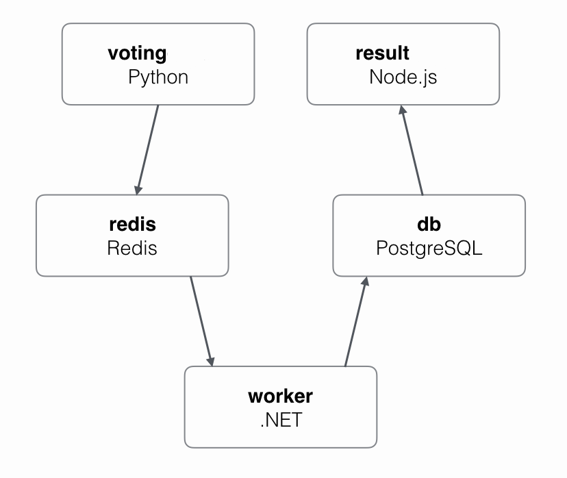

## AKS Kubernetes

This page explains how to prepare your applications for migration from Docker Cloud to [Azure Container Service (AKS)](https://azure.microsoft.com/en-us/free/){: target="_blank" class="_"} clusters. AKS is a hosted Kubernetes service on Microsoft Azure. It exposes standard Kubernetes APIs so that standard Kubernetes tools and apps run on it without needing to be reconfigured.

To demonstrate, we use [example-voting-app](https://github.com/dockersamples/example-voting-app){: target="_blank" class="_"}: we **build** a target environment of AKS nodes, **convert** the Cloud stackfile to a Kubernetes manifest, and **test** the manifest in the new environment to ensure that it is safe to migrate.


> The actual process of migrating -- switching customers from your Docker Cloud applications to AKS applications -- will vary by application and environment.

## Voting-app example

In the [Docker Cloud stackfile](https://raw.githubusercontent.com/dockersamples/example-voting-app/master/dockercloud.yml){: target="_blank" class="_"}, the voting app is defined as a stack of six microservices:

- **vote**: Web front-end that displays voting options
- **redis**: In-memory k/v store that collects votes
- **worker**: Stores votes in database
- **db**: Persistent store for votes
- **result**: Web server that pulls and displays results from database
- **lb**: Container-based load balancer

Votes are accepted with the `vote` service and stored in a persistent backend database (`db`) with the help of services, `redis`, `worker`, and `lb`. The vote tally is viewed with the `result` service.

{:width="500px"}

## Migration prerequisites

To complete the migration from Docker Cloud to Kubernetes on AKS, you need:

- An active Azure subscription with billing enabled.

## Build target environment

Azure Container Service (AKS) is a managed Kubernetes service. Azure takes care of all of the Kubernetes control plane management -- delivering the control plane APIs, managing control plane HA, managing control plane upgrades, etc. You only need to look after worker nodes -- how many, size and spec, where to deploy them, etc.

Building an AKS cluster involves the following high-level steps:

1.  Create an Azure Application Registration.
2.  Deploy an AKS cluster.
3.  Connect to the AKS cluster.

### Register your application

Currently, AKS needs to be manually registered with Azure Active Directory so that it can receive security tokens and integrate with secure sign-on and authorization.

1.  Log in to the [Azure portal](https://portal.azure.com){: target="_blank" class="_"}.
2.  Click **Azure Active Directory** > **App registrations** > **New application registration**.
3.  Give the application a **Name**, select application type **Web app/API**, and enter a **Sign-on URL**. The sign-on URL needs to be a valid DNS name but does not need to be resolvable. An example might be `https://k8s-vote.com`.
4.  Click **Create**.
5.  Copy and save the Application ID (this is your **Service principal client ID**).
6.  Click **Settings** > **Keys** and set a description and duration.
7.  Click **Save**.
8.  Copy the **Value** field contents to a safe place (this is your **Service principal client secret**).

The application registration is now complete. Time to build the AKS cluster.

### Build an AKS cluster

In this section, we build a three-node cluster; yours should probably be based on the configuration of your Docker Cloud node cluster.

Docker Cloud deploys work to all nodes in a cluster (managers and workers); Kubernetes only deploys work to nodes (workers). With this in mind, you should size your AKS cluster accordingly. For example, if your Docker Cloud node cluster was working well with three managers and two workers of a particular size, you should probably size your AKS cluster to have five nodes of a similar size.

> To see the configuration of each of your clusters in Docker Cloud, select **Node Clusters** > _your_cluster_.

Before continuing, ensure you know:

- Your **Azure subscription credentials**
- **Azure region** to which you want to deploy your AKS cluster
- **SSH public key** to use when connecting to AKS nodes
- **Service principal client ID** and **Service principal client secret** (from the previous section)
- The **number, size, and spec** of the nodes (workers) you want.

To deploy a cluster of AKS nodes:

1.  Select **+New** from the top-left of the Azure portal main dashboard.
2.  Select **Containers** > **Azure Container Service - AKS (preview)**. _Do not select the other ACS option._
3.  Fill out the form with the required details.

    - **Cluster name**: This is the name you want to use to identify this AKS cluster.
    - **Kubernetes version**: Choose one of the 1.8.x versions.
    - **Subscription**: Choose the subscription that you want to use to pay for the cluster.
    - **Resource group**: Create a new resource group or choose one from your existing list.
    - **Location**: Select the Azure region that you want to deploy the AKS cluster to. AKS may not be available in all Azure regions.

4.  Click **OK**.
5.  Configure the additional AKS cluster parameters.

    - **User name**: The default option should be fine.
    - **SSH public key**: This is the public key (certificate) of a key-pair that you own that can be used for SSH. You can generate this using a number of different tools such as `ssh-keygen` or PuTTY. It should be a minimum of 2048 bits of type ssh-rsa.
    - **Service principal client ID**: This is the application ID that you copied in an earlier step.
    - **Service principal client secret**: This is password value that you copied in a previous step.
    - **Node count**: This is the number of **worker** nodes that you want in the cluster. It should probably match the number of **worker** nodes in your existing Docker Cloud node cluster.
    - **Node virtual machine size**: This is the size and specification of each AKS node. It only applies to **worker** nodes, and should probably match the configuration of your existing Docker Cloud node cluster.

6.  Click **OK**.
7.  Review the configuration on the Summary screen and click **OK** to deploy the cluster. It will take a few minutes.

### Connect to the AKS cluster

You can connect to your AKS cluster from the web-based Azure cloud shell; but to do so from your laptop, or other local terminal, you must:

- Install the Azure CLI tool (`az`).
- Install the Kubernetes CLI (`kubectl`) with the `az` tool.
- Configure `kubectl` to connect to your AKS cluster.

To connect to your AKS cluster from a local terminal:

1.  Download and install the [Azure CLI](https://docs.microsoft.com/en-us/cli/azure/install-azure-cli?view=azure-cli-latest){: target="_blank" class="_"} for your Operating System.
2.  With the Azure CLI, install the Kubernetes CLI, `kubectl`.

    ```
    > az aks install-cli
    Downloading client to C:\Program Files (x86)\kubectl.exe from...
    ```

3.  Start the Azure login process:

    ```
    > az login
    To sign in, use a web browser to open the page [https://aka.ms/devicelogin](https://aka.ms/devicelogin){: target="_blank" class="_"} and enter...
    ```

4.  Open the "devicelogin" page in a browser and paste the authentication code. When complete, the CLI returns some JSON.
5.  Get the credentials and use them to configure `kubectl`:

    The values for `--resource-group` and `--name` are the Resource Group and Cluster Name that you set in the previous steps. Substitute the values below with the values for your environment.

    ```
    > az aks get-credentials --resource-group=k8s-vote --name=k8s-vote
    Merged "k8s-vote" as current context in C:\Users\nigel\.kube\config
    ```

6.  Test that `kubectl` can connect to your cluster.

    ```
    > kubectl get nodes
    NAME                       STATUS    ROLES     AGE       VERSION
    aks-agentpool-29046111-0   Ready     agent     3m        v1.8.1
    aks-agentpool-29046111-1   Ready     agent     2m        v1.8.1
    aks-agentpool-29046111-2   Ready     agent     2m        v1.8.1
    ```

    The `kubectl get nodes` command returns information about the nodes in the cluster. If the values returned by the command match your AKS cluster (number of nodes, age, and version), you have successfully configured `kubectl` to manage your AKS cluster.

You now have an AKS cluster and have configured the `kubectl` Kubernetes client to manage it. Let's switch tak and convert a Docker Cloud app into a Kubernetes app.

## Convert Docker Cloud stackfile

**In the following sections, we discuss each service definition separately, but you should group them into one stackfile with the `.yml` extension, for example, [docker-stack.yml](https://github.com/dockersamples/example-voting-app/blob/master/docker-stack.yml){: target="_blank" class="_"}.**

To prepare your applications for migration from Docker Cloud to Kubernetes, you must recreate your Docker Cloud stackfiles as Kubernetes _manifests_. Once you have each application converted, you can test and deploy. Like Docker Cloud stackfiles, Kubernetes manifests are YAML files but usually longer and more complex.

> To find the stackfiles for your existing applications in Docker Cloud, you can (1) Select **Stacks** > _your_stack_ > **Edit**, or (2) Select **Stacks** > _your_stack_ and scroll down.

In the Docker Cloud stackfile, the six Docker _services_ in our `example-voting-app` stack are defined as **top-level keys**:

```
db:
redis:
result:
lb:
vote:
worker:
```

Kubernetes applications are built from objects (such as [Pods](https://kubernetes.io/docs/concepts/workloads/pods/pod/){: target="_blank" class="_"})
and object abstractions (such as [Deployments](https://kubernetes.io/docs/concepts/workloads/controllers/deployment/){: target="_blank" class="_"}
and [Services](https://kubernetes.io/docs/concepts/services-networking/service/){: target="_blank" class="_"}). For each _Docker service_ in our voting app stack, we create one Kubernetes Deployment and one _Kubernetes Service_. Each Kubernetes Deployment spawns Pods. A Pod is a set of containers and also the smallest unit of work in Kubernetes.

> A [Docker serivce](https://docs.docker.com/engine/swarm/how-swarm-mode-works/services/){: target="_blank" class="_"} is one component of an application that is generated from one image.
> A [Kubernetes service](https://kubernetes.io/docs/concepts/services-networking/service/){: target="_blank" class="_"} is a networking construct that load-balances Pods behind a proxy.

A Kubernetes Deployment defines the application "service" -- which Docker image to use and the runtime instructions (which container ports to map and the container restart policy). The Deployment is also where you define how rolling updates work, rollbacks, and other advanced features.

A Kubernetes Service object is an abstraction that provides stable networking for a set of Pods. A Service is where you can register a cluster-wide DNS name and virtual IP for accessing the Pods, and also create cloud-native load-balancers.

The diagram shows four Pods deployed as part of a single Deployment. Each Pod is labeled as “app=vote” and the Deployment has a label selector with “app=vote”. This combination of labels and label selector is what allows the Deployment object to manage Pods (create, terminate, scale, update, roll back…). The Service object selects Pods on the same label (“app-vote”). This time the label and label selector allow the service to provide a stable network abstraction (IP and DNS name) for the Pods.

{:width="400px"}

### db service

Consider using a hosted database service for production databases. This is something that, ideally, should not change as part of your migration away from Docker Cloud stacks.

**Docker Cloud stackfile**: The Docker Cloud stackfile defines an image and a restart policy for the `db` service.

```
db:
  image: 'postgres:9.4'
  restart: always
```

**Kubernetes manifest**: The Kubernetes translation defines two object types or "kinds": a _Deployment_ and a _Service_ (separated by three dashes `---`). Each object includes an API version, metadata (labels and name), and a `spec` field for object configuration (that is, the Deployment Pods and the Service).

```
apiVersion: apps/v1beta1
kind: Deployment
metadata:
  name: db
  labels:
    app: db
spec:
  template:
    metadata:
      labels:
        app: db
    spec:
      containers:
      - image: postgres:9.4
        name: db
      restartPolicy: Always
---
apiVersion: v1
kind: Service
metadata:
  name: db
spec:
  clusterIP: None
  ports:
  - port: 55555
    targetPort: 0
  selector:
    app: db
```

About the Kubernetes fields in general:

- `apiVersion` sets the schema version for Kubernetes to use when managing the object. The versions set here are supported on AKS (1.7.7 and 1.8.1).
- `kind` defines the object type. In this example, we only define Deployments and Services but there are many others.
- `metadata` assigns a name and set of labels to the object.
- `spec` is where we configure the object. In a Deployment, `spec` defines the Pods to deploy.

It is important that **Pod labels** (`Deployment.spec.template.metadata.labels`) match both **Deployment labels** (`Deployment.metadata.labels`) and **Service label selectors** (`Service.spec.selector`). This is how the Deployment object knows which Pods to manage and how the Service knows which Pods for which to provide networking.

For the `db` Deployment, we define a container called `db` based on the `postgres:9.4` Docker image, and define a restart policy. All Pods created by this Deployment have the label, `app=db`.

The `db` Service is a “headless” service (`clusterIP: None`). Headless services are useful when you want a stable DNS name but do not need the cluster-wide VIP. They create a stable DNS record, but instead of creating a VIP, they map the DNS name to multiple
[A records](https://kubernetes.io/docs/concepts/services-networking/dns-pod-service/#a-records){: target="_blank" class="_"} -- one for each Pod associated with the Service.

The label selector (`Service.spec.selector`) has the value, "app=db". This means the Service provides stable networking and load-balancing for all Pods on the cluster labeled as “app=db”. Pods defined in the Deployment section are all labelled as "app-db". It is this mapping between the Service label selector and the Pod labels that tells the Service object which Pods for which to provide networking.

### redis service

**Docker Cloud stackfile**:

```
redis:
  image: 'redis:latest'
  restart: always
```

**Kubernetes manifest**:

```
apiVersion: apps/v1beta1
kind: Deployment
metadata:
  labels:
    app: redis
  name: redis
spec:
  template:
    metadata:
      labels:
        app: redis
    spec:
      containers:
      - image: redis:alpine
        name: redis
        ports:
        - containerPort: 6379
      restartPolicy: Always
---
apiVersion: v1
kind: Service
metadata:
  labels:
    app: redis
  name: redis
spec:
  ports:
  - port: 6379
    targetPort: 6379
  selector:
    app: redis
```

Here, the Deployment object deploys a Pod from the `redis:alpine` image and sets the container port to `6379`. It also ensures that `labels` for both the Deployment and its Pods have the same value ("app=redis") to tie the two together.

The Service object defines cluster-wide DNS mapping for the name "redis" on port 6379. This means that traffic for `tcp://redis:6379` is routed to this Service and load-balanced across all Pods on the cluster with the "app=redis" label. The Service is accessed on the cluster-wide `port`; and the Pod listens on the `targetPort`. Again, the label-selector for the Service (Service.spec.selector) and the labels for the Pods (Deployment.spec.template.metadata.labels)  are what tie the two together.

The diagram shows traffic intended for tcp://redis:6379 being sent to the redis Service and then load-balanced across all Pods that match the Service label selector.

{:width="400px"}

### lb service

The Docker Cloud stackfile defines an `lb` service to load balance traffic to the vote service. This is not needed in Kubernetes on AKS, because you can define a Kubernetes Service that creates a native Azure load-balancer to do this job. We demonstrate in the `vote` section.

### vote service

The Docker Cloud stackfile defines an image, a restart policy, and a specific number containers (in this case, five) for the `vote` service. It also enables the Docker Cloud `autoredeploy` feature. We can infer that it listens on port 80 by either inspecting its image, or seeing that the Docker Cloud `lb` service was forwarding traffic to it on port 80.

> **Autoredeploy options**: Autoredeploy is a Docker Cloud feature that automatically updates running applications every time you build an image. It is not native to Docker CE, AKS or GKE, but you may be able to regain it with Docker Cloud auto-builds, using web-hooks from the Docker Cloud repository for your image back to the CI/CD pipeline in your dev/staging/production environment.

**Docker Cloud stackfile**:

```
vote:
  autoredeploy: true
  image: 'docker/example-voting-app-vote:latest'
  restart: always
  target_num_containers: 5
```

**Kubernetes manifest**:

```
apiVersion: apps/v1beta1
kind: Deployment
metadata:
  labels:
    app: vote
  name: vote
spec:
  replicas: 5
  template:
    metadata:
      labels:
        app: vote
    spec:
      containers:
      - image: docker/example-voting-app-vote:latest
        name: vote
        ports:
        - containerPort: 80
      restartPolicy: Always
---
apiVersion: v1
kind: Service
metadata:
  labels:
    app: vote
  name: vote
spec:
  type: LoadBalancer
  ports:
  - port: 80
  selector:
    app: vote
```

Again, we ensure that both Deployment and Service objects can find the Pods with matching labels and label selectors ("app=vote"). We also set the number of Pod replicas to five (`Deployment.spec.replicas`) to match the `target_num_containers` from the Docker Cloud stackfile.

We define the Service as "type=loadbalancer". This creates a native Azure load-balancer with a stable, publicly routable IP for the service. It also maps port 80 so that traffic hitting port 80 is load-balanced across all five Pod replicas in the cluster.  This is why the `lb` service from the Docker Cloud app is not needed.

### worker service

Like the `vote` service, the `worker` service defines an image, a restart policy, and a specified number of containers (or replicas). It also defines the Docker Cloud `autoredeploy` policy.

> **Autoredeploy options**: Autoredeploy is a Docker Cloud feature that automatically updates running applications every time you build an image. It is not native to Docker CE, AKS or GKE, but you may be able to regain it with Docker Cloud auto-builds, using web-hooks from the Docker Cloud repository for your image back to the CI/CD pipeline in your dev/staging/production environment.

**Docker Cloud stackfile**:

```
worker:
  autoredeploy: true
  image: 'docker/example-voting-app-worker:latest'
  restart: always
  target_num_containers: 3
```

**Kubernetes manifest**:

```
apiVersion: apps/v1beta1
kind: Deployment
metadata:
  labels:
    app: worker
  name: worker
spec:
  replicas: 3
  template:
    metadata:
      labels:
        app: worker
    spec:
      containers:
      - image: docker/example-voting-app-worker:latest
        name: worker
      restartPolicy: Always
---
apiVersion: v1
kind: Service
metadata:
  labels:
    app: worker
  name: worker
spec:
  clusterIP: None
  ports:
  - port: 55555
    targetPort: 0
  selector:
    app: worker
```

Again, we ensure that both Deployment and Service objects can find the Pods with matching labels and label selectors respectively ("app=worker").

The Service is another “headless” service where a DNS name is created and mapped to individual
[A records](https://kubernetes.io/docs/concepts/services-networking/dns-pod-service/#a-records){: target="_blank" class="_"} for each Pod rather than a cluster-wide VIP.

### result service

**Docker Cloud stackfile**:

```
result:
  autoredeploy: true
  image: 'docker/example-voting-app-result:latest'
  ports:
    - '80:80'
  restart: always
```

**Kubernetes manifest**:

```
apiVersion: apps/v1beta1
kind: Deployment
metadata:
  labels:
    app: result
  name: result
spec:
  template:
    metadata:
      labels:
        app: result
    spec:
      containers:
      - image: docker/example-voting-app-result:latest
        name: result
        ports:
        - containerPort: 80
      restartPolicy: Always
---
apiVersion: v1
kind: Service
metadata:
  labels:
    app: result
  name: result
spec:
  type: LoadBalancer
  ports:
  - port: 80
  selector:
    app: result
```

The Deployment section defines the usual names, labels, and Pod (container) spec. The Service section defines another Azure-native load-balancer to load balance external traffic to the cluster on port 80.

### Kubernetes manifest file

You can choose to include all Deployments and Services in a single YAML file, or have one YAML file per Docker Cloud service. The choice is yours, but it's usually easier to deploy and manage as a single file.

The example below shows them all defined in a single long YAML file called "k8s-vote.yml". You should manage your Kubernetes manifest files the way you manage your application code -- checking them in and out of version control repositories etc.

```
apiVersion: apps/v1beta1
kind: Deployment
metadata:
  name: db
  labels:
    app: db
spec:
  template:
    metadata:
      labels:
        app: db
    spec:
      containers:
      - image: postgres:9.4
        name: db
      restartPolicy: Always
---
apiVersion: v1
kind: Service
metadata:
  name: db
spec:
  clusterIP: None
  ports:
  - port: 55555
    targetPort: 0
  selector:
    app: db
---
apiVersion: apps/v1beta1
kind: Deployment
metadata:
  labels:
    app: redis
  name: redis
spec:
  template:
    metadata:
      labels:
        app: redis
    spec:
      containers:
      - image: redis:alpine
        name: redis
        ports:
        - containerPort: 6379
      restartPolicy: Always
---
apiVersion: v1
kind: Service
metadata:
  labels:
    app: redis
  name: redis
spec:
  ports:
  - port: 6379
    targetPort: 6379
  selector:
    app: redis
---
apiVersion: apps/v1beta1
kind: Deployment
metadata:
  labels:
    app: vote
  name: vote
spec:
  replicas: 5
  template:
    metadata:
      labels:
        app: vote
    spec:
      containers:
      - image: docker/example-voting-app-vote:latest
        name: vote
        ports:
        - containerPort: 80
      restartPolicy: Always
---
apiVersion: v1
kind: Service
metadata:
  labels:
    app: vote
  name: vote
spec:
  type: LoadBalancer
  ports:
  - port: 80
  selector:
    app: vote
---
apiVersion: apps/v1beta1
kind: Deployment
metadata:
  labels:
    app: worker
  name: worker
spec:
  replicas: 3
  template:
    metadata:
      labels:
        app: worker
    spec:
      containers:
      - image: docker/example-voting-app-worker:latest
        name: worker
      restartPolicy: Always
---
apiVersion: v1
kind: Service
metadata:
  labels:
    app: worker
  name: worker
spec:
  clusterIP: None
  ports:
  - port: 55555
    targetPort: 0
  selector:
    app: worker
---
apiVersion: apps/v1beta1
kind: Deployment
metadata:
  labels:
    app: result
  name: result
spec:
  template:
    metadata:
      labels:
        app: result
    spec:
      containers:
      - image: docker/example-voting-app-result:latest
        name: result
        ports:
        - containerPort: 80
      restartPolicy: Always
---
apiVersion: v1
kind: Service
metadata:
  labels:
    app: result
  name: result
spec:
  type: LoadBalancer
  ports:
  - port: 80
  selector:
    app: result
```

Save the Kubernetes manifest file and check it into version control.

## Test the app on AKS

Before migrating, you should thoroughly test each new Kubernetes manifest on an AKS cluster. Healthy testing includes deploying the application with the new manifest file, performing scaling operations, increasing load, running failure scenarios, and doing updates and rollbacks. These tests are specific to each of your applications. You should also manage your manifest files in a version control system.

If you had a CI/CD pipeline with automated tests and deployments for your Docker Cloud stacks, you should build, test, and implement one for each application on AKS.

The following steps explain how to deploy your app from the Kubernetes manifest file and verify that it is running. They are based on the sample application used throughout this guide, but the general commands should work for your cluster.

> Perform the following from an Azure cloud shell or local terminal with the azure client and `kubectl` Kubernetes client installed. `kubectl` must be configured to talk to your AKS cluster.

1.  Verify that your shell/terminal is configured to talk to your AKS cluster. The output should match your cluster.

    ```
    > kubectl get nodes
    NAME                       STATUS    ROLES     AGE       VERSION
    aks-agentpool-29046111-0   Ready     agent     6h        v1.8.1
    aks-agentpool-29046111-1   Ready     agent     6h        v1.8.1
    aks-agentpool-29046111-2   Ready     agent     6h        v1.8.1
    ```

2.  Deploy your Kubernetes application to your cluster.

    This example assumes the application is defined in a Kubernetes manifest file called `ks8-vote.yml` in your system PATH. Substitute the name of your manifest file.

    ```
    > kubectl create -f k8s-vote.yml

    deployment "db" created
    service "db" created
    deployment "redis" created
    service "redis" created
    deployment "vote" created
    service "vote" created
    deployment "worker" created
    service "worker" created
    deployment "result" created
    service "result" created
    ```

3.  Check the status of the app (both Deployments and Services):

    ```
    > kubectl get deployments
    NAME      DESIRED   CURRENT   UP-TO-DATE   AVAILABLE   AGE
    db        1         1         1            1           43s
    redis     1         1         1            1           43s
    result    1         1         1            1           43s
    vote      5         5         5            5           43s
    worker    3         3         3            3           43s

    > kubectl get services
    NAME         TYPE           CLUSTER-IP     EXTERNAL-IP   PORT(S)        AGE
    db           ClusterIP      None           <none>        55555/TCP      48s
    kubernetes   ClusterIP      10.0.0.1       <none>        443/TCP        6h
    redis        ClusterIP      10.0.168.188   <none>        6379/TCP       48s
    result       LoadBalancer   10.0.76.157    <pending>     80:31033/TCP   47s
    vote         LoadBalancer   10.0.244.254   <pending>     80:31330/TCP   48s
    worker       ClusterIP      None           <none>        55555/TCP      48s
    ```

    Both `LoadBalancer` services are `pending` because it takes a minute or two to provision an Azure load-balancer. Run the `kubectl get svc --watch` to see when they have finished provisioning. Once provisioned, the output looks like this (with different external IPs):

    ```
    > kubectl get services
    <Snip>
    result    LoadBalancer   10.0.76.157   52.174.195.232   80:31033/TCP   7m
    vote      LoadBalancer   10.0.244.254  52.174.196.199   80:31330/TCP   8m
    ```

4. Check that the application works in your environment.

    The example application exposes to web front-ends: one for casting votes and the other for seeing results. Both can be tested.

    Copy the `EXTERNAL-IP` value for the `vote` service, paste it into a browser tab, and cast a vote.

    Copy the `EXTERNAL-IP` value for the `result` service, paste it into a browser tab, and check that the vote registered.

> You can extend your Kubernetes manifest file with advanced features to perform rolling updates and simple rollbacks. But you should not do this until you have confirmed your application is working with the simple manifest file.

## Migrate apps from Docker Cloud

How you migrate your applications is unique to your environment and applications.

- Plan with all developers and operations teams
- Plan with customers
- Plan with owners of other applications that interact with your Docker Cloud app
- Plan a rollback strategy if problems occur

Once your migration is in process, check that the everything is working as expected. Ensure that users are hitting the new application on the Docker CE infrastructure and getting expected results.

> Think before you terminate stacks and clusters
>
> Do not terminate your Docker Cloud stacks or node clusters until some time after the migration has been signed off as successful. If there are problems, you may need to roll back and try again.
{: .warning}
