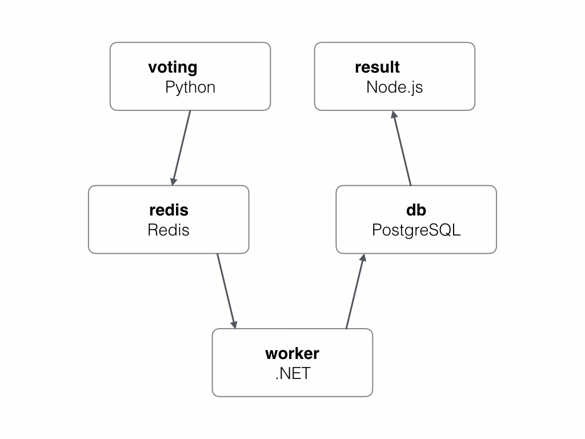

## Voting-app example

This page demonstrates how to migrate an application running as a Docker Cloud stack to an application running as a *service stack* on a cluster of Docker Community Edition (CE) nodes in swarm mode. We **deploy** the [example-voting-app](https://github.com/dockersamples/example-voting-app){: target="_blank" class="_"} to Docker Cloud, **convert** the Cloud stackfile to a service stack format, and **test** in the new environment to ensure that it is safe to migrate.

In the Docker Cloud stackfile, the voting app is defined as a stack of six microservices:

- **vote**: Web front-end that displays voting options
- **redis**: In-memory k/v store that collects votes
- **worker**: Stores votes in database
- **db**: Persistent store for votes
- **result**: Web server that pulls and displays results from database
- **lb**: Container-based load balancer

Votes are accepted with the `vote` service and stored in persistent backend database (`db`) with the help of services, `redis` and `worker`. The vote tally is viewed with the `result` service. The `lb` service balances internal traffic between containers.

The Docker Cloud stack is defined in [dockercloud.yml](https://raw.githubusercontent.com/dockersamples/example-voting-app/master/dockercloud.yml){: target="_blank" class="_"} and the Docker CE service stack is defined in
[docker-stack.yml](https://raw.githubusercontent.com/dockersamples/example-voting-app/master/docker-stack.yml){: target="_blank" class="_"}. This doc explains how `dockercloud.yml` is converted to `docker-stack.yml` so that you have the tools to do the same for your applications.

{:width="400px"}

## Migration prerequisites

To complete the migration from Docker Cloud to Docker Swarm on Docker CE, you need:

- **Docker CE nodes** (in a public cloud or on-premise) organized as a swarm cluster
- **SSH access** to the nodes in the swarm cluster.

You *may* also need the following application-specific things:

- Permanent public IP and DNS **addresses** for nodes.
- External **load balancers** configured to direct traffic to Docker CE nodes.

## Build target environment

Our target environment is a cluster of Docker CE nodes configured into a swarm cluster. A swarm cluster comprises one or more manager and worker nodes.

To ensure high availability (HA) of the swarm control plane in production, your environment you should include an odd number (3+) of manager nodes, usually no more than seven. They should be spread across availability zones and connected by high-speed reliable networks. See [Swarm mode overview](https://docs.docker.com/engine/swarm/){: target="_blank" class="_"}, for information on building a secure HA swarm cluster for production.

### Plan Docker CE nodes

Planning and building your nodes is specific to your requirements, but includes such things as:

- Choosing a **platform** (cloud or on-prem) to host your Docker CE nodes.
- Estimating **node size and spec** (your Docker Cloud nodes can be a guide)
- Deciding **node distribution** across availability zones for high availability (HA).
- Calculating the **number of nodes** for managers and workers (manager HA requires 3/5/7 managers).
- Ensuring **nodes can communicate** over the network and have stable resolvable DNS names.
- Configuring a **load balancer**.

Your swarm cluster of Docker CE nodes should probably resemble your existing Docker Cloud node cluster. For example, if you currently have five managers and seven workers of a particular size and spec, in hosted availability zones, your target swarm cluster should probably match that.

> **Note**: To see the configuration of each of your clusters in Docker Cloud, select **Node Clusters** > _your_cluster_.

This diagram shows a six-node swarm cluster spread across two availability zones:

{:width="500px"}

### Configure swarm cluster

Configuring a swarm cluster of Docker CE nodes involves the following high-level steps:

- Deploy nodes and install Docker CE.
- Initialize swarm mode (which creates one manager).
- Add manager nodes (for HA). **[optional]**
- Add worker nodes.

In this demo, we build a swarm cluster with three nodes (one manager, two workers), but you can add extra. For manager HA, create a minimum of three manager nodes. You can add as many workers as you like.

1.  Deploy three (or optionally more) nodes and install the latest version of [Docker CE](https://docs.docker.com/install/) on each.

2.  Initialize a swarm cluster from one node (that automatically becomes the first manager in the swarm):

    ```
    $ docker swarm init
    ```

    > **Note**: Our swarm cluster uses self-signed certificates. To use an external CA, initialize with the option, [`--external-ca`](https://docs.docker.com/engine/reference/commandline/swarm_init/#--external-ca){: target="_blank" class="_"}. You should also build your nodes in appropriate failure domains.

3.  Extract and **safely store** the command and manager *join-token* required to add manager nodes.

    ```
    $ docker swarm <manager join-token> manager
    ```

4.  Extract and **safely store** the command and worker *join-token* required to add worker nodes.

    ```
    $ docker swarm <manager join-token> worker
    ```

    > **Note**: Join tokens are required to add managers/workers to a swarm. Don't lose them!

5.  **[optional]** If you deployed extra nodes, you can add manager nodes with the _manager_ join token. Run on each node designated as a manager. The join token and network details will differ in your environment.

    ```
    $ docker swarm join --token <insert-manager-join-token> <IP-and-port>
    ```

6.  Add two or more worker nodes with the _worker_ join token. Run on each node designated as a worker. The join token and network details will differ in your environment.

    ```
    $ docker swarm join --token <insert-worker-join-token> <IP-and-port>
    ```

7. List the nodes on each manager (if you have more than one) to verify the
   status of the swarm. In the `MANAGER STATUS` column, manager nodes are either
   "Leader" or "Reachable". Worker nodes are blank.

    ```
    $ docker node ls
    ID            HOSTNAME    STATUS    AVAILABILITY        MANAGER STATUS
    vrx...vr1 *   node1       Ready     Active              Leader
    f4b...fbd     node2       Ready     Active              Reachable
    f2v...sdo     node3       Ready     Active              Reachable
    bvb...l55     node4       Ready     Active
    hf2...kvc     node5       Ready     Active
    p49...aav     node6       Ready     Active
    ```

With your target environment configured, let us look at the application and convert the Docker Cloud stackfile to a service stack.

## Convert Docker Cloud stackfile

To prepare your applications for migration from Docker Cloud to Docker CE (in swarm mode), you must recreate your Docker Cloud stackfiles (**source** files) as stackfiles for service stacks (**target** files). Once you have each application defined as a service stack, you can test and deploy.

> **Note**: To find the stackfiles for each of your existing applications in Docker Cloud, select **Stacks** > _your_stack_ > **Edit**.

**Cloud source**: In the Docker Cloud stackfile, the six services in our `example-voting-app` are defined as a **top-level key**:

```
db:
redis:
result:
lb:
vote:
worker:
```

**Swarm target**: In the *service stack* stackfile, services should be listed as individual **sub-level keys** (below the top-level key, `services:`). The Compose file format version must also be defined (at the top).

```
version: "3.5"
services:
  db:
  redis:
  result:
  vote:
  worker:
```

Another difference in the *service stack* stackfile is that we removed the `lb` service because it is not needed in Swarm. In Cloud, the load-balancer was used to balance internal application traffic. Swarm has built-in load balancing with a native transport-layer routing mesh called the Swarm service mesh.

In the following sections, we step through each service of
[example-voting-app](https://github.com/dockersamples/example-voting-app){: target="_blank" class="_"} and explain how Cloud source file
 ([dockercloud.yml](https://raw.githubusercontent.com/dockersamples/example-voting-app/master/dockercloud.yml){: target="_blank" class="_"}) is converted to the service stack target file
 ([docker-stack.yml](https://raw.githubusercontent.com/dockersamples/example-voting-app/master/docker-stack.yml){: target="_blank" class="_"}). We provide a simple version, that literally converts the target file, and an extended version that demonstrates more features in swarm mode.

 - **Simple example:** Only includes the necessary features for the migration to work
 - **Extended example:** Includes some advanced features that improves application management.

### db service

**Cloud source**: The Docker Cloud `db` service defines an image and a restart policy:

```
db:
  image: 'postgres:9.4'
  restart: always
```

**Swarm target**: This can be translated into a service stack service as follows:

```
db:
  image: postgres:9.4
  deploy:
    placement:
      constraints: [node.role == manager]
    restart_policy:
      condition: on-failure
```

**Swarm target (extended)**: You can also add some best practices, documentation, and advanced features, to improve application management:

```
db:
    image: postgres:9.4
    volumes:
      - db-data:/var/lib/postgresql/data
    networks:
      - backend
    deploy:
      placement:
        constraints: [node.role == manager]
    restart_policy:
      condition: on-failure
```

Let's step through some fields:

- `volumes` places the Postgres database on a named volume called **db-data** and mounts it into each service replica at `/var/lib/postgresql/data`. This ensures that the data written by the application persists in the event that the Postgres container fails.
- `networks` adds security by putting the service on a backend network.
- `deploy.placement.constraints` forces the service to run on manager nodes. In a single-manager swarm, this ensures that the service always starts on the same node and has access to the same volume.

> **Note**: Consider using a hosted database service for production databases. This is something that, ideally, should not change as part of your migration away from Docker Cloud stacks.

### redis service

**Cloud source**: The Docker Cloud `redis` service defines an image and a restart policy.

```
redis:
  image: 'redis:latest'
  restart: always
```

**Swarm target**: This can be translated into a service stack service as follows.

```
redis:
  image: redis:latest
  deploy:
  restart_policy:
    condition: on-failure
```

**Swarm target (extended)**:

```
redis:
  image: redis:alpine
  ports:
    - "6379"
  networks:
    - frontend
  deploy:
    replicas: 1
    update_config:
      parallelism: 2
      delay: 10s
    restart_policy:
      condition: on-failure
```

Let's step through each field.

- `image` defies the exact same image as the Docker Cloud stackfile.
- `ports` defines and documents the network port that the service will operate on --- this could be omitted as it's the default port for redis.
- `networks` deploys it on a network called `frontend`.
- `deploy.replicas` makes sure there's always one instance (replica) of the service running.
- `deploy.update-config` tells Swarm how to perform rolling updates on the service. While not strictly needed, these settings are like gold when it comes to performing application updates. The settings in this example will update two instances (replicas) of the service at a time, and will wait for 10 seconds in between each set of two. Obviously these settings have no significance if there is less than 3 service replicas.
- `deploy.restart_policy` tells Swarm to restart service replicas if they stop with a non-zero return code.

### result service

**Cloud source**:

```
result:
  autoredeploy: true
  image: 'docker/example-voting-app-result:latest'
  ports:
    - '80:80'
  restart: always
```

**Swarm target**:

```
result:
  image: docker/example-voting-app-result:latest
  ports:
    - 5001:80
  deploy:
    restart_policy:
      condition: on-failure
```

Notice the different port mappings in the two stackfiles. Docker Cloud allows multiple services on a single port. Docker Swarm does not. In the Docker Cloud stackfile, the voting application publishes two services on port 80. The `result` service is published directly on port 80, and the `vote` service is published indirectly on port 80 using the `lb` service. To get around this in swarm mode, we publish the `result` service on port 5001.

> **Note**: If you cannot publish to a 2nd port, you may be able to *front* the service with a load balancer that listens on port 80 and forwards to 5001 behind the scenes. You may even use an application-layer load-balancer such as the Docker EE HRM to publish multiple services on a single port and route traffic based on hostnames in the HTTP headers. This topic beyond the scope of this document.

**Swarm target (extended)**

```
result:
  image: dockersamples/examplevotingapp_result:latest
  ports:
    - 5001:80
  networks:
    - backend
  depends_on:
    - db
  deploy:
    replicas: 1
    update_config:
      parallelism: 2
      delay: 10s
    restart_policy:
      condition: on-failure
```

This adds the following:

- `networks` places all service replicas on a network called `backend`.
- `depends_on` tells Docker to start the `db` service before starting this one.
- `deploy.replicas` tells Docker to create a single replica for this service.
- `deploy.update-config` tells Docker how to perform rolling updates to this service.
- `deploy.restart_policy` tells Docker to restart replicas for this service if they stop with non-zero return codes.

### lb service

In Docker Cloud, the `lb` service was used to proxy connections on port 80 to the `vote` service. It was deployed as a `global` service so that an instance of it would always run on every node in the Docker Cloud node cluster. We do not need to migrate the `lb` service because Docker CE in swarm mode has native load balancing built into its service mesh.

If your applications are running load banalcers, such as `dockercloud/haproxy`, you ___may___ no longer need them when migrating to stacks on Docker CE.
Be sure to test your application and consult with your Docker technical account manager for further details.

### vote service

The Docker Cloud `vote` service defines an image, a restart policy, service replicas. It also defines an `autoredeploy` policy which is not supported natively in *service stacks*.

**Cloud source**:

```
vote:
  autoredeploy: true
  image: 'docker/example-voting-app-vote:latest'
  restart: always
  target_num_containers: 5
```

**Swarm target**:

```
vote:
  image: dockersamples/examplevotingapp_vote:latest
  ports:
    - 5000:80
  deploy:
    replicas: 5
    restart_policy:
      condition: on-failure
```

As with the `result` service, Docker Swarm only allows a single service to be published on any given port in a swarm cluster. The Docker Cloud version of the voting application publishes both the `result` and `vote` services on port 80 (the vote services is made available on port 80 with the `lb` service). To get around this in swarm mode, we publish the `vote` service on port 5000 (as we did with the `result` service on port 5001).

**Swarm target (extended)**:

```
vote:
  image: dockersamples/examplevotingapp_vote:latest
  ports:
    - 5000:80
  networks:
    - frontend
  depends_on:
    - redis
  deploy:
    replicas: 2
    update_config:
      parallelism: 2
    restart_policy:
      condition: on-failure
```

### worker service

**Cloud source**: The Docker Cloud `worker` service defines an image, a restart policy, and a number of service replicas. It also defines an `autoredeploy` policy which is not supported natively in *service stacks*.

```
worker:
  autoredeploy: true
  image: 'docker/example-voting-app-worker:latest'
  restart: always
  target_num_containers: 3
```

**Swarm target**:

```
worker:
  image: dockersamples/examplevotingapp_worker
  deploy:
    replicas: 3
    restart_policy:
      condition: on-failure
```

**Swarm target (extended)**:

```
worker:
  image: dockersamples/examplevotingapp_worker
  networks:
    - frontend
    - backend
  deploy:
    mode: replicated
    replicas: 3
    labels: [APP=VOTING]
    restart_policy:
      condition: on-failure
      delay: 10s
      max_attempts: 3
      window: 120s
    placement:
      constraints: [node.role == manager]
```

All of the settings mentioned here are application specific and may not be needed in your application.

- `replicas` here are attached to two networks--frontend and backend--allowing them to communicate with services on either network.
- `placement.constraints` ensure that replicas for this service always tart on a manager node.
- `restart_policy` attempts to restart any service replica that exits with a non-zero return code (on-failure). It makes 3 attempts to restart, gives each restart attempt 120 seconds to complete, and waits 10 seconds before trying again.

## Test Docker Swarm stackfile

Before migrating, you should thoroughly test each new *service stack* stackfile in a Docker CE cluster in swarm mode. Test the simple stackfile first--that is, the stackfile that most literally mimics what you have in Docker Cloud. Once that works, start testing some of the more robust features in the extended examples.

Healthy testing includes spinning up the application with the new *service stack* stackfile, performing scaling operations, and doing updates and rollbacks. You should also manage your *service stack* stackfiles in a version control system.

The following steps explain how to deploy your app from the **target** Docker Swarm stackfile and verify that it is running. Perform the following from a manager node in your swarm cluster.

1. Deploy the app from the *service stack* stackfile you created.

    ```
    $ docker stack deploy -c example-stack.yaml example-stack
    ```

    The format of the command is `docker stack deploy -c <name-of-stackfile> <name-of-stack>` where the name of the stack is arbitrary but should be probably be meaningful.

2.  Test that the stack is running.

    ```
    $ docker stack ls
    NAME                SERVICES
    example-stack       5
    ```

3.  Get more details about the stack and the services running as part of it.

    ```
    $ docker stack ps example-stack
    ID                  NAME                    IMAGE                                          NODE                DESIREDSTATE       CURRENT STATE            ERROR                       PORTS
    x3bwp962jupw        bigstack_worker.1       dockersamples/examplevotingapp_worker:latest   node1               Running            Running 35 minutes ago
    ymfaw93x7oe4        bigstack_db.1           postgres:9.4                                   node1               Running            Running 35 minutes ago
    w35zadj7fs9i        bigstack_worker.1       dockersamples/examplevotingapp_worker:latest   node1               Shutdown            Failed 35 minutes ago    "task: non-zero exit (1)"
    ukhutap9l1oi        bigstack_vote.1         dockersamples/examplevotingapp_vote:latest     node1               Running            Running 35 minutes ago
    qtv23fa4uam7        bigstack_result.1       dockersamples/examplevotingapp_result:latest   node1               Running            Running 35 minutes ago
    yjhvjpf75tr4        bigstack_redis.1        redis:alpine                                   node1               Running            Running 35 minutes ago
    0szg5x4wysk2        bigstack_worker.2       dockersamples/examplevotingapp_worker:latest   node1               Running            Running 35 minutes ago
    8kk849j1ozqv         \_ bigstack_worker.2   dockersamples/examplevotingapp_worker:latest   node1               Shutdown            Failed 35 minutes ago    "task: non-zero exit (1)"
    om6ga0ayozin        bigstack_vote.2         dockersamples/examplevotingapp_vote:latest     node1               Running            Running 35 minutes ago
    skfu11dcp00r        bigstack_worker.3       dockersamples/examplevotingapp_worker:latest   node1               Running            Running 35 minutes ago
    qbuu5l2r9ay7         \_ bigstack_worker.3   dockersamples/examplevotingapp_worker:latest   node1               Shutdown            Failed 35 minutes ago    "task: non-zero exit (1)"
    ```

4.  Continue testing. With the stack deployed and all services running, test failure scenarios, increasing load, scaling operations, updates, rollbacks, and any other operations that are considered important for the lifecycle of the application.

    These tests are specific to each of your apps, and are beyond the scope of this document. Be sure to complete them before beginning the migration of your application. If you had a CI/CD pipeline with automated tests and deployments for your Docker Cloud stack, you should build, test, and implement one for the app on Docker CE.

## Migrate application from Docker Cloud

How you migrate your applications is unique to your environment and applications. Once your migration is in process, check that the everything is working as expected. Ensure that users are hitting the new application on the Docker CE infrastructure and getting expected results.

<span class="badge badge-danger">Warning</span> Do not terminate your Docker Cloud stacks or node clusters until some time after the migration has been signed off as successful. If there are problems, you may need to roll back and try again.
