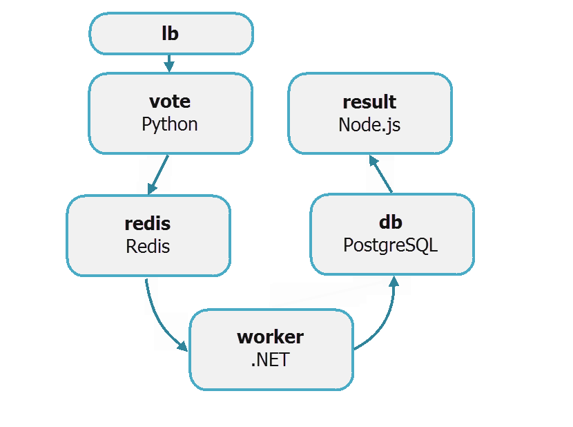
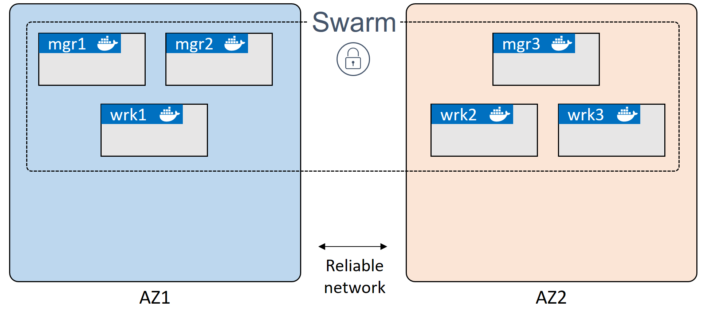

## Docker CE in swarm mode

This page explains how to prepare your applications for migration from Docker Cloud to applications running as _service stacks_ on clusters of Docker Community Edition (CE) nodes in swarm mode. You can also use [Docker Enterprise Edition](https://www.docker.com/enterprise-edition){: target="_blank" class="_"} (Docker EE) for your target environment.

At a high level, migrating your Docker Cloud applications requires that you:

- **Build** a target environment (Docker CE in swarm mode).
- **Convert** your Docker Cloud YAML stackfiles.
- **Test** the converted YAML stackfiles in the new environment.
- **Point** your application CNAMES to new service endpoints.
- **Migrate** your applications from Docker Cloud to the new environment.

To demonstrate, we **build** a Docker CE swarm cluster, **convert** the Docker Cloud stackfile for [example-voting-app](https://github.com/dockersamples/example-voting-app){: target="_blank" class="_"} to a service stack format, and **test** the service stack file in swarm mode to ensure that it is safe to migrate.

> The actual process of migrating -- switching customers from your Docker Cloud applications to Docker CE applications -- will vary by application and environment.

## Voting-app example

The Docker Cloud stack of our example voting application is defined in [dockercloud.yml](https://raw.githubusercontent.com/dockersamples/example-voting-app/master/dockercloud.yml){: target="_blank" class="_"}. The Docker CE service stack (for our target environment) is defined in
[docker-stack.yml](https://raw.githubusercontent.com/dockersamples/example-voting-app/master/docker-stack.yml){: target="_blank" class="_"}. This document explains how `dockercloud.yml` is converted to `docker-stack.yml` so that you have the tools to do the same for your applications.

In the [dockercloud.yml](https://raw.githubusercontent.com/dockersamples/example-voting-app/master/dockercloud.yml){: target="_blank" class="_"}, the voting app is defined as a stack of six microservices:

- **vote**: Web front-end that displays voting options
- **redis**: In-memory k/v store that collects votes
- **worker**: Stores votes in database
- **db**: Persistent store for votes
- **result**: Web server that pulls and displays results from database
- **lb**: Container-based load balancer

Votes are accepted with the `vote` service and stored in persistent backend database (`db`) with the help of services, `redis`, `worker`, and `lb`. The vote tally is displayed with the `result` service.

{:width="500px"}

## Migration prerequisites

To complete the migration from Docker Cloud to Docker CE in swarm mode, you need:

- **Docker CE nodes** (in a public cloud or on-premises) organized as a swarm cluster
- **SSH access** to the nodes in the swarm cluster

You _may_ also need the following application-specific things:

- **Permanent public IP addresses and hostnames** for nodes
- **External load balancers** configured to direct traffic to Docker CE nodes

## Build target environment

Our target environment is a cluster of Docker CE nodes configured in swarm mode. A swarm cluster comprises one or more manager and worker nodes.

To ensure high availability (HA) of the swarm control plane in production, you should include an odd number (3+) of manager nodes, usually no more than seven. They should be spread across availability zones and connected by high-speed reliable networks. For information on building a secure HA swarm cluster for production, see [Swarm mode overview](https://docs.docker.com/engine/swarm/){: target="_blank" class="_"}.

### Plan Docker CE nodes

How you plan and build your nodes will depend on your application requirements, but you should expect to:

- Choose a **platform** (cloud or on-premises) to host your Docker CE nodes.
- Estimate **node size and spec** (your Docker Cloud nodes can be a guide).
- Calculate the **number of nodes** for managers and workers (manager HA requires 3/5/7 managers).
- Decide **node distribution** across availability zones for high availability (HA).
- Ensure **nodes can communicate** over the network and have stable resolvable hostnames.
- Configure **load balancers**.

Your swarm cluster of Docker CE nodes should probably resemble your existing Docker Cloud node cluster. For example, if you currently have nodes of a particular size and spec, in hosted availability zones, your target swarm cluster should probably match that.

> In Docker Cloud, to see the configuration of each of your clusters, select **Node Clusters** > _your_cluster_.

This diagram shows a six-node swarm cluster spread across two availability zones:

{:width="600px"}

### Configure swarm cluster

Configuring a swarm cluster of Docker CE nodes involves the following high-level steps:

1.  Deploy nodes and install Docker CE.
2.  Initialize swarm mode (which creates one manager).
3.  _[optional] Add manager nodes (for HA)._
4.  Add worker nodes.

In this demo, we build a swarm cluster with six nodes (3 managers/3 workers), but you can use more (or fewer, for example, 1 manager/2 workers). For manager HA, create a minimum of three manager nodes. You can add as many workers as you like.

1.  Deploy six nodes and install the latest version of [Docker CE](https://docs.docker.com/install/){: target="_blank" class="_"} on each.

2.  Initialize a swarm cluster from one node (that automatically becomes the first manager in the swarm):

    ```
    $ docker swarm init
    ```

    > Our swarm cluster uses self-signed certificates. To use an [external CA](https://docs.docker.com/engine/reference/commandline/swarm_init/#--external-ca){: target="_blank" class="_"}, initialize with the option, `--external-ca`. You should also build your nodes in appropriate availability zones.

    > You can use the flag, `--advertise-addr`, to define the IP and port that other nodes should use to connect to this manager. You can even specify an IP that does not exist on the node, such one for a load balancer. See [docker swarm init](https://docs.docker.com/engine/reference/commandline/swarm_init/#--advertise-addr){: target="_blank" class="_"}.

3.  Extract and **safely store** the manager _join-token_ required to add manager nodes.

    ```
    $ docker swarm join-token manager
    ```

4.  Extract and **safely store** the worker _join-token_ required to add worker nodes.

    ```
    $ docker swarm join-token worker
    ```

    > Keep your join tokens safe and secure as bad people can join managers with them!

5.  **[optional]** If you deployed six nodes, you can add two manager nodes with the _manager_ join token. Run the command on each node designated as a manager. The join token and network details will differ in your environment.

    ```
    $ docker swarm join --token <insert-manager-join-token> <IP-and-port>
    ```

6.  Add two or more worker nodes with the _worker_ join token. Run the command on each node designated as a worker. The join token and network details will differ in your environment.

    ```
    $ docker swarm join --token <insert-worker-join-token> <IP-and-port>
    ```

7. List the nodes from one of the managers (if you have more than one) to verify the status of the swarm. In the `MANAGER STATUS` column, manager nodes are either "Leader" or "Reachable". Worker nodes are blank.

    ```
    $ docker node ls
    ID            HOSTNAME    STATUS    AVAILABILITY    MANAGER STATUS
    vrx...vr1 *   node1       Ready     Active          Leader
    f4b...fbd     node2       Ready     Active          Reachable
    f2v...sdo     node3       Ready     Active          Reachable
    bvb...l55     node4       Ready     Active
    hf2...kvc     node5       Ready     Active
    p49...aav     node6       Ready     Active
    ```

With your target environment configured, let us look at the application and convert the Docker Cloud stackfile to a service stack.

## Convert Docker Cloud stackfile

**In the following sections, we discuss each service definition separately, but you should group them into one stackfile with the `.yml` extension, for example, [docker-stack.yml](https://raw.githubusercontent.com/dockersamples/example-voting-app/master/docker-stack.yml){: target="_blank" class="_"}.**

To prepare your applications for migration from Docker Cloud to Docker CE in swarm mode, you must recreate your Docker Cloud stackfiles (**source** files) as _service stack_ stackfiles (**target** files). Once you have each application defined as a service stack, you can test and deploy.

> In Docker Cloud, to find the stackfiles for your existing applications, you can either: (1) Select **Stacks** > _your_stack_ > **Edit**, or (2) Select **Stacks** > _your_stack_ and scroll down.

In the sections below, we step through each service in [example-voting-app](https://github.com/dockersamples/example-voting-app){: target="_blank" class="_"} and explain how the Docker Cloud source file
([dockercloud.yml](https://raw.githubusercontent.com/dockersamples/example-voting-app/master/dockercloud.yml){: target="_blank" class="_"}) is converted to the service stack target file
 ([docker-stack.yml](https://raw.githubusercontent.com/dockersamples/example-voting-app/master/docker-stack.yml){: target="_blank" class="_"}). We provide a simple version of each service definition (one that does a like-for-like conversion with no added bells and whistles), and an extended version that demonstrates more features in swarm mode.

 - **Simple example:** Only includes the necessary features for _this_ migration to work.
 - **Extended example:** Includes some advanced features that improves application management.

> This is not a best practice guide
>
> This document shows you how to convert a Docker Cloud application to a Docker CE application and run it in a swarm. Along the way it introduces some of the advanced features offered by service stacks. It is not intended to be a best practice guide, but more of a "what's possible guide".

### Top- and sub-level keys

In the Docker Cloud stackfile, the six services are defined as top-level keys, whereas in the _service stack_ stackfile, they are sub-level keys.

**Cloud source**: Services are **top-level keys**:

```
db:
redis:
result:
lb:
vote:
worker:
```

**Swarm target**: Services are **sub-level keys** (below the top-level key, `services`), and the Compose file format version is defined at the top (and is required).

```
version: "3.5"
services:
  db:
  redis:
  result:
  vote:
  worker:
```

Notice that we removed the `lb` service -- this is because it is not needed in swarm mode. In Docker Cloud, the `lb` service accepts incoming traffic on port 80 and load balances across all replicas in the `vote` front-end service. In swarm mode, load balancing is built-in with a native transport-layer routing mesh called the [swarm mode service mesh](/../../engine/swarm/ingress/){: target="_blank" class="_"}.

### db service

> Consider using a hosted database service for production databases. This is something that, ideally, should not change as part of your migration away from Docker Cloud stacks.

**Cloud source**: The Docker Cloud `db` service defines an image and a restart policy:

```
db:
  image: 'postgres:9.4'
  restart: always
```

**Swarm target**: This can be translated into a service stack service as follows:

```
db:
  image: postgres:9.4
  deploy:
    restart_policy:
      condition: any
```

**Swarm target (extended)**: You can also add best practices, documentation, and advanced features, to improve application management:

```
db:
    image: postgres:9.4
    volumes:
      - db-data:/var/lib/postgresql/data
    networks:
      - backend
    deploy:
      placement:
        constraints: [node.role == manager]
      restart_policy:
        condition: any
```

Let's step through some fields:

- `volumes` places the Postgres database on a named volume called **db-data** and mounts it into the service replica at `/var/lib/postgresql/data`. This ensures that the data written by the application persists in the event that the Postgres container fails.
- `networks` adds security by putting the service on a backend network.
- `deploy.placement.constraints` forces the service to run on manager nodes. In a single-manager swarm, this ensures that the service always starts on the same node and has access to the same volume.
- `deploy.restart_policy.condition` tells Docker to restart any service replica that has stopped (no matter the exit code).

### redis service

**Cloud source**: The Docker Cloud `redis` service defines an image and a restart policy.

```
redis:
  image: 'redis:latest'
  restart: always
```

**Swarm target**: This can be translated into a service stack service as follows.

```
redis:
  image: redis:latest
  deploy:
    restart_policy:
      condition: any
```

**Swarm target (extended)**:

```
redis:
  image: redis:alpine
  ports:
    - "6379"
  networks:
    - frontend
  deploy:
    replicas: 1
    restart_policy:
      condition: any
```

Let's step through each field.

- `image` defines the exact same image as the Docker Cloud stackfile.
- `ports` defines the network port that the service should operate on -- this can actually be omitted as it's the default port for redis.
- `networks` deploys the service on a network called `frontend`.
- `deploy.replicas` ensures there is always one instance (one replica) of the service running.
- `deploy.restart_policy.condition` tells Docker to restart any service replica that has stopped (no matter the exit code).

### result service

**Cloud source**:

```
result:
  autoredeploy: true
  image: 'docker/example-voting-app-result:latest'
  ports:
    - '80:80'
  restart: always
```

**Swarm target**:

```
result:
  image: docker/example-voting-app-result:latest
  ports:
    - 5001:80
  deploy:
    restart_policy:
      condition: any
```

Notice the different port mappings in the two stackfiles. The Docker Cloud application makes two services available on port 80 (using different nodes). The `result` service is published directly on port 80, and the `vote` service is published indirectly on port 80 using the `lb` service.

In the _service stack_ stackfile, we publish these two services on different ports -- `vote` on port 5000 and `result` service on port 5001. If this is a problem for your users or application, you may be able to:

- Publish this service on port 80 and any other service on a different port.
- Use host mode and publish both services on port 80 by using placement constraints to run them on different nodes.
- Use a frontend service, such as HAProxy, and route the traffic based on a virtual host.

**Swarm target (extended)**

```
result:
  image: dockersamples/examplevotingapp_result:latest
  ports:
    - 5001:80
  networks:
    - backend
  depends_on:
    - db
  deploy:
    replicas: 1
    restart_policy:
      condition: any
```

The extended version adds the following:

- `networks` places all service replicas on a network called `backend`.
- `depends_on` tells Docker to start the `db` service before starting this one.
- `deploy.replicas` tells Docker to create a single replica for this service.
- `deploy.restart_policy.condition` tells Docker to restart any service replica that has stopped (no matter the exit code).

### lb service

In Docker Cloud, the `lb` service was used to proxy connections on port 80 to the `vote` service. We do not need to migrate the `lb` service because Docker CE in swarm mode has native load balancing built into its service mesh.

If your applications are running load balancers, such as `dockercloud/haproxy`, you _may_ no longer need them when migrating to stacks on Docker CE. Be sure to test your application and consult with your Docker technical account manager for further details.

### vote service

The Docker Cloud `vote` service defines an image, a restart policy, service replicas. It also defines an `autoredeploy` policy which is not supported natively in service stacks.

> **Autoredeploy options**: Autoredeploy is a Docker Cloud feature that automatically updates running applications every time you push an image. It is not native to Docker CE, AKS or GKE, but you may be able to regain it with Docker Cloud auto-builds, using web-hooks from the Docker Cloud repository for your image back to the CI/CD pipeline in your dev/staging/production environment.

**Cloud source**:

```
vote:
  autoredeploy: true
  image: 'docker/example-voting-app-vote:latest'
  restart: always
  target_num_containers: 5
```

**Swarm target**:

```
vote:
  image: dockersamples/examplevotingapp_vote:latest
  ports:
    - 5000:80
  deploy:
    replicas: 5
    restart_policy:
      condition: any
```

Again, the Docker Cloud version of the voting application publishes both the `result` and `vote` services on port 80 (where the `vote` service is made available on port 80 with the `lb` service).

Docker Swarm only allows a single service to be published on a swarm-wide port (because in this example, we are in swarm mode and using the routing mesh option for network configuration). To get around this, we publish the `vote` service on port 5000 (as we did with the `result` service on port 5001).

> For the difference between swarm mode (with ingress networking) and host mode, see [Use swarm mode routing mesh](/../../engine/swarm/ingress/).

**Swarm target (extended)**:

```
vote:
  image: dockersamples/examplevotingapp_vote:latest
  ports:
    - 5000:80
  networks:
    - frontend
  depends_on:
    - redis
  deploy:
    replicas: 5
    update_config:
      parallelism: 2
    restart_policy:
      condition: any
```

About some fields:

- `networks` places all service replicas on a network called `frontend`.
- `depends_on` tells Docker to start the `redis` service before starting the `vote` service.
- `deploy.replicas` tells Docker to create 5 replicas for the `vote` service (and we need at least 3 for the parallelism setting).
- `deploy.update_config` tells Docker how to perform rolling updates on the service. While not strictly needed, `update_config` settings are extremely helpful when doing application updates. Here, `parallelism: 2` tells swarm to update two instances of the service at a time, and wait for 10 seconds in between each set of two.
- `deploy.restart_policy.condition` tells Docker to restart any service replica that has stopped (no matter the exit code).

### worker service

**Cloud source**: The Docker Cloud `worker` service defines an image, a restart policy, and a number of service replicas. It also defines an `autoredeploy` policy which is not supported natively in service stacks.

```
worker:
  autoredeploy: true
  image: 'docker/example-voting-app-worker:latest'
  restart: always
  target_num_containers: 3
```

**Swarm target**:

```
worker:
  image: dockersamples/examplevotingapp_worker
  deploy:
    replicas: 3
    restart_policy:
      condition: any
```

**Swarm target (extended)**:

```
worker:
  image: dockersamples/examplevotingapp_worker
  networks:
    - frontend
    - backend
  deploy:
    mode: replicated
    replicas: 3
    labels: [APP=VOTING]
    restart_policy:
      condition: any
      delay: 10s
      max_attempts: 3
      window: 120s
    placement:
      constraints: [node.role == manager]
```

All of the settings mentioned here are application specific and may not be needed in your application.

- `networks` tells Docker to attach replicas to two networks (named "frontend" and "backend") allowing them to communicate with services on either one.
- `deploy.placement.constraints` ensures that replicas for this service always start on a manager node.
- `deploy.restart_policy.condition` tells Docker to restart any service replica that has stopped (no matter the exit code). It makes 3 attempts to restart, gives each restart attempt 120 seconds to complete, and waits 10 seconds before trying again.

## Test converted stackfile

Before migrating, you should thoroughly test each new stackfile in a Docker CE cluster in swarm mode. Test the simple stackfile first -- that is, the stackfile that most literally mimics what you have in Docker Cloud. Once that works, start testing some of the more robust features in the extended examples.

Healthy testing includes _deploying_ the application with the new stackfile, performing _scaling_ operations, increasing _load_, running _failure_ scenarios, and doing _updates_ and _rollbacks_. These tests are specific to each of your applications. You should also manage your manifest files in a version control system.

The following steps explain how to deploy your app from the **target** Docker Swarm stackfile and verify that it is running. Perform the following from a manager node in your swarm cluster.

1.  Deploy the app from the _service stack_ stackfile you created.

    ```
    $ docker stack deploy -c example-stack.yaml example-stack
    ```

    The format of the command is `docker stack deploy -c <name-of-stackfile> <name-of-stack>` where the name of the stack is arbitrary but should be probably be meaningful.

2.  Test that the stack is running.

    ```
    $ docker stack ls
    NAME                SERVICES
    example-stack       5
    ```

3.  Get more details about the stack and the services running as part of it.

4.  Test that the application works in your new environment.

    For example, the voting app exposes two web front-ends -- one for casting votes and the other for viewing results. We exposed the `vote` service on port 5000, and the `result` service on port 5001. To connect to either of them, open a web browser and point it to the public IP or public hostname of any swarm node on the required port:

    - Go to <public-IP-or-hostname>:5000 and cast a vote.
    - Go to <public-IP-or-hostname>:5001 and view the result of your vote.

If you had a CI/CD pipeline with automated tests and deployments for your Docker Cloud stacks, you should build, test, and implement one for each application on Docker CE.

## Migrate apps from Docker Cloud

> Remember to point your application CNAMES to new service endpoints.

How you migrate your applications is unique to your environment and applications.

- Plan with all developers and operations teams.
- Plan with customers.
- Plan with owners of other applications that interact with your Docker Cloud app.
- Plan a rollback strategy if problems occur.

Once your migration is in process, check that the everything is working as expected. Ensure that users are hitting the new application on the Docker CE infrastructure and getting expected results.

> Think before you terminate stacks and clusters
>
> Do not terminate your Docker Cloud stacks or node clusters until some time after the migration has been signed off as successful. If there are problems, you may need to roll back and try again.
{: .warning}
