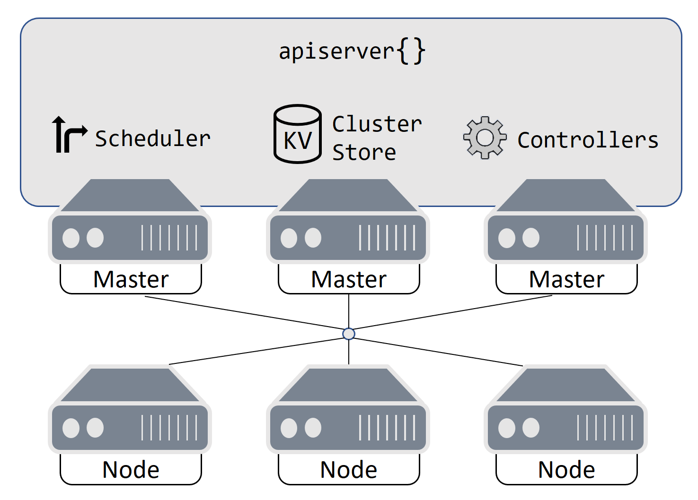
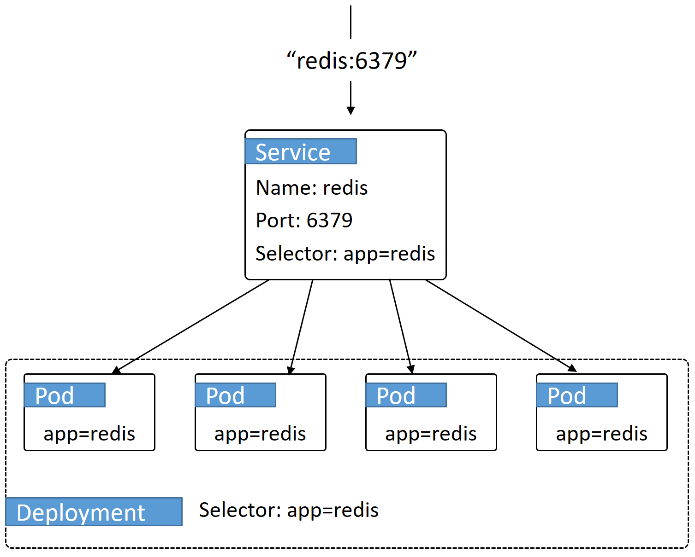
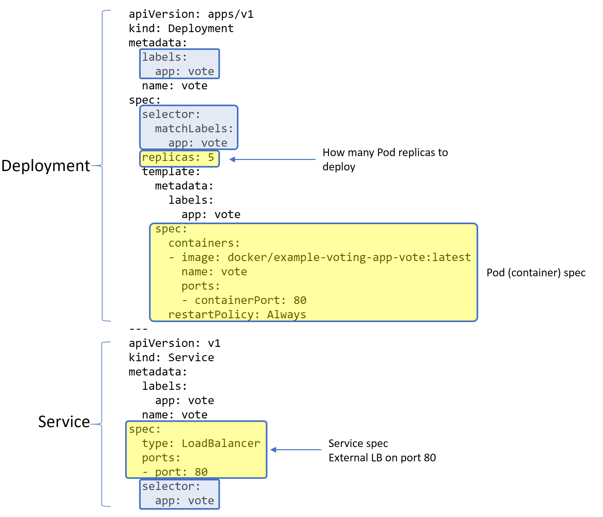

## Introduction

Like Docker Cloud applications, Kubernetes applications are defined in YAML files and can run on public cloud infrastructure. Important Kubernetes concepts are:

- The Kubernetes cluster
- The Kubernetes application

## Kubernetes cluster

A Kubernetes cluster is made up of _masters_ and _nodes_. These can be cloud instances or VMs in your data center.

The diagram below shows a Kubernetes cluster with three masters and three nodes.

{:width="400px"}

### Masters

**Masters** run the control plane services and also issue work to nodes. They are the equivalent to _managers_ in a Docker Cloud or Docker Swarm cluster. They handle:

- Exposing the main Kubernetes API
- The cluster store
- The scheduler
- All of the _controllers_ (such as Deployments)
- Assigning jobs to nodes

### Nodes

**Nodes** receive and execute work assigned by masters. They are equivalent to _workers_ in a Docker Cloud or Docker Swarm cluster.

You should run all of your work on nodes and _not_ on masters. This may differ from Docker Cloud where you may have run some work on manager nodes.

### Hosted services

You can run a Kubernetes cluster on-premises where you manage everything yourself -- masters (control plane) and nodes. But Control plane high availability (HA) can be difficult to configure.

Cloud providers such as [Microsoft Azure](https://azure.microsoft.com/en-us/free/){: target="_blank" class="_"},
[Google Cloud Platform (GCP)](https://cloud.google.com/free/){: target="_blank" class="_"}, and
[Amazon Web Services (AWS)](https://aws.amazon.com/free/){: target="_blank" class="_"}, provide hosted Kubernetes services:

- Azure Container Service (AKS)
- Google Kubernetes Engine (GKE)
- Amazon Elastic Container Service for Kubernetes (EKS)

Each provides the Kubernetes control plane as a managed service, meaning the platform takes care of things such as control plane high availability (HA) and control plane upgrades. In fact, you have no access to the control plane (masters).


> The managed control plane service is usually free but worker nodes are not.

## Kubernetes application

A Kubernetes app is any containerized application defined in a Kubernetes manifest file.

### Manifest

The manifest file (usually written in YAML) tells Kubernetes everything it needs to know about the application, as well as how to deploy and manage it. For example:

- Images and containers to run
- Network ports to publish
- How to scale the app (up or down as demand requires)
- How to perform rolling updates
- How to perform rollbacks

### Pods and Services

In the Docker world, the atomic unit of deployment is the _Docker container_. In the Kubernetes world, it is the _Pod_. If you already understand containers, you can think of a **[Pod](https://kubernetes.io/docs/concepts/workloads/pods/pod-overview/){: target="_blank" class="_"}** as one or more related containers. For the most part, Pods have a single container and are almost analogous to a container.

A Kubernetes **[Service](https://kubernetes.io/docs/concepts/services-networking/service/){: target="_blank" class="_"}** is an object abstraction that sits in front of a set of Pods and provides a static virtual IP (VIP) address and DNS name. The main purpose of a Kubernetes Service is to provide stable networking for groups of Pods.

Kubernetes Services can also be used to provision cloud-native load balancers and provide load balancing of requests coming in to the cluster from external sources. Examples include integration with native load balancers on AWS, Azure, and GCP.

### Deployments

Docker has a higher level construct called a _Docker service_ (different from a Kubernetes Service) that wraps around a container and adds things such as scalability and rolling updates. Kubernetes also has a higher level construct called a _Deployment_. A Kubernetes **[Deployment](https://kubernetes.io/docs/concepts/workloads/controllers/deployment/){: target="_blank" class="_"}** is a "controller" that wraps around a set of Pods and adds things such as scalability, rolling updates, and simple rollbacks.

The diagram below shows a Service object providing a DNS name and stable IP for a Deployment of 4 Pods.

{:width="500px"}

## Managing Kubernetes apps

Docker apps are usually managed with the `docker` command line utility. Docker Cloud apps can be managed with the Docker Cloud CLI. Kubernetes apps are managed with the `kubectl` command line utility.

### Common commands

This command deploys a Docker application, named `test-app`, from a YAML configuration file called `app1.yml`:

```
$ docker stack deploy -c app1.yml test-app
```

This command deploys a Kubernetes application from a YAML manifest file called `k8s-app1.yml`:

```
$ kubectl create -f k8s-app.yml
```

Some other useful `kubectl` commands include:

- `kubectl get` prints a short description about an object. For Deployments, run: `kubectl get deploy`.
- `kubectl describe` prints detailed information about an object. For a Deployment named "app1", run: `kubectl describe deploy app1`
- `kubectl delete` deletes a resource on the cluster. To delete a Deployment created with the `app1.yml` manifest file, run: `kubectl delete -f app1.yml`.

### Sample manifest

Below is a simple Kubernetes manifest file containing a Deployment and a Service.

- The Deployment lists everything about the app, including how many Pod replicas to deploy, and the spec of the Pods to be deployed.
- The Service defines an external load balancer that listens on port 80 and load-balances traffic across all ports with the "app=vote" label.

Everything in Kubernetes is loosely connected with labels. The three blue boxes show the **[labels and label selectors](https://kubernetes.io/docs/concepts/overview/working-with-objects/labels/){: target="_blank" class="_"}** that connect the service to the Pods, and the Pods to the Deployment.

> Indentation is important in Kubernetes manifests, and you should indent with two spaces.

{:width="650px"}
