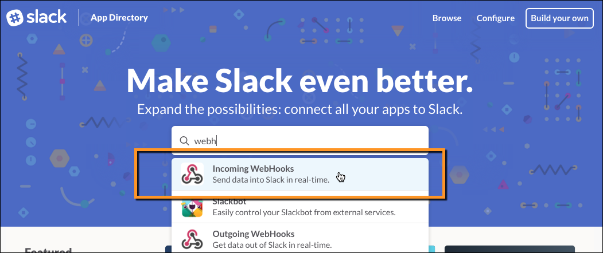
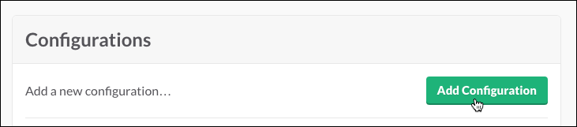
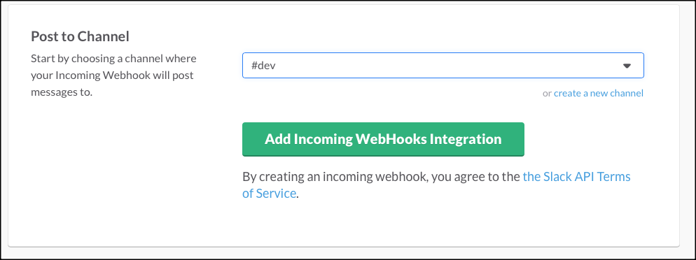

---
aliases:
- /docker-cloud/tutorials/slack-integration/
description: Integrate with Slack
keywords:
- Slack, integrate, notifications
menu:
  main:
    parent: docker-cloud
title: Docker Cloud notifications in Slack
---

# Docker Cloud notifications in Slack

Docker Cloud can integrate with your **Slack** team to provide notifications about stacks, services, containers and nodes.

## Setting up a Slack integration

1. Go to the <a href="https://slack.com/apps" target="_blank">Slack App Directory</a> and search for the **Incoming WebHooks** integration:
  

2. Click the **Configure** button next to your team
    

3. On the next screen, click **Add Configuration**.
    

4. Select the channel where you want Docker Cloud to post notifications, and click **Add Incoming WebHook Integration**:
  

5. In the next screen, copy the **Webhook URL** that is displayed:
  

6. Log in to Docker Cloud, and click **Cloud Settings** in the lower left navigation.

7. Scroll down to the **Notifications** section.

8. Paste the **Webhook URL** you copied in step 5 into the dialog, and click **Connect**:
  

Once configured, choose a notification level:

* **Off** Do not receive any notifications.
* **Only failures** Only receive notifications about failed actions, containers that stop with a failed exit code, and nodes that become unreachable.
* **Everything** Receive all of the above, plus notifications about successful actions.
  

Enjoy your new Slack channel integration!

## Editing a Slack integration

* Click **Cloud Settings** in the lower left, scroll down to **Notifications**, and locate the **Slack** section. From here you can choose a new notification level, delete the webhook, or update the webhook URL.

* Alternately, go to the <a href="https://slack.com/apps/manage" target="_blank">Slack App Management page</a> and click **Custom Integrations \> Incoming Webhooks** to see a list of webhooks. Click the pencil icon next to the webhook configuration you want to change.
