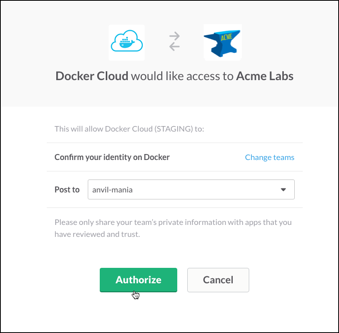
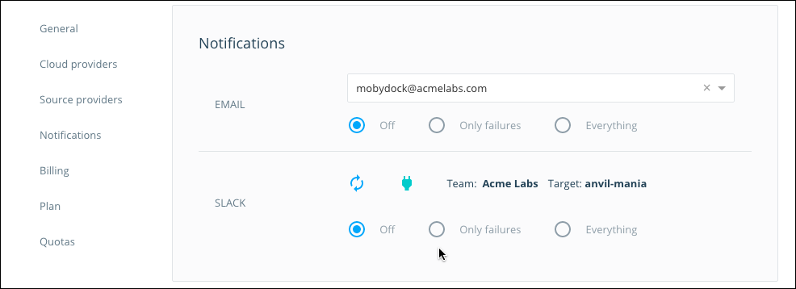

Docker Cloud can integrate with your **Slack** team to provide notifications about stacks, services, containers, and nodes.

## Set up a Slack integration

Before you begin, make sure that you are signed into the Slack team that you want to show notifications in.

1. Log in to the Docker account that owns the builds or nodes that you want to receive notifications about.

    > **Note**: If you are setting up notifications for an organization, log in as a member of the organization's `Owners` team, then switch to the organization account to change the settings.

2. Click **Cloud Settings** in the left hand navigation, and scroll down to the **Notifications** section.

3. Click the plug icon next to **Slack**.

    The Docker Cloud page refreshes to show a Slack authorization screen.

4. On the page that appears, double check that you're signed in to the correct Slack team. (If necessary sign in to the correct one.)
5. Select the channel that should receive notifications.
6. Click **Authorize**.

    Once you click **Authorize**, you should see a message in the Slack channel notifying you of the new integration.

    

Once configured, choose a notification level:

* **Off** Do not receive any notifications.
* **Only failures** Only receive notifications about failed actions, containers that stop with a failed exit code, and nodes that become unreachable.
* **Everything** Receive all of the above, plus notifications about successful actions.
  

Enjoy your new Slack channel integration!

## Edit a Slack integration

* Click **Cloud Settings** in the lower left, scroll down to **Notifications**, and locate the **Slack** section. From here you can choose a new notification level, or remove the integration.

* From the Slack **Notifications** section you can also change the channel that the integration posts to. Click the reload icon (two arrows) next to the Slack integration to reopen the OAuth channel selector.

* Alternately, go to the <a href="https://slack.com/apps/manage" target="_blank">Slack App Management page</a> and search for "Docker Cloud". Click the result to see all of the Docker Cloud notification channels set for the Slack team.
