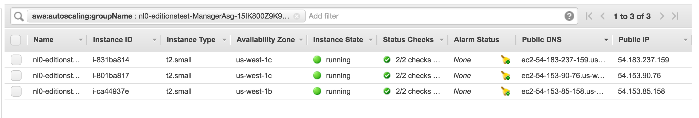

## Connect to your manager nodes

This section walks you through connecting to your installation and deploying
applications. Instructions are included for both AWS and Azure, so be sure to
follow the instructions for the cloud provider of your choice in each section.

First, you obtain the public IP address for a manager node. Any manager
node can be used for administrating the swarm.

### Manager Public IP on AWS

Once you've deployed Docker on AWS, go to the "Outputs" tab for the stack in
CloudFormation.

The "Managers" output is a URL you can use to see the available manager nodes of
the swarm in your AWS console. Once present on this page, you can see the
"Public IP" of each manager node in the table and/or "Description" tab if you
click on the instance.



## Connect via SSH

### Manager nodes

Obtain the public IP and/or port for the manager node as instructed above and
using the provided SSH key to begin administrating your swarm:

```bash
$ ssh -i <path-to-ssh-key> docker@<ssh-host>

Welcome to Docker!
```

Once you are logged into the container you can run Docker commands on the swarm:

```bash
$ docker info

$ docker node ls
```

You can also tunnel the Docker socket over SSH to remotely run commands on the cluster (requires [OpenSSH 6.7](https://lwn.net/Articles/609321/) or later):

```bash
$ ssh -i <path-to-ssh-key> -NL localhost:2374:/var/run/docker.sock docker@<ssh-host> &

$ docker -H localhost:2374 info
```

If you don't want to pass `-H` when using the tunnel, you can set the `DOCKER_HOST` environment variable to point to the localhost tunnel opening.

### Worker nodes

As of Beta 13, the worker nodes also have SSH enabled when connecting from
manager nodes. SSH access is not possible to the worker nodes from the public
Internet. To access the worker nodes, you need to first connect to a
manager node (see above).

On the manager node you can then `ssh` to the worker node, over the private
network. Make sure you have SSH agent forwarding enabled (see below). If you run
the `docker node ls` command you can see the full list of nodes in your swarm.
You can then `ssh docker@<worker-host>` to get access to that node.

#### AWS

Use the `HOSTNAME` reported in `docker node ls` directly.

```
$ docker node ls
ID                           HOSTNAME                                     STATUS  AVAILABILITY  MANAGER STATUS
a3d4vdn9b277p7bszd0lz8grp *  ip-172-31-31-40.us-east-2.compute.internal   Ready   Active        Reachable
...

$ ssh docker@ip-172-31-31-40.us-east-2.compute.internal
```

#### Use SSH agent forwarding

SSH agent forwarding allows you to forward along your ssh keys when connecting
from one node to another. This eliminates the need for installing your private
key on all nodes you might want to connect from.

You can use this feature to SSH into worker nodes from a manager node without
installing keys directly on the manager.

If your haven't added your ssh key to the `ssh-agent` you also need to do
this first.

To see the keys in the agent already, run:

```bash
$ ssh-add -L
```

If you don't see your key, add it like this.

```bash
$ ssh-add ~/.ssh/your_key
```

On macOS, the `ssh-agent` forgets this key on restart. But
you can import your SSH key into your Keychain so that your key survives
restarts.

```bash
$ ssh-add -K ~/.ssh/your_key
```

You can then enable SSH forwarding per-session using the `-A` flag for the ssh
command.

Connect to the Manager.

```bash
$ ssh -A docker@<manager ip>
```

To always have it turned on for a given host, you can edit your ssh config file
(`/etc/ssh_config`, `~/.ssh/config`, etc) to add the `ForwardAgent yes` option.

Example configuration:

```conf
Host manager0
  HostName <manager ip>
  ForwardAgent yes
```

To SSH in to the manager with the above settings:

```bash
$ ssh docker@manager0
```

## Run apps

You can now start creating containers and services.

    $ docker run hello-world

You can run websites too. Ports exposed with `--publish` are automatically exposed
through the platform load balancer:

    $ docker service create --name nginx --publish published=80,target=80 nginx

Once up, find the `DefaultDNSTarget` output in either the AWS or Azure portals
to access the site.

### Execute docker commands in all swarm nodes

There are cases (such as installing a volume plugin) wherein a docker command may need to be executed in all the nodes across the cluster. You can use the `swarm-exec` tool to achieve that.

Usage : `swarm-exec {Docker command}`

The following installs a test plugin in all the nodes in the cluster.

Example : `swarm-exec docker plugin install --grant-all-permissions
mavenugo/test-docker-netplugin`

This tool internally makes use of docker global-mode service that runs a task on
each of the nodes in the cluster. This task in turn executes your docker
command. The global-mode service also guarantees that when a new node is added
to the cluster or during upgrades, a new task is executed on that node and hence
the docker command is automatically executed.

### Docker Stack deployment

To deploy complex multi-container apps, you can use the `docker stack deploy` command. You can either deploy a bundle on your machine over an SSH tunnel, or copy the `docker-compose.yml` file (for example using `scp`) to a manager node, SSH into the manager and then run `docker stack deploy` (if you have multiple managers, ensure that your session is on one that has the stack file).

For example:

```bash
docker stack deploy -f docker-compose.yml myapp
```

A good sample app to test deployment of stacks is the [Docker voting app](https://github.com/docker/example-voting-app).

By default, apps deployed with stacks do not have ports publicly exposed. Update port mappings for services, and Docker automatically wires up the underlying platform load balancers:

    docker service update --publish-add published=80,target=80 <example-service>

### Images in private repos

To create swarm services using images in private repos, first make sure you're
authenticated and have access to the private repo, then create the service with
the `--with-registry-auth` flag (the example below assumes you're using Docker
Hub):

    docker login
    ...
    docker service create --with-registry-auth user/private-repo
    ...

This causes the swarm to cache and use the cached registry credentials when creating containers for the service.
