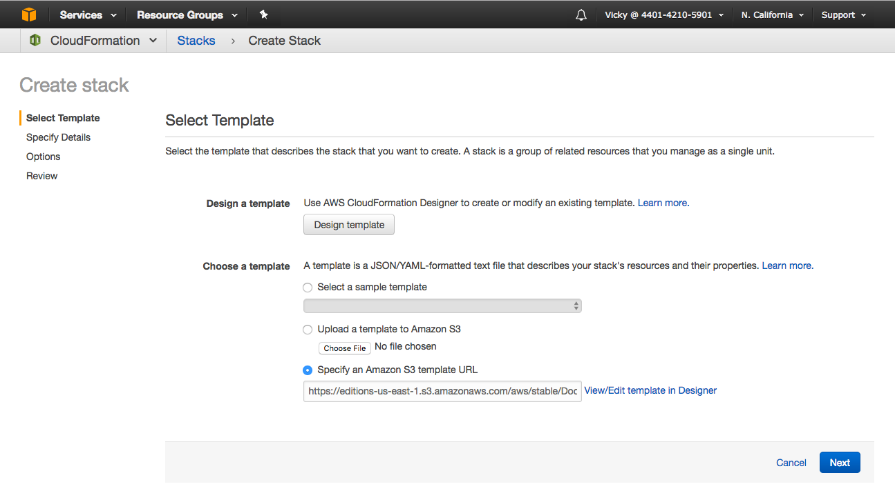
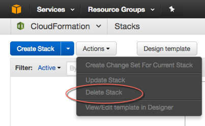



## Docker Enterprise Edition (EE) for AWS

This deployment is fully baked and tested, and comes with the latest Docker
Enterprise Edition for AWS.

This release is maintained and receives **security and critical bug fixes for
one year**.

[Deploy Docker Enterprise Edition (EE) for AWS](https://store.docker.com/editions/enterprise/docker-ee-aws?tab=description){: target="_blank" class="button outline-btn blank_"}


## Docker Community Edition (CE) for AWS

### Quickstart

If your account [has the proper
permissions](/docker-for-aws/iam-permissions.md), you can
use the blue button from the stable or edge channel to bootstrap Docker for AWS
using CloudFormation. For more about stable and edge channels, see the
[FAQs](/docker-for-aws/faqs.md#stable-and-edge-channels).

<table style="width:100%">
  <tr>
    <th style="font-size: x-large; font-family: arial">Stable channel</th>
    <th style="font-size: x-large; font-family: arial">Edge channel</th>
  </tr>
  <tr valign="top">
    <td width="33%">This deployment is fully baked and tested, and comes with the latest CE version of Docker. <br><br>This is the best channel to use if you want a reliable platform to work with. <br><br>Stable is released quarterly and is for users that want an easier-to-maintain release pace.</td>
    <td width="34%">This deployment offers cutting edge features of the CE version of Docker and comes with experimental features turned on, described in the <a href="https://github.com/docker/docker-ce/blob/master/components/cli/experimental/README.md">Docker Experimental Features README</a> on GitHub. (Adjust the branch or tag in the URL to match your version.)<br><br>This is the best channel to use if you want to experiment with features under development, and can weather some instability and bugs. Edge is for users wanting a drop of the latest and greatest features every month. <br><br>We collect usage data on edges across the board.</td>
  </tr>
  <tr valign="top">
  <td width="33%">
  {{aws_blue_latest}}
  {{aws_blue_vpc_latest}}
  </td>
  <td width="34%">
  {{aws_blue_edge}}
  {{aws_blue_vpc_edge}}
  </td>
  </tr>
</table>

> **Note* During stable channel updates, edge channel will have the same release (unless it's a patch release)

### Deployment options

There are two ways to deploy Docker for AWS:

- With a pre-existing VPC
- With a new VPC created by Docker

We recommend allowing Docker for AWS to create the VPC since it allows Docker to optimize the environment. Installing in an existing VPC requires more work.

#### Create a new VPC
This approach creates a new VPC, subnets, gateways, and everything else needed to run Docker for AWS. It is the easiest way to get started, and requires the least amount of work.

All you need to do is run the CloudFormation template, answer some questions, and you are good to go.

#### Install with an Existing VPC
If you need to install Docker for AWS with an existing VPC, you need to do a few preliminary steps. See [recommended VPC and Subnet setup](faqs.md#recommended-vpc-and-subnet-setup) for more details.

1. Pick a VPC in a region you want to use.

2. Make sure the selected VPC is setup with an Internet Gateway, Subnets, and Route Tables.

3. You need to have three different subnets, ideally each in their own availability zone. If you are running in a region with only two Availability Zones, you need to add more than one subnet into one of the availability zones. For production deployments we recommend only deploying to regions that have three or more Availability Zones.

4. When you launch the docker for AWS CloudFormation stack, make sure you use the one for existing VPCs. This template prompts you for the VPC and subnets that you want to use for Docker for AWS.

### Prerequisites

- Access to an AWS account with permissions to use CloudFormation and creating the following objects. [Full set of required permissions](iam-permissions.md).
    - EC2 instances + Auto Scaling groups
    - IAM profiles
    - DynamoDB Tables
    - SQS Queue
    - VPC + subnets and security groups
    - ELB
    - CloudWatch Log Group
- SSH key in AWS in the region where you want to deploy (required to access the completed Docker install)
- AWS account that support EC2-VPC (See the [FAQ for details about EC2-Classic](faqs.md))

For more information about adding an SSH key pair to your account, refer
to the [Amazon EC2 Key Pairs
docs](http://docs.aws.amazon.com/AWSEC2/latest/UserGuide/ec2-key-pairs.html).

The China and US Gov Cloud AWS partitions are not currently supported.

### Configuration

Docker for AWS is installed with a CloudFormation template that configures
Docker in swarm mode, running on instances backed by custom AMIs. There are two
ways you can deploy Docker for AWS. You can use the AWS Management Console
(browser based), or use the AWS CLI. Both have the following configuration
options.

#### Configuration options

##### KeyName

Pick the SSH key to be used when you SSH into the manager nodes.

##### InstanceType

The EC2 instance type for your worker nodes.

##### ManagerInstanceType

The EC2 instance type for your manager nodes. The larger your swarm, the larger
the instance size you should use.

##### ClusterSize

The number of workers you want in your swarm (0-1000).

##### ManagerSize

The number of managers in your swarm. On Docker CE, you can select either 1,
3 or 5 managers. We only recommend 1 manager for testing and dev setups. There
are no failover guarantees with 1 manager — if the single manager fails the
swarm goes down as well. Additionally, upgrading single-manager swarms is not
currently guaranteed to succeed.

On Docker EE, you can choose to run with 3 or 5 managers.

We recommend at least 3 managers, and if you have a lot of workers, you should
use 5 managers.

##### EnableSystemPrune

Enable if you want Docker for AWS to automatically cleanup unused space on your
swarm nodes.

When enabled, `docker system prune` runs staggered every day, starting at
1:42AM UTC on both workers and managers. The prune times are staggered slightly
so that not all nodes are pruned at the same time. This limits resource
spikes on the swarm.

Pruning removes the following:
- All stopped containers
- All volumes not used by at least one container
- All dangling images
- All unused networks

##### EnableCloudWatchLogs

Enable if you want Docker to send your container logs to CloudWatch. ("yes",
"no") Defaults to yes.

##### WorkerDiskSize

Size of Workers' ephemeral storage volume in GiB (20 - 1024).

##### WorkerDiskType

Worker ephemeral storage volume type ("standard", "gp2").

##### ManagerDiskSize

Size of Manager's ephemeral storage volume in GiB (20 - 1024)

##### ManagerDiskType

Manager ephemeral storage volume type ("standard", "gp2")

#### Installing with the AWS Management Console

The simplest way to use the template is to use one of the
[Quickstart](#docker-community-edition-ce-for-aws) options with the
CloudFormation section of the AWS Management Console.



#### Installing with the CLI

You can also invoke the Docker for AWS CloudFormation template from the AWS CLI:

Here is an example of how to use the CLI. Make sure you populate all of the
parameters and their values from the above list:

```bash
$ aws cloudformation create-stack --stack-name teststack --template-url <templateurl> --parameters ParameterKey=<keyname>,ParameterValue=<keyvalue> ParameterKey=InstanceType,ParameterValue=t2.micro ParameterKey=ManagerInstanceType,ParameterValue=t2.micro ParameterKey=ClusterSize,ParameterValue=1 .... --capabilities CAPABILITY_IAM
```

To fully automate installs, you can use the [AWS Cloudformation API](http://docs.aws.amazon.com/AWSCloudFormation/latest/APIReference/Welcome.html).

### How it works

Docker for AWS starts with a CloudFormation template that creates everything
that you need from scratch. There are only a few prerequisites that are listed
above.

The CloudFormation template first creates a new VPC along with subnets and
security groups. After the networking set-up completes, two Auto Scaling Groups
are created, one for the managers and one for the workers, and the configured
capacity setting is applied. Managers start first and create a quorum using
Raft, then the workers start and join the swarm one at a time. At this point,
the swarm is comprised of X number of managers and Y number of workers, and you
can deploy your applications. See the [deployment](deploy.md) docs for your next
steps.

> To [log into your nodes using SSH](/docker-for-aws/deploy.md#connecting-via-ssh),
> use the `docker` user rather than `root` or `ec2-user`.

If you increase the number of instances running in your worker Auto Scaling
Group (via the AWS console, or updating the CloudFormation configuration), the
new nodes that start up automatically join the swarm.

Elastic Load Balancers (ELBs) are set up to help with routing traffic to your
swarm.

### Logging

Docker for AWS automatically configures logging to Cloudwatch for containers you
run on Docker for AWS. A Log Group is created for each Docker for AWS install,
and a log stream for each container.

The `docker logs` and `docker service logs` commands are not supported on Docker
for AWS when using Cloudwatch for logs. Instead, check container logs in
CloudWatch.

### System containers

Each node has a few system containers running on it to help run your
swarm cluster. For everything to run smoothly, keep those
containers running, and don't make any changes. If you make any changes, Docker
for AWS does not work correctly.

### Uninstalling or removing a stack

To uninstall Docker for AWS, log on to the [AWS
Console](https://aws.amazon.com/){: target="_blank" class="_"}, navigate to
**Management Tools -> CloudFormation -> Actions -> Delete Stack**, and select
the Docker stack you want to remove.


