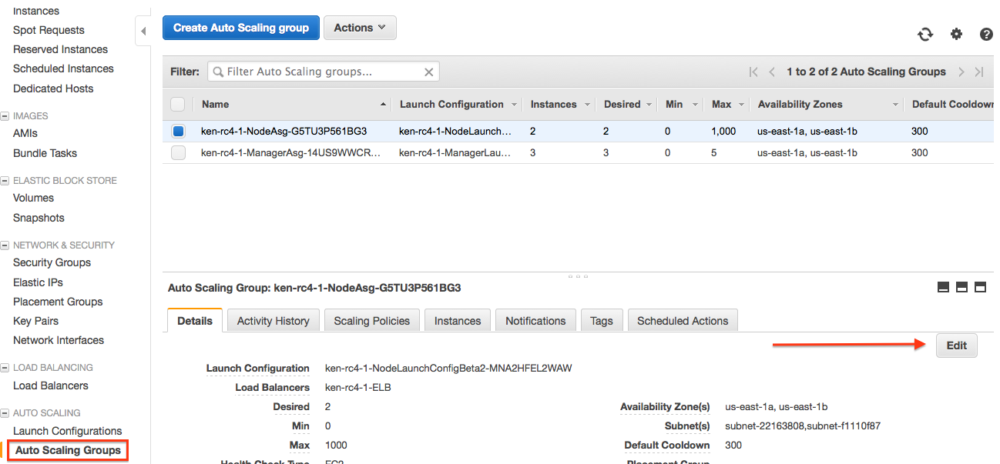
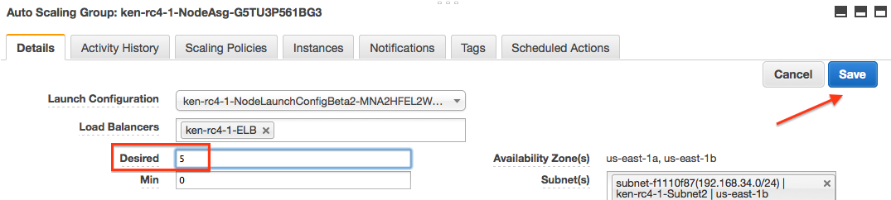
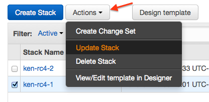

## Scaling workers

You can scale the worker count using the AWS Auto Scaling group. Docker
automatically joins or removes new instances to the Swarm.

There are currently two ways to scale your worker group. You can "update" your
stack, and change the number of workers in the CloudFormation template
parameters, or you can manually update the Auto Scaling group in the AWS console
for EC2 auto scaling groups.

Changing manager count live is _not_ currently supported.

### AWS console
Log in to the AWS console, and go to the EC2 dashboard. On the lower left hand
side select the "Auto Scaling Groups" link.

Look for the Auto Scaling group with the name that looks like
$STACK_NAME-NodeASG-* Where `$STACK_NAME` is the name of the stack you created
when filling out the CloudFormation template for Docker for AWS. Once you find
it, click the checkbox, next to the name. Then Click on the "Edit" button on the
lower detail pane.

Change the "Desired" field to the size of the worker pool that you would like, and hit "Save".

This takes a few minutes and add the new workers to your swarm
automatically. To lower the number of workers back down, you just need to update
"Desired" again, with the lower number, and it shrinks the worker pool until
it reaches the new size.

### CloudFormation update

Go to the CloudFormation management page, and click the checkbox next to the
stack you want to update. Then Click on the action button at the top, and select
"Update Stack".

Pick "Use current template", and then click "Next". Fill out the same parameters
you have specified before, but this time, change your worker count to the new
count, click "Next". Answer the rest of the form questions. CloudFormation
shows you a preview of the changes. Review the changes and if they
look good, click "Update". CloudFormation changes the worker pool size to
the new value you specified. It takes a few minutes (longer for a larger
increase / decrease of nodes), but when complete the swarm has
the new worker pool size.
