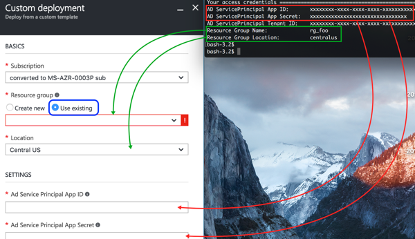



## Docker Enterprise Edition (EE) for Azure
This deployment is fully baked and tested, and comes with the latest Enterprise Edition version of Docker. <br/>This release is maintained and receives <strong>security and critical bugfixes for one year</strong>.

<a class="button outline-btn" href="https://store.docker.com/editions/enterprise/docker-ee-azure?tab=description" target="_blank">Deploy Docker Enterprise Edition (EE) for Azure</a>


## Docker Community Edition (CE) for Azure

### Quickstart

If your account has the [proper permissions](#prerequisites), you can generate the [Service Principal](#service-principal) and
then choose from the stable or edge channel to bootstrap Docker for Azure using Azure Resource Manager.
For more about stable and edge channels, see the [FAQs](/docker-for-azure/faqs.md#stable-and-edge-channels).
<table style="width:100%">
  <tr>
    <th style="font-size: x-large; font-family: arial">Stable channel</th>
    <th style="font-size: x-large; font-family: arial">Edge channel</th>
  </tr>
  <tr valign="top">
    <td width="50%">This deployment is fully baked and tested, and comes with the latest CE version of Docker. <br><br>This is the best channel to use if you want a reliable platform to work with. <br><br>Stable is released quarterly and is for users that want an easier-to-maintain release pace.</td>
    <td width="50%">This deployment offers cutting edge features of the CE version of Docker and comes with experimental features turned on, described in the <a href="https://github.com/docker/docker-ce/blob/master/components/cli/experimental/README.md">Docker Experimental Features README</a> on GitHub. (Adjust the branch or tag in the URL to match your version.)<br><br>This is the best channel to use if you want to experiment with features under development, and can weather some instability and bugs. Edge is for users wanting a drop of the latest and greatest features every month <br><br>We collect usage data on edges across the board.</td>
  </tr>
  <tr valign="top">
  <td width="50%">
  {{azure_blue_latest}}
  </td>
  <td width="50%">
  {{azure_blue_edge}}
  </td>
  </tr>
</table>

### Prerequisites

- Access to an Azure account with admin privileges
- SSH key that you want to use when accessing your completed Docker install on Azure


### Configuration

Docker for Azure is installed with an Azure template that configures Docker in swarm-mode, running on VMs backed by a custom VHD. There are two ways you can deploy Docker for Azure. You can use the Azure Portal (browser based), or use the Azure CLI. Both have the following configuration options.

#### Configuration options

##### Manager count
The number of Managers in your swarm. You can pick either 1, 3 or 5 managers. We only recommend 1 manager for testing and dev setups. There are no failover guarantees with 1 manager — if the single manager fails the swarm will go down as well. Additionally, upgrading single-manager swarms is not currently guaranteed to succeed.

We recommend at least 3 managers, and if you have a lot of workers, you should pick 5 managers.

##### Manager VM size
The VM type for your manager nodes. The larger your swarm, the larger the VM size you should use.

##### Worker VM size
The VM type for your worker nodes.

##### Worker count
The number of workers you want in your swarm (1-100).

#### Service principal

A [Service Principal](https://azure.microsoft.com/en-us/documentation/articles/active-directory-application-objects/)
is required to set up Docker for Azure. The Service Principal is used to invoke Azure APIs as you scale the number of nodes up
and down or deploy apps on your swarm that require configuration of the Azure Load Balancer. Docker provides a
containerized helper script called `docker4x/create-sp-azure` to help you create the Service Principal.

1.  Download the latest version of `docker4x/create-sp-azure` to your local environment:

   ```bash
   docker pull docker4x/create-sp-azure:latest
   ```

2.  Run the `sp-azure` script with the following arguments:

   ```bash
   $ docker run -ti docker4x/create-sp-azure sp-name [rg-name rg-region]

   ...
   Your access credentials =============================
   AD App ID:       <app-id>
   AD App Secret:   <secret>
   AD Tenant ID:   <tenant-id>
   ```

   If you have multiple Azure subscriptions, make sure to create the
   Service Principal with the subscription ID that you will be using
   to deploy Docker for Azure.

   | Argument | Description | Example values |
   |----------|-------------|---------|
   | `sp-name` | The name of the authentication app that the script creates with Azure. The name is not important, simply choose something you'll recognize in the Azure portal. | `sp1` |
   | `rg-name` | The name of the new resource group that will be created to deploy the resources (VMs, networks, storage accounts) associated with the swarm. The Service Principal will be scoped to this resource group. Specify this when deploying Docker Community Edition for Azure. Do not specify this when deploying Docker Enterprise Edition for Azure. | `swarm1` |
   | `rg-region` | The name of Azure's region/location where the resource group will be created. This needs to be one of the regions supported by Azure. Specify this when deploying Docker Community Edition for Azure. Do not specify this when deploying Docker Enterprise Edition for Azure. | `westus`, `centralus`, `eastus`. See our [FAQs](/docker-for-azure/faqs.md#what-are-the-different-azure-regions) for a list of regions. |

- **Docker Community Edition for Azure**: `rg-name` and `rg-region` are optional, but specifying them is recommended
  so that the Azure resource group is created up front and the service principal is scoped to that specific resource
  group.

- **Docker Enterprise Edition for Azure**: The Azure Marketplace portal does not currently allow users to specify an
  existing resource group to use when deploying resources. Do not specify `rg-name` and `rg-region`, because you need
  a Service Principal that is scoped throughout your account.


If the script fails, your Azure user account may not have sufficient privileges. Contact your Azure administrator.

When setting up the ARM template, you will be prompted for the App ID (a UUID) and the app secret. If you are
deploying Docker Community Edition for Azure and specified the resource group name and location parameters,
choose the option to deploy the template into an **existing resource group** and pass the same name and
region/location that you used when running the `create-sp-azure` helper script.



#### SSH Key

Docker for Azure uses SSH for accessing the Docker swarm once it's deployed. During setup, you will be prompted for a SSH public key. If you don't have a SSH key, you can generate one with `puttygen` or `ssh-keygen`. You only need the public key component to set up Docker for Azure. Here's how to get the public key from a .pem file:

    ssh-keygen -y -f my-key.pem

#### Installing with the CLI

You can also invoke the Docker for Azure template from the Azure CLI:

Here is an example of how to use the CLI. Make sure you populate all of the parameters and their values:

```bash
$ azure group create  --name DockerGroup --location centralus --deployment-name docker.template --template-file <templateurl>
```
