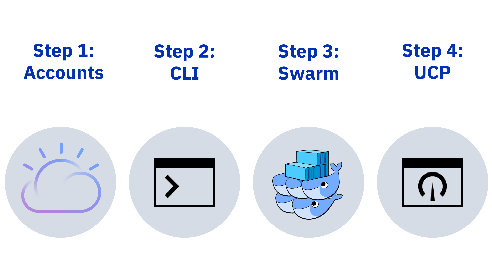

# Docker Enterprise Edition for IBM Cloud (Beta) Quick Start

Are you ready to orchestrate Docker Enterprise Edition swarm clusters that are enhanced with the full suite of secure IBM Cloud platform, infrastructure, and Watson services? Great! Let's get you started.

To request access to the closed beta, [contact IBM](mailto:sealbou@us.ibm.com).



## Step 1: Get all your accounts in order

1. Set up your IBM Cloud account:

   * [Register for a Pay As You Go IBM Cloud account](https://console.bluemix.net/registration/).
   * If you already have an IBM Cloud account, make sure that you can provision infrastructure resources. You might need to [upgrade or link your account](https://console.bluemix.net/docs/account/index.html#accounts).

2. Get your IBM Cloud infrastructure credentials:

   * [Add your SSH key to IBM Cloud infrastructure](https://knowledgelayer.softlayer.com/procedure/add-ssh-key), label it, and note the label.
   * Get your [account API credentials](https://knowledgelayer.softlayer.com/procedure/retrieve-your-api-key).

3. If you have not already, [create an organization and space](https://console.bluemix.net/docs/admin/orgs_spaces.html#orgsspacesusers) to use when using IBM Cloud services. You must be the account owner or administrator to complete this step.

4. Get the Docker EE URL associated with your subscription. [Email IBM](mailto:sealbou@us.ibm.com) to get a trial subscription during the beta.

5. Set your environment variables to use your IBM Cloud infrastructure credentials and your Docker EE installation URL. For example:

   ```none
   export SOFTLAYER_USERNAME=user.name.1234567
   export SOFTLAYER_API_KEY=api-key
   export D4IC_DOCKER_EE_URL=my_docker-ee-url
   ```

Now let's download some Docker for IBM Cloud tools.

## Step 2: Install the CLIs

1. Install the [IBM Cloud CLI](https://console.bluemix.net/docs/cli/reference/bluemix_cli/get_started.html#getting-started).

2. Install the Docker for IBM Cloud plug-in. The prefix for running commands is `bx d4ic`.

   ```bash
   $ bx plugin install docker-for-ibm-cloud -r Bluemix
   ```

3. Optional: To manage a private IBM Cloud Container Registry, install the plug-in. The prefix for running commands is `bx cr`.

   ```bash
   $ bx plugin install container-registry -r Bluemix
   ```

4. Verify that the plug-ins have been installed properly:

   ```bash
   $ bx plugin list
   ```

Now we're ready to get to the fun stuff: making a cluster!

## Step 3: Create clusters

Create a Docker EE swarm cluster in IBM Cloud. For beta, your cluster can have a maximum of 20 nodes, up to 14 of which can be worker nodes. If you need more nodes than this, work with your Docker representative to acquire an additional Docker EE license.

1. Log in to the IBM Cloud CLI. If you have a federated ID, use the `--sso` option.

   ```bash
   $ bx login [--sso]
   ```

2. Target the IBM Cloud org and space:

   ```bash
   $ bx target --cf
   ```

3. Create the cluster. Use the `--swarm-name` flag to name your cluster, and fill in the credentials, SSH, and Docker EE installation URL variables with the information that you previously retrieved.

   ```bash
   $ bx d4ic create --swarm-name my_swarm \
   --sl-user user.name.1234567 \
   --sl-api-key api_key \
   --ssh-label my_ssh_label \
   --ssh-key filepath_to_my_ssh_key \
   --docker-ee-url my_docker-ee-url
   ```

   > Customize your cluster
   >
   > You can customize your cluster by
   > [using other flags and options](cli-ref.md#bx-d4ic-create) with
   > `bx d4ic help create`, but this example uses a basic swarm.

5. Note the cluster **Name**, **ID**, and **UCP Password**.

Congrats! Your Docker EE for IBM Cloud cluster is provisioning. First, the manager node is deployed. Then, the rest of the infrastructure resources are deployed, including the worker nodes, DTR nodes, load balancers, subnet, and NFS volume.

* To check manager node status: `docker logs cluster-name_ID`.
* To check infrastructure resources: `bx d4ic show --swarm-name cluster-name --sl-user user.name.1234567 --sl-api-key api_key`.

## Step 4: Use UCP

Check it out: Docker for IBM Cloud uses [Docker Universal Control Plane (UCP)](/datacenter/ucp/2.2/guides/) to help you manage your cluster through a simple web UI!

### Step 4a: Access UCP

Before you begin, get your cluster **Name**, **ID**, and **UCP Password** that you previously noted.

1. Retrieve your cluster's **UCP URL**:

  ```bash
  $ bx d4ic list --sl-user user.name.1234567 --sl-api-key api_key
  ```

2. In your browser, navigate to the **UCP URL**.

3. Log in to UCP. Your credentials are `admin` and the UCP password from the `bx d4ic create` command output, or the credentials that your admin created for you.

We're almost done! We just need to download the UCP certificate bundle so that you can create and deploy services from your local Docker client to the cluster.

### Step 4b: Download client certificates

1. From the UCP GUI under your user name (for example, **admin**), click **My Profile**.

2. Click **Client Bundles** > **New Client Bundle**. A zip file is generated.

3. In the GUI, you see a label and public key. To edit the label, click the pencil icon and give it a name, such as _d4ic-ucp_.

4. In a terminal, navigate and unzip the client bundle:

   ```bash
   $ cd Downloads && unzip ucp-bundle-admin.zip
   ```

   > Keep your client bundle handy
   >
   > Move the certificate environment variable directory to a safe and
   > accessible location on your machine. It gets used a lot.

5. From the client bundle directory, update your `DOCKER_HOST` and `DOCKER_CERT_PATH` environment variables by loading the `env.sh` script contents into your environment:

   ```bash
   $ source env.sh
   ```

   > Set your environment to use Docker EE for IBM Cloud
   >
   > Repeat this to set your environment variables each time you enter a new terminal session, or after you unset your variables, to connect to the Docker EE for IBM Cloud swarm.

That's it! Your Docker EE for IBM Cloud cluster is provisioned, connected to UCP, and ready to go.

What's next, you ask? Why not try to:

* [Learn when to use UCP and the CLIs](administering-swarms.md#ucp-and-clis).
* [Deploy an app](deploy.md).
* [Scale your swarm cluster](scaling.md).
* [Set up DTR to use IBM Cloud Object Storage](dtr-ibm-cos.md).
