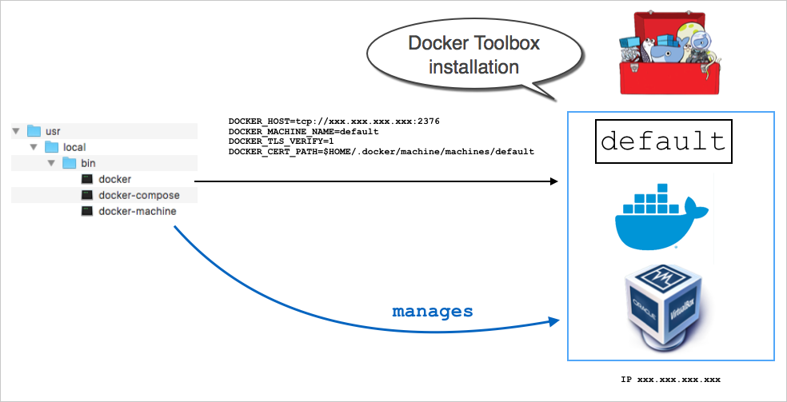
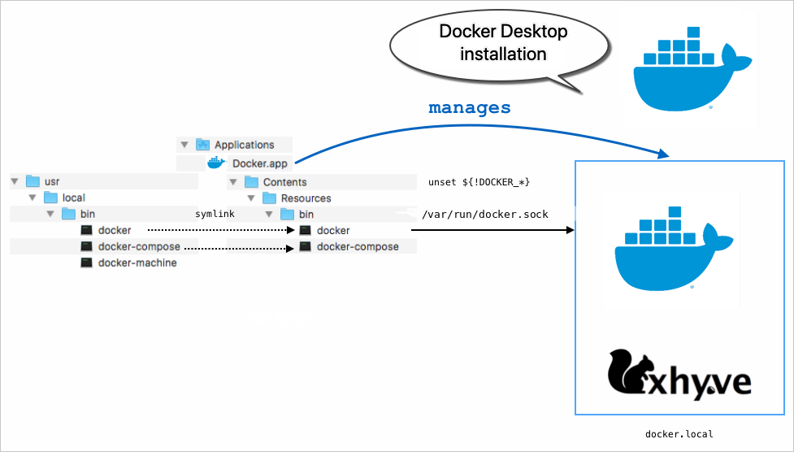
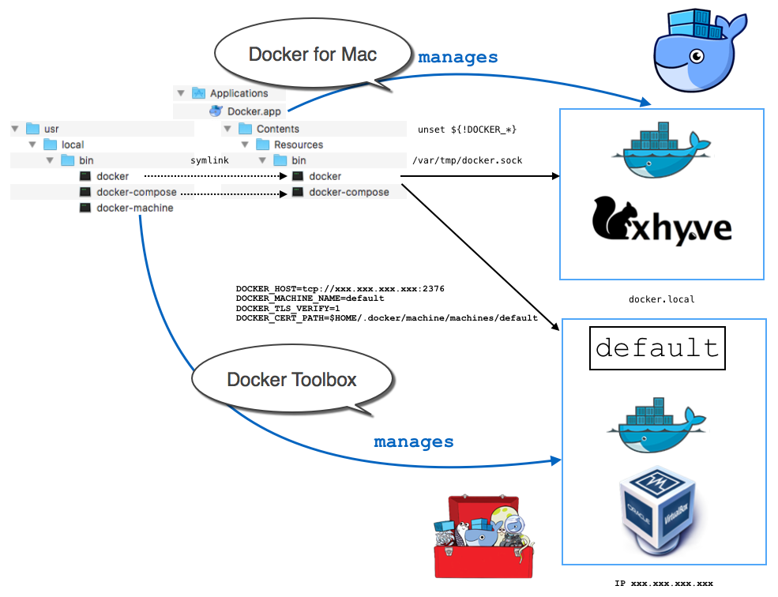

If you already have an installation of Docker Toolbox, read these topics
first to learn how Docker Desktop on Mac and Docker Toolbox differ, and how they can
coexist.

## The Docker Toolbox environment

Docker Toolbox installs `docker`, `docker-compose`, and `docker-machine` in
`/usr/local/bin` on your Mac. It also installs VirtualBox. At installation time,
Toolbox uses `docker-machine` to provision a VirtualBox VM called `default`,
running the `boot2docker` Linux distribution, with [Docker Engine](/engine/)
with certificates located on your Mac at
`$HOME/.docker/machine/machines/default`.

Before you use `docker` or `docker-compose` on your Mac, you typically use the
command `eval $(docker-machine env default)` to set environment variables so
that `docker` or `docker-compose` know how to talk to Docker Engine running on
VirtualBox.

This setup is shown in the following diagram.



## The Docker Desktop on Mac environment

Docker Desktop on Mac is a Mac-native application, that you install in `/Applications`.
At installation time, it creates symlinks in `/usr/local/bin` for `docker` and
`docker-compose` and others, to the commands in the application
bundle, in `/Applications/Docker.app/Contents/Resources/bin`.

Here are some key points to know about Docker Desktop on Mac before you get started:

* Docker Desktop uses [HyperKit](https://github.com/docker/HyperKit/) instead of Virtual Box. Hyperkit is a lightweight macOS virtualization solution built on top of Hypervisor.framework in macOS 10.10 Yosemite and higher.

* When you install Docker Desktop on Mac, machines created with Docker Machine are not affected.

* Docker Desktop does not use `docker-machine` to provision its VM.
  The Docker Engine API is exposed on a
  socket available to the Mac host at `/var/run/docker.sock`. This is the
  default location Docker and Docker Compose clients use to connect to
  the Docker daemon, so you can use `docker` and `docker-compose` CLI commands
  on your Mac.

This setup is shown in the following diagram.



With Docker Desktop on Mac, you only get (and only usually need) one VM, managed by Docker Desktop. Docker Desktop automatically upgrades the Docker client and daemon when updates are available.

Also note that Docker Desktop can’t route traffic to containers, so you can't
directly access an exposed port on a running container from the hosting machine.

If you do need multiple VMs, such as when testing multi-node swarms, you can
continue to use Docker Machine, which operates outside the scope of Docker Desktop. See
[Docker Toolbox and Docker Desktop coexistence](docker-toolbox.md#docker-toolbox-and-docker-desktop-coexistence).

## Setting up to run Docker Desktop on Mac

1. Check whether Toolbox DOCKER environment variables are set:

        $ env | grep DOCKER
        DOCKER_HOST=tcp://192.168.99.100:2376
        DOCKER_MACHINE_NAME=default
        DOCKER_TLS_VERIFY=1
        DOCKER_CERT_PATH=/Users/<your_username>/.docker/machine/machines/default

    If this command returns no output, you are ready to use Docker Desktop.

    If it returns output (as shown in the example), unset
    the `DOCKER` environment variables to make the client talk to the
    Docker Desktop Engine (next step).

2. Run the `unset` command on the following `DOCKER` environment variables to
   unset them in the current shell.

        unset DOCKER_TLS_VERIFY
        unset DOCKER_CERT_PATH
        unset DOCKER_MACHINE_NAME
        unset DOCKER_HOST

  Now, this command should return no output.

          $ env | grep DOCKER

  If you are using a Bash shell, you can use `unset ${!DOCKER_*}` to unset all
  DOCKER environment variables at once. (This does not work in other shells such
  as `zsh`; you need to unset each variable individually.)

> **Note**: If you have a shell script as part of your profile that sets these
> `DOCKER` environment variables automatically each time you open a command
> window, then you need to unset these each time you want to use Docker Desktop.

> If you install Docker Desktop on a machine where Docker Toolbox is installed..
>
> Docker Desktop replaces the `docker` and `docker-compose` command lines in
> `/usr/local/bin` with symlinks to its own versions.
{:.warning}

See also [Unset environment variables in the current shell](../machine/get-started.md#unset-environment-variables-in-the-current-shell)
in the Docker Machine topics.

## Docker Toolbox and Docker Desktop coexistence

You can use Docker Desktop and Docker Toolbox together on the same machine. When
you want to use Docker Desktop make sure all DOCKER environment variables are
unset. You can do this in bash with `unset ${!DOCKER_*}`. When you want to use
one of the VirtualBox VMs you have set with `docker-machine`, just run a `eval
$(docker-machine env default)` (or the name of the machine you want to target).
This switches the current command shell to talk to the specified Toolbox
machine.

This setup is represented in the following diagram.



## Using different versions of Docker tools

The coexistence setup works as is as long as your VirtualBox VMs provisioned
with `docker-machine` run the same version of Docker Engine as Docker Desktop.
If you need to use VMs running older versions of Docker Engine, you can use a
tool like [Docker Version Manager](https://github.com/getcarina/dvm) to manage
several versions of docker client.

### Checking component versions

Ideally, the Docker CLI client and Docker Engine should be the same version.
Mismatches between client and server, and host machines you might have
created with Docker Machine can cause problems (client can't talk to the server
or host machines).

If you have already installed [Docker Toolbox](/toolbox/overview/), and then
installed Docker Desktop, you might get a newer version of the Docker client. Run `docker version` in a command shell to see client and server versions. In this example, the client installed with Docker Desktop is `Version: 19.03.1` and the server (which was installed earlier with Toolbox) is `Version: 19.03.2`.

    $ docker version
    Client:
    Version:      19.03.1
    ...

    Server:
    Version:      19.03.2
    ...

Also, if you created machines with Docker Machine (installed with Toolbox) then
upgraded or installed Docker Desktop, you might have machines running different
versions of Engine. Run `docker-machine ls` to view version information for the
machines you created. In this example, the DOCKER column shows that each machine
is running a different version of server.

    $ docker-machine ls
    NAME             ACTIVE   DRIVER         STATE     URL                         SWARM   DOCKER    ERRORS
    aws-sandbox      -        amazonec2      Running   tcp://52.90.113.128:2376            v19.03.1
    default          *        virtualbox     Running   tcp://192.168.99.100:2376           v19.03.2
    docker-sandbox   -        digitalocean   Running   tcp://104.131.43.236:2376           v19.03.1

There are a few ways to address this problem and keep using your older
machines. One solution is to use a version manager like
[DVM](https://github.com/getcarina/dvm).

## Migrating from Docker Toolbox to Docker Desktop on Mac

Docker Desktop does not propose Toolbox image migration as part of its
installer since version 18.01.0.  You can migrate existing Docker
Toolbox images with the scripts described below. (This migration
cannot merge images from both Docker and Toolbox: any existing Docker image is
*replaced* by the Toolbox images.)

Run the following shell commands in a terminal. You need a working
`qemu-img`; it is part of the qemu package in both MacPorts and Brew:

```sh
$ brew install qemu  # or sudo port install qemu
```

First, find your Toolbox disk images. You probably have just one:
`~/.docker/machine/machines/default/disk.vmdk`.

```sh
$ vmdk=~/.docker/machine/machines/default/disk.vmdk
$ file "$vmdk"
/Users/akim/.docker/machine/machines/default/disk.vmdk: VMware4 disk image
```

Second, find out the location and format of the disk image used by your Docker
Desktop.

```sh
$ settings=~/Library/Group\ Containers/group.com.docker/settings.json
$ dimg=$(sed -En 's/.*diskPath.*:.*"(.*)".*/\1/p' < "$settings")
$ echo "$dimg"
/Users/akim/Library/Containers/com.docker.docker/Data/vms/0/Docker.raw
```

In this case the format is `raw` (it could have been `qcow2`), and the location
is `~/Library/Containers/com.docker.docker/Data/vms/0/`.

Then:
- if your format is qcow2, run
```sh
$ qemu-img convert -p -f vmdk -O qcow2 -o lazy_refcounts=on "$vmdk" "$dimg"
```
- if your format is raw, run the following command. If you are short on disk
  space, it is likely to fail.
```sh
$ qemu-img convert -p -f vmdk -O raw "$vmdk" "$dimg"
```

Finally (optional), if you are done with Docker Toolbox, you may fully
[uninstall
it](https://docs.docker.com/toolbox/toolbox_install_mac/#how-to-uninstall-toolbox).

## How do I uninstall Docker Toolbox?

You might decide that you do not need Toolbox now that you have Docker Desktop,
and want to uninstall it. For details on how to perform a clean uninstall of
Toolbox on Mac, see [How to uninstall Toolbox](../toolbox/toolbox_install_mac.md#how-to-uninstall-toolbox)
in the Toolbox Mac topics.
